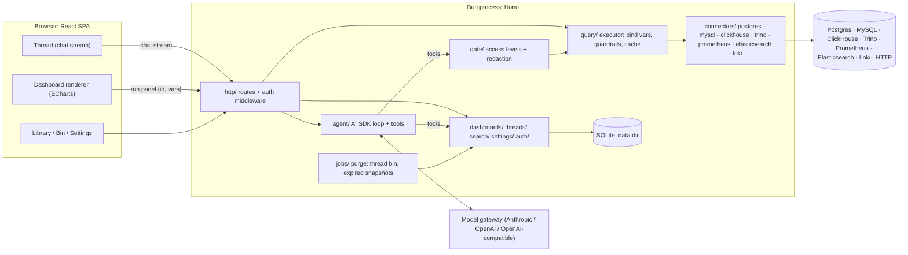
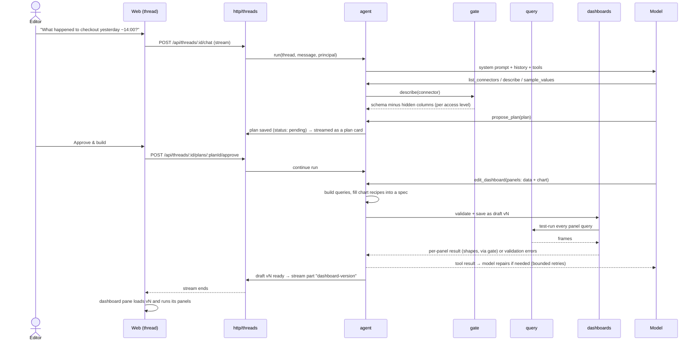

# Architecture

How quanthea is laid out and how the pieces talk to each other. The design is deliberately
simple: one Bun process, one SQLite file, one React SPA. The complexity budget goes to the parts
that deserve it: the spec, the access gate and the agent loop.

The spec format is in [dashboard-spec.md](dashboard-spec.md).

---

## 1. The big picture



The two paths that matter:

- **Authoring** (costs tokens): thread → agent → tools → gate → query → connector. The model only
  ever receives what the gate returns.
- **Rendering** (no model): dashboard → `POST /api/panels/run` → query → connector → data frames
  → browser → ECharts. The gate is not involved because the output goes to a human who is allowed
  to see it (their role permits opening the dashboard).

## 2. Repository layout

```
.
├── apps/
│   ├── server/                      @quanthea/server
│   │   └── src/
│   │       ├── main.ts              bootstrap: config → migrate → jobs → Bun.serve
│   │       ├── app.ts               Hono app: middleware, /api routes, static SPA + fallback
│   │       ├── config/              system settings: environment, config file, defaults
│   │       ├── provisioning/        apply the config file's connectors and settings
│   │       ├── lib/                 leaf utilities: errors, logger, ids, clock
│   │       ├── http/                route modules + middleware (auth, errors, request id)
│   │       ├── auth/                modes none|basic|oidc, sessions, Principal, role checks
│   │       ├── agent/               AI SDK: provider factory, prompts, tools, run loop
│   │       ├── gate/                what the model may see: access levels, hidden columns, error sanitizing
│   │       ├── query/               executor: variable binding, guardrails, timeouts, result cache
│   │       ├── connections/         configured connectors: CRUD, sealed secrets, open instances, schema cache
│   │       ├── connectors/          registry + _shared/ + one folder per kind
│   │       │   ├── _shared/         the server's kit: the public kit plus its policy lists
│   │       │   ├── postgres/  mysql/  clickhouse/  trino/
│   │       │   ├── prometheus/  loki/
│   │       │   └── search/          Elasticsearch and OpenSearch: two kinds, one engine
│   │       ├── dashboards/          versions, validate, pin, copies, library, snapshots; queries/
│   │       │                        (builders, saved and raw queries) and panels/ (edits: data +
│   │       │                        chart, layout)
│   │       ├── threads/             threads, messages, plans (state machine)
│   │       ├── settings/            typed settings store (auth, gateway, retention)
│   │       ├── secrets/             encrypt/decrypt credentials at rest
│   │       ├── jobs/                in-process jobs: the hourly purge of the bin and of snapshots
│   │       └── db/                  bun:sqlite client, migrations, repositories
│   └── web/                         @quanthea/web
│       ├── index.html
│       ├── vite.config.ts           dev proxy /api → :3000
│       └── src/
│           ├── main.tsx
│           ├── app/                 router, session, route guards, layout with nav rail, error page
│           ├── routes/              thin route modules; compose features
│           ├── features/
│           │   ├── thread/          chat stream, plan card, diff and repair cards, composer, @mentions
│           │   ├── dashboard/       dashboard pane, variables bar, panels, inspector, snapshot menu, Ask and History
│           │   ├── snapshot/        a snapshot's page, Settings → Snapshots
│           │   ├── library/         search, connector and tag filters, cards with a live panel
│           │   ├── bin/
│           │   ├── connectors/
│           │   └── settings/        gateway, auth, retention
│           ├── charts/              view + datasets → ECharts option: preparations, tokens, maps
│           ├── ui/                  presentational primitives (Button, Card, Pill, Tabs, Switch…), brand
│           └── lib/                 typed API client (from shared contract), utils
├── packages/
│   ├── plugin-kit/                  @quanthea/plugin-kit: the connector kit, public types,
│   │                                a test kit and the conformance suite, and the frames and
│   │                                query languages every connector shares (frames.ts)
│   └── shared/                      @quanthea/shared  (isomorphic: browser + Bun)
│       └── src/
│           ├── spec/                dashboard spec Zod schemas + types
│           ├── api/                 endpoint contracts (method, path, input, output)
│           ├── formatters/          named formatter library (pure functions)
│           ├── dataset/             the data contract: datasets, shapes, reshaping, from frames
│           ├── chart-recipes/       chart recipes by family, their schema, fill, samples
│           ├── queries.ts           query builders, saved queries, a thread's queries
│           ├── roles.ts             Role, capability matrix
│           └── index.ts
├── examples/
│   └── quanthea-plugin-sqlite/       an example connector plugin: read-only SQLite files
├── dev/                             docker-compose + seed data for local sources
├── evals/                           prompt → expected-dashboard checks against dev sources
├── docs/                            architecture, dashboard spec, brand, contributing, security
├── scripts/                         remark-check-formatted.mjs (the docs:check plugin)
├── AGENTS.md · CLAUDE.md            conventions for anyone writing code here
├── Dockerfile · .tool-versions      the image, and the Bun version CI and the image use
├── biome.json · knip.json · .dependency-cruiser.cjs · tsconfig.base.json
├── .remarkrc.mjs · commitlint.config.js · .releaserc.json · .husky/
└── .github/  dependabot.yml · workflows/quality.yml · workflows/release.yml · octocov.yml
```

## 3. Server modules and who may import whom

The allowed dependencies are enforced by `.dependency-cruiser.cjs`. The table summarizes
them.

| Module               | Responsibility                                              | May import                                                          | Must not import                                 |
| -------------------- | ----------------------------------------------------------- | ------------------------------------------------------------------- | ----------------------------------------------- |
| `lib/`               | errors, logger, ids                                         | nothing internal                                                    | everything else                                 |
| `connectors/<kind>/` | talk to one kind of source; return Frames                   | `connectors/_shared`, `lib`, `@quanthea/shared`, its own driver     | other connector kinds, anything else in the app |
| `query/`             | bind variables, enforce guardrails, run, cache              | `connectors`, `lib`, shared                                         | `agent`, `http`                                 |
| `gate/`              | turn query results and schemas into what the model may see  | `query`, `connectors/_shared`, `settings`, `lib`                    | `agent`, `http`                                 |
| `agent/`             | AI SDK loop, prompts, tool definitions                      | `gate`, `dashboards`, `threads`, `settings`, `lib`                  | **`connectors`, `query`, `db`**                 |
| `dashboards/`        | validate, store, pin and run specs                          | `db`, `query`, `lib`, shared; connectors through injected functions | `http`, `agent`, `connections`, `connectors`    |
| `threads/`           | domain logic                                                | `db`, `lib`, shared                                                 | `http`, `agent`                                 |
| `settings/`          | typed settings sections; the model key, sealed              | `db`, `secrets`, `lib`, shared                                      | `http`, `agent`                                 |
| `connections/`       | configured connectors: CRUD, sealed secrets, open instances | `db`, `secrets`, `connectors`, `gate`, `query` types, `lib`         | `http`, `auth`, `agent`                         |
| `db/`                | the only user of `bun:sqlite`                               | `lib`                                                               | —                                               |
| `http/`              | validate, authorize, call services, stream                  | services, `agent`, `auth`                                           | `connectors`, `db`                              |
| `auth/`              | modes, sessions, Principal                                  | `settings`, `db` via repositories, `lib`                            | `agent`                                         |
| `provisioning/`      | apply the configuration file; what it manages               | `config`, `connections`, `db`, `secrets` types, `lib`               | `http`, `agent`                                 |

Library ownership rules: only `agent/` imports `ai` or `@ai-sdk/*`, and only `db/` imports
`bun:sqlite`. Each connector kind owns its driver: `postgres` and `mysql2` in their folders, and
the kit's HTTP client for every kind that speaks HTTP.

## 4. Web modules

- `routes/` compose features. Features never import routes (rule `features-not-to-routes`).
- Features reach each other only through their `index.ts(x)`
  (`features-talk-through-their-index`). A feature's screens are exported from its `screens.ts`
  instead, which routes load with React Router's `lazy` when the route first opens: loaders and
  actions stay in the first chunk, each feature's screens are a chunk of their own
  (`<feature>-screens`), and React, React Router and Zod are chunks of their own too, which
  browsers keep across releases (`vite.config.ts`). The thread screen draws its draft with the
  `DashboardCanvas` and `usePanelRunData` that `features/dashboard` exports, so a draft renders
  exactly like a pinned dashboard.
- `charts/` is the only place that imports ECharts (`echarts-only-in-charts`). It exposes
  `<Chart spec={panel} frames={frames} />` and nothing about ECharts leaks out.
- `@ai-sdk/react` is used only in `features/thread` (`ai-react-only-in-thread`).
- **Thread screen.** The conversation streams through `useChat`, which posts only the new message
  to `/api/threads/:threadId/chat`; the server holds the conversation. Approving a plan, undoing
  and pinning go through the route action, and approving then continues the assistant message.
  The version the draft pane shows lives in `?v=`, so a reload or a shared link keeps it. The new-thread screen is one question box in the middle of the screen, with a Past threads button at the top right. It opens a drawer from the right (from the top on a phone) that searches the titles, can show only threads whose dashboard is pinned (each marked with a pin), groups the threads by day, and moves one to the bin after asking. A thread whose dashboard is pinned can't be deleted. A link can fill the question box with `?question=`. It creates the thread and hands the first question over in `?ask=`, which the thread screen sends
  once and removes. Each question carries the browser's time zone.
- `ui/` is purely presentational (`ui-is-dumb`). `ui/brand.tsx` draws the logo, icon and mark
  from [`docs/brand/`](brand/README.md); `public/` holds the favicons and the web app manifest.
- **Colour scheme.** Light, dark or the system's, picked under Appearance in the account menu and
  kept in the browser's `localStorage` (`ui/color-scheme.ts`). Light is the default. The choice
  sets `data-theme` on the document element before the first render, and `ui/theme.css`
  redefines the colour tokens for `dark`. Charts read their colours from the tokens again when the
  scheme changes. The icon tiles keep their brand colours in both schemes.

**Routes** (React Router data mode):

| Path                                                     | Screen                                                     | Min role |
| -------------------------------------------------------- | ---------------------------------------------------------- | -------- |
| `/`                                                      | redirect → `/library` (viewer, analyst) or `/threads/new`  | viewer   |
| `/threads/new`, `/threads/:threadId`                     | Plan, Build and refine, Variant                            | editor   |
| `/library`                                               | Library: search pinned dashboards and their panels         | viewer   |
| `/account`                                               | resource route: the account menu's providers and actions   | viewer   |
| `/d/:dashboardId`                                        | the pinned version; for editors, the latest if unpinned    | viewer   |
| `/d/:dashboardId/v/:version`                             | a specific version                                         | viewer   |
| `/d/:dashboardId/v/:version/panels/:panelId`             | resource route: one panel's run, for fetchers              | viewer   |
| `/d/:dashboardId/v/:version/panels/:panelId/explanation` | resource route: a panel's latest explanation               | viewer   |
| `/d/:dashboardId/v/:version/options/:name`               | resource route: a variable's options, for fetchers         | viewer   |
| `/d/:dashboardId/snapshots`                              | resource route: a dashboard's live snapshots, for fetchers | editor   |
| `/d/:dashboardId/conversations`                          | resource route: a dashboard's conversations, or a search   | viewer   |
| `/d/:dashboardId/conversations/:conversationId`          | resource route: one conversation's questions and answers   | viewer   |
| `/d/:dashboardId/similar-questions`                      | resource route: earlier answered questions like a text     | viewer   |
| `/d/:dashboardId/v/:version/sources`                     | resource route: a version's sources and access levels      | viewer   |
| `/s/:snapshotId`                                         | a snapshot: a version frozen with its data, read-only      | viewer   |
| `/bin`                                                   | Bin: deleted threads, restore; retention, delete (admin)   | editor   |
| `/connectors`, `/connectors/:connectorId`                | Connectors: list, access level, guardrails, schema         | admin    |
| `/connectors/new`, `/connectors/:connectorId/edit`       | add and edit a connection                                  | admin    |
| `/connectors/:connectorId/health`                        | resource route: the connection test, for fetchers          | admin    |
| `/settings/model`                                        | Model: the providers, their keys and limits                | admin    |
| `/settings/auth`                                         | Authentication: sign-in providers, passwords               | admin    |
| `/settings/users`                                        | Users: invite, roles, disable, reset links, sign out       | admin    |
| `/settings/usage`                                        | Usage: tokens, cost and views; by feature, model, person   | admin    |
| `/settings/snapshots`                                    | Snapshots: every live snapshot, revoke one                 | admin    |
| `/settings/queries`                                      | Queries: builders on or off, your own with placeholders    | admin    |
| `/settings/charts`                                       | Charts: every chart recipe drawn from its sample           | admin    |
| `/settings/server`                                       | Server: system settings and keys, read-only, with sources  | admin    |
| `/settings`                                              | redirect → `/settings/model`                               | admin    |
| `/ui`                                                    | UI kit: every `ui/` primitive, for checking the visuals    | viewer   |
| `/login`                                                 | sign in                                                    | —        |
| `/setup`                                                 | the default admin chooses their own email and password     | —        |
| `/set-password`                                          | choose a password from an invite or reset link             | —        |

The roles rank viewer, analyst, editor, admin (`roles` in `@quanthea/shared`), and `hasRole` is
the one check of a minimum role, on the server and in the browser. An analyst reads everything a
viewer reads and also asks questions about pinned dashboards (`POST
/api/dashboards/:id/questions`) and asks for a panel's explanation; every role reads the questions
asked, their answers, the conversations they form and the explanations.

Route loaders fetch through the typed API client. The root loader loads the session
(`GET /api/me`, once per page load). Without a session, every screen redirects to
`/login?next=<path>`. Each screen's loader checks its minimum role (`app/route-access.ts`) and
throws a 403, which the error page shows as "Your role can't do this" inside the layout, so the
rail stays. A test drives every screen with every role through the real route tree.

Screens change data through route actions: forms and fetchers submit JSON, the action calls the
API, and React Router reloads the route data afterwards. A refusal the user can act on
(`bad_request`, `source_failed`) comes back as action data with the issues by field; other errors
go to the error page. TanStack Query is added with the first screen that caches server data.

## 5. Core flows

### 5.1 Ask → plan → approve → build



**The thread state machine is enforced server-side:**

```
idle ──propose_plan──▶ plan_pending ──approve──▶ building ──done──▶ ready
  ▲                         │ reject/edit                               │
  └─────────────────────────┴────────────── new message ◀──────────────┘
```

`edit_dashboard` refuses to write unless the thread is `building`, or `ready` with the change
scoped to existing panels (the small-edit path). If the AI SDK's tool-approval feature fits this
flow cleanly, use it for the UX, but the state check in `threads/` stays the source of truth.

### 5.2 Render a panel (no model)

1. The dashboard pane knows `{dashboardId, version}`, the variable values and the time range
   (`now-6h`, or ISO timestamps).
2. For each panel: `POST /api/panels/run {dashboardId, version, panelId, variables, time}`.
3. The server loads the spec. Viewers may run versions pinned at some time, while the dashboard is
   pinned; anything else is "not found" to them.
4. `dashboards/` resolves the time range and the variables against the spec's declarations: a
   custom value must be an option, a single-value variable takes one value, a text value must
   match its pattern. Query-backed values are bound as they come, since binding is safe; "All"
   (`$__all`) and a missing default run the variable's source query for the options.
5. Each query goes to `query/`, which binds it, applies the connector's guardrails, runs it with a
   timeout and caches the frames for 15 s by connector, bound query and time range. The chart's
   markers run their annotation queries the same way, with the same variables, and come back, per
   set with its label and colour, as `{time, text}` points. A change of variable runs the panel
   again, its markers with it.
6. The browser receives `{ time, queries: [{ refId, frames, error }], markers, durationMs }`, and
   `charts/` builds the ECharts option.

Panels run in parallel. Each query has its own outcome with a safe error message, so one failing
query never fails the rest of the panel, and one failing panel never blanks the dashboard.
`POST /api/variables/options` lists a query-backed variable's options the same way.

### 5.3 Pin and unpin

Versions are the immutable part: none is ever rewritten, and a trigger enforces it for every
version. Pinning chooses the version the library, the dashboard's link and viewers see
(`dashboards.pinned_version_id`). The thread can keep adding versions to a pinned dashboard; they
stay drafts until one is pinned.

`POST /api/dashboards/:id/pin {version}` (editor+) accepts any version, including one pinned
before, so pinning an earlier version rolls the library back. It refuses the version already
shown.

1. Validate the version again (connectors may have changed) and test-run every panel with the
   default variables. A dashboard with a failing query can't be pinned; the refusal lists each
   failing query by path.
2. The _metadata_ model (`agent/metadata.ts`) writes a one-line description and 3 to 6 lowercase
   tags, with the provider of the dashboard's thread (the default one without a thread). Its
   tokens go to the usage ledger as the `metadata` job, under building dashboards. **This is best effort**: when the model
   is not set up, fails or takes more than 20 seconds, the dashboard is pinned without tags.
   The dashboards service gets it as a function, so `dashboards/` never imports the agent.
3. Set `dashboards.pinned_version_id`, the title from the version, the description from the
   version or else the model's, and the tags.
   The version keeps `pinned_at`, the time it was first pinned. A trigger on `dashboards` rewrites
   the dashboard's rows in the library index.

`POST /api/dashboards/:id/unpin` (editor+) clears `pinned_version_id`. The dashboard leaves the
library, and viewers get "not found" for it and all its versions. Editors still open every
version.

The dashboard's Versions menu lists the versions: the one pinned, the ones pinned before, and drafts
with their summary. Editors pin any other version or unpin from there. The thread's draft pane
says which version the library shows, and pins the version it shows.

### 5.4 A new thread on a dashboard

`POST /api/dashboards/:id/threads {mode, version?}` (editor+) opens a thread that is ready for
edits, with no model involved:

- `copy` makes a new dashboard whose v1 is a copy of a version (the pinned one by default), with
  `parent_dashboard_id` and `parent_version` set. The dashboard screen copies the version it
  shows; library cards copy the pinned one ("New dashboard from this").
- `edit` attaches the dashboard itself. Only a dashboard without a thread allows it, such as one
  created through the API ("Edit with the agent"). A dashboard with a thread is edited there.

A plan for an existing draft, a copy's or any built dashboard's, says how it changes it: each
panel it changes carries `replaces` (the draft's panel id) and `change` (what changes, in words);
a panel without `replaces` is new; `removes` lists the panels it drops and `changes` the changes
outside panels, such as the time range. Panels it leaves out stay. `propose_plan` refuses ids the
draft does not have. The agent is told when the draft started as a copy, and of what. With
`behaviour.planQueries` on (Settings → Model, off by default), each plan panel also carries the
query it will run, so the plan card can show how a changed query changes; plans take longer and
cost more.

The thread shows such a plan as changes (`features/thread/plan-changes.ts`): CHANGED rows for the
changes outside panels and the replaced panels, with their note and, when the plan carries the
query, its diff; NEW rows for the panels it adds; REMOVED rows; and one SAME row counting the
panels kept. While it waits, the draft pane previews it on the latest version: changed panels get
an orange outline and their note over the current chart, dimmed; removed panels a dashed red one;
kept panels are greyed; new panels follow as dashed blue placeholders; a legend says which is
which. A copy's thread opens with a banner naming the dashboard and version it was copied from,
or that it was deleted since.

### 5.5 The thread bin

The bin holds threads, not dashboards: a dashboard lives in its thread, and leaves the library by
being unpinned. Deleting a thread frees the space of the thread and its dashboard together.

- `DELETE /api/threads/:id` (editor+) moves the thread to the bin: it sets `threads.deleted_at`
  and `deleted_by` and writes a `thread.bin` audit event. A thread whose dashboard is pinned is
  refused: unpin first.
- A binned thread is out of reach: the thread reads skip it, its dashboard can't be pinned, and
  an `edit` thread on its dashboard is refused. Its dashboard still opens for editors, and its
  Change menu's Edit with the agent says the conversation is in the bin and links there.
- `GET /api/bin` and `POST /api/bin/:id/restore` (editor+) list and restore binned threads.
- `DELETE /api/bin/:id` and `DELETE /api/bin` (admin) purge: in one transaction, the thread with
  its messages and plans, then its dashboard with every version, unless that dashboard is pinned
  or another thread uses it. The library index drops it through its trigger, and its snapshots go
  with it. Copies keep their `parent_dashboard_id`.
- The usage ledger has no foreign keys, so purging never changes Settings → Usage.
- **Retention** (the Retention dialog on the bin, `GET/PUT /api/settings/retention`, admin): binned threads
  are kept for `binDays` days, 30 by default, or until someone deletes them (`null`).
  `jobs/purge.ts` runs at startup and then every hour, and purges the threads binned longer ago,
  as the actor `retention`. With 0 days, the next run purges everything in the bin.
- The Bin screen says, for each thread, when it goes for good.

`threads/bin.ts` holds these rules over `db/thread-bin.ts`.

### 5.6 Snapshot links

A snapshot shares a moment, such as an incident: a version frozen with the results its panels
showed, at a link that opens with no query and no model (`dashboards/snapshots.ts`, over
`db/snapshot-repository.ts`).

1. `POST /api/snapshots` (editor+) names the version, the time range and variables as shown, the
   hidden sets of markers, and a lifetime: `1d`, `7d`, `30d` or `forever`. The version is read as
   for a panel run, so a draft is snapshotted only by those who may see it.
2. The server resolves the time range to absolute times once and runs every panel through the
   panel run path (`dashboards/run-panel.ts`), with the same variables, guardrails and row limits.
   The browser never sends results, which it could forge.
3. It stores the version's spec and each panel's run in the shape `POST /api/panels/run` returns,
   with the absolute range, the variable values (the chosen ones, else the defaults), the hidden
   sets of markers, the taker and `expires_at` (`NULL` for `forever`). A failing query is frozen as
   it failed. Over 10 MiB of spec and results, the snapshot is refused with its size: a query
   returns at most 50,000 rows by default, a few MB as JSON.
4. The id is 128 random bits from WebCrypto in URL-safe base64 (`newSnapshotId`), so a link can't
   be guessed. `GET /api/snapshots/:id` (viewer+) returns it with no query; an unknown, revoked or
   expired id gets the same "not found". An expired snapshot is refused from the moment it
   expires; the hourly purge job (`jobs/purge.ts`) then deletes it.
5. `GET /api/dashboards/:id/snapshots` (editor+) lists a dashboard's live snapshots and
   `GET /api/snapshots` (admin) every live one. `DELETE /api/snapshots/:id` (editor+) revokes one
   at once: the row is deleted.
6. The taker is recorded on the snapshot and in the audit log (`snapshot.take`,
   `snapshot.revoke`), for accountability only: any editor revokes any snapshot.
7. A snapshot keeps working while its dashboard's thread is in the bin. Purging the thread deletes
   the dashboard with every version, and its snapshots with them (`ON DELETE CASCADE`), as it does
   every other part of the dashboard. A pinned dashboard's thread can't be binned, so a snapshot
   of a pinned dashboard goes only when it expires, is revoked, or the dashboard is unpinned and
   its thread purged.
8. Each opening counts in the usage ledger as a `snapshot_view`, with the dashboard's id.

## 6. The agent

### Tools

Every tool validates its input with Zod, runs as the thread's person, and returns compact JSON.
The data tools answer only through the gate's model view (`gate/model-view.ts`), so what a result
shows depends on the connector's access level.

| Tool                                                | Returns                                                                                                   | Notes                                                                                    |
| --------------------------------------------------- | --------------------------------------------------------------------------------------------------------- | ---------------------------------------------------------------------------------------- |
| `describe(connector, scope?)`                       | entities and fields minus hidden ones, at most 60, and how many more matched                              | From the schema cache; read from the source when never read.                             |
| `sample_values(connector, entity, field, limit≤50)` | distinct values                                                                                           | Level 2 and up. Refuses hidden and high-cardinality fields.                              |
| `test_query(connector, query, variables?, time?)`   | L1: ok or error. L2: fields, types, row counts. L3: plus summaries. L4: plus rows                         | Default range `now-6h` to `now`. Errors are safe messages below L4.                      |
| `ask_person(question, options)`                     | `{ asked, next }`                                                                                         | 2 to 4 options, shown as buttons; the run then stops and the answer is the next message. |
| `propose_plan(plan)`                                | `{ planId, status, next }`                                                                                | Streams a `data-plan` part and moves the thread to `plan_pending`; the run then stops.   |
| `edit_dashboard(edit)`                              | the new version, each panel's test result, and the new panels left out; or the issues and failures to fix | Panels of data and a chart; see "Writing a version".                                     |
| `chart_recipe(id)`                                  | a chart recipe's roles, variants, pitfalls and option template                                            | The instructions list every recipe in one line; this reads one in full.                  |
| `read_guide(kind)`                                  | a connector kind's query guide: each shape of data from it, with examples, and its raw query syntax       | The instructions name the kinds in use; this reads one in full.                          |

`search_library` and `get_dashboard` arrive with the library and variants.

### Reuse before generating

On a thread's first question, before any model runs, the server searches the pinned dashboards
(`dashboards/pinned.ts`): words shared with each one's title (counting double), description, panel
titles and connectors, at most three matches. When some match, the answer is a matches card and
one sentence, with no model call and no tokens. The person can:

- open a match,
- start from it (`POST /api/threads/:id/start-from`): a copy of its pinned version becomes the
  thread's draft, with its lineage recorded, and the thread is ready for edits,
- or build a new one, which continues the answer: the model runs, told the person saw the matches
  and wants a new dashboard.

This search reads the pinned specs in memory and scores shared words. The library uses the
full-text index instead (see "The library").

### The library

`GET /api/dashboards?q=&tags=&connectors=` searches the pinned dashboards outside the bin
(`dashboards/library.ts`, over `db/library-search.ts`).

- The index is the FTS5 table `library_fts`: one row for each pinned dashboard and one for each of
  its panels. Triggers on `dashboards` keep it in step with pinning, renaming, the bin and deletes.
- A panel row holds its title, description, connectors and query text, and its dashboard's title
  and tags as context. A dashboard row holds its title, description and tags, and its panels'
  titles as context. So a search can match words spread over a dashboard and one of its panels.
- Every word must match, as a prefix, with Porter stemming. Titles weigh most, then tags,
  descriptions, queries and context. The search is quoted word by word, so FTS5 syntax typed in
  the box is read as words.
- Each result lists the panels whose own text matches any word, the best first, and one panel to
  preview: the best match, else the first chart.
- `tags` and `connectors` are comma-separated; a dashboard must have all of them. The answer also
  lists every tag and connector in the library, for the filter chips.

The library screen searches as the person types. Each card draws its preview panel live, once the
card scrolls into view, from the same resource route as the dashboard, so no model is involved.
A matching panel links to `/d/:id#panel-<id>`, which scrolls to it. Editors get a link to ask in a
new thread, with the search filled in (`/threads/new?question=`).

### The catalog

The model starts every turn knowing the data: the instructions carry a catalog of the connectors
(`gate/catalog.ts`), built by the gate from the cached schemas. Each connector gets a header with
its kind, query language and access level, then one line per table (columns, types, row count) or
metric (label names), at most 80 per connector, with a note to call `describe` for the rest.

From level 2, fields with at most 20 distinct values also list their values, sampled through the
same gate function as `sample_values`. A Prometheus label is sampled once per connector, since its
values are counted across metrics. At most 30 fields are sampled per connector, and sampled values
are kept for ten minutes. Level 1 shows no values and no row counts, and hidden fields never
appear. The catalog replaces exploring call by call, which cost a model request per step.

A connector with more than 40 tables or metrics is trimmed to what the thread is about
(`gate/catalog-focus.ts`): the entities whose names, descriptions or field names share words with
the person's messages, at most 25, in catalog order, or the first 25 when none match. The note
under them says `describe` reaches the rest. The words come from all the person's messages, so the
catalog stays the same from turn to turn and the providers' cache keeps working.

### Writing a version

The model never writes a spec, and rarely a query. Each panel of an `edit_dashboard` edit is
**data** and a **chart**, two independent layers joined by one data contract: every query result
becomes a table of typed columns and rows (`Dataset`, `@quanthea/shared/dataset`), which maps
directly onto an ECharts `dataset`.

- **Data** (`dashboards/queries/`) is a query builder, a saved query or a raw query. Each says
  what it returns: a shape of table and its columns.
  - **Query builders.** PromQL: `rate`, `ratio` (such as 5xx over all requests), `latency`
    (every percentile in one query, labelled `quantile`), `gauge`, `top`. SQL: `sql-series`,
    `sql-breakdown`, `sql-stat`, `sql-rows`. Names are checked against strict patterns and
    quoted, literals are escaped, and variables stay bound references. SQL is written for the
    connector's dialect (`dashboards/queries/sql-writers.ts`): PostgreSQL buckets time with
    `date_bin` from the start of the range; MySQL and MariaDB bucket epoch seconds in a UTC
    session, quote names in backticks and escape backslashes in strings. ClickHouse also buckets
    epoch seconds (`toStartOfInterval` takes no bound width), escapes quotes with a backslash and
    matches regular expressions with `match()`. Trino buckets epoch seconds in a UTC session, reads
    an interval variable with `parse_duration` and matches with `regexp_like`. InfluxDB 3 takes
    the PostgreSQL builders as they are. On `ansi`, names and aliases are double-quoted, casts
    are `CAST(… AS VARCHAR(1000))`, groups name their expression (SQL Server and Oracle refuse
    `GROUP BY 1`), and the row limit is the kind's: `FETCH FIRST n ROWS ONLY` or `LIMIT n`.
    Standard SQL has no portable time buckets, intervals or regular expressions, so `sql-series`,
    `sql-ratio` over time, `=~` and `!~` filters and duration placeholders are refused there with
    a message to write a raw query. The built-in dialects write what they always did: a snapshot
    of every builder in every dialect (`sql-snapshots.test.ts`) pins it. `sql-ratio` divides two `CASE` sums (the rows matching
    `match`, the rows matching `of` or every row) as `1e0 * part / nullif(whole, 0)`: a double in
    MySQL, MariaDB, ClickHouse and Trino, exact in PostgreSQL, and no division by zero.
    Search, for Elasticsearch and OpenSearch (`dashboards/queries/search.ts`): `search-series`,
    `search-ratio`, `search-breakdown`, `search-stat`, `search-histogram`, `search-rows`. Filters
    on document fields become a bool query: `term` for a literal, `terms` with a list node
    (`{"$var": "name", "as": "list"}`) for a variable, so one value or several both work, and
    `regexp` for a pattern. A count counts the time field's values. `search-ratio` divides the
    documents matching `match` by those matching `of` with two filter helpers and the kit's ratio
    script, over time or over the range (per `by` value, or in one bucket), `complement` for one
    minus it and `counts` to keep the two counts as columns.
    LogQL, for Loki (`dashboards/queries/logql.ts`): `logql-series`, `logql-ratio`,
    `logql-breakdown`, `logql-stat`, `logql-lines`. A request names its streams by label, the text
    lines contain (`|=`), a parser (`json` or `logfmt`) and filters on labels and parsed fields.
    Lines are counted (`count_over_time`) or rated and summed by label; a number is read from a
    field with `unwrap`, conversion errors dropped, and grouped in the range function
    (`quantile_over_time(0.95, … | unwrap duration_ms | __error__="" [$__interval]) by (route)`).
    `logql-ratio` divides the counts with and without the `match` filters, over time or over the
    range.
    MongoDB (`dashboards/queries/mongodb.ts`): `mongodb-series`, `mongodb-ratio`,
    `mongodb-breakdown`, `mongodb-stat`, `mongodb-histogram`, `mongodb-rows`, as aggregation
    pipelines that start with a `$match` on the range and the filters and end with a `$project`
    naming the columns (dotted paths become nested fields, flattened back to dotted columns). A
    literal that reads as a number or a boolean also matches as one, since MongoDB compares types
    strictly. Time is bucketed with `$dateTrunc` in milliseconds: a literal duration converted, an
    interval variable or `__interval_ms` as `{"$var": "name", "as": "ms"}`. Percentiles use
    `$percentile` (MongoDB 7 and later). `mongodb-ratio` counts the part and the whole with
    `$cond` in one `$group` and divides them in the `$project`.
  - **Saved queries.** An admin saves a query in any language with typed placeholders
    (`{{name}}`: metric, label, table, column, value or duration) and the shape it returns. The
    model asks for it by id with a value per placeholder. Each value is checked and written for
    its kind like the builders write theirs (`dashboards/queries/saved.ts`). SQL, PromQL and LogQL
    are text: values quoted or bound, names checked and quoted. A Redis command is filled word by
    word, each word one argument; the command takes no placeholder. Search, MongoDB and HTTP
    queries are the JSON of their template (`saved-json.ts`): a placeholder is a whole string or a
    whole key, and a variable value becomes a `{"$var": "name"}` node, never text in a string.
    Only an HTTP path (its literal encoded) and its query values take a placeholder inside text,
    where `$name` is their own variable syntax.
  - **Raw queries**, for data no builder gives.
- **Shapes.** `long` (x, series, value), `wide` (x, a column per series), `single`, `values` (raw
  numbers to bin), `matrix`, `hierarchical`, `graph`, `geo`, `ohlc` and `rows`. A Prometheus
  range result is long: the time, a column per label, `series` and `value`.
- **Charts** (`@quanthea/shared/chart-recipes/`) are presentation only: a recipe names the shape it
  draws and the role of each column (`x`, `series`, `y`, `category`, `value`…), carries an ECharts
  option template with `@role`, `@format` and theme tokens, variants as small option patches, its
  pitfalls, and a small fake sample it draws on its own. No recipe names a connector or a query
  language; a test checks it. Thirty-two recipes cover trends, comparisons, distributions,
  composition, relationships, flows, maps, numbers, tables and small multiples.
- **Filling.** The panel's chart choice (`recipe`, `variants`, `roles`, `unit`, `options`) is
  filled into the view (`fillView`): variants and the model's option changes merged in order, the
  unit's named formatter put where the recipe asks. The view keeps the filled option, how the
  adapter prepares the data (`prepare`) and the column of each role, so a pinned chart draws the
  same whatever the catalogue becomes.
- **Which queries.** Admins switch builders off (`GET/PUT /api/settings/queries`). A thread uses
  the default set (the builders switched on and every saved query), a set chosen when it starts,
  or none (free style: raw queries only), stored on the thread (`POST /api/threads` with
  `queries`). The tool schema and the guide list only those.
- **Which charts.** Every chart recipe is offered to the agent until an admin switches it off in
  Settings → Charts (`charts` settings section, `GET/PUT /api/settings/charts`); at least one
  stays on. The tool schema, the guide and `chart_recipe` offer only those.
- **Layout.** Existing panels keep their place; a rebuilt panel keeps its id and place. A panel
  sent without `replaces` but with the title of a current panel rebuilds that panel, so a model
  that sends the whole dashboard again changes it in place instead of adding copies. New
  panels are packed in reading order into rows below, as wide as asked or as their kind usually
  is (numbers a quarter, time charts full width, tables and category charts half).
- **Markers.** Sets of markers are annotations (`dashboards/panels/markers.ts`,
  `marker-placement.ts`): events such as deploys, incidents or feature flags, drawn as lines on
  time charts, from any connector, whatever the charts query. Each set has an id (a slug), a label
  and a colour. A set comes from a table of a SQL connector (its time and text columns), or from a
  raw query in any language that returns a time column and a text column. An edit's `markers`
  adds or replaces sets by id, and `removeMarkers` removes sets by id; sets it leaves out stay as
  they were. A set without a colour keeps the one it had, or takes the first colour no other set
  has. Each set goes on every time chart, or on the charts its `panels` names, by id or title. A
  set an edit leaves out keeps its charts: a rebuilt chart keeps it, and a new time chart gets it
  when every time chart has it. Each set an edit sets must show on a chart, follow the time range
  and run; otherwise the write fails with the issue at that set (`markers[1]`). The prompt asks
  for markers, not a panel of events, when a question asks whether something followed an event.
- **Markers that follow the variables.** A set uses the dashboard's variables as a panel does: a
  table set's filter takes a value such as `$service`, which becomes a bound `:service`, and a raw
  query names them in its language. The binders bind them at run time, never into the query text,
  so a dashboard with a service variable marks only the deploys of the chosen service. The spec
  check reports a variable the dashboard does not declare at the set that names it, with the
  dashboard's variables, and the test run runs each set with the variables' defaults.

The edit's schema is the tool's input schema, so providers that constrain tool input keep the model
to it. Providers get it without array length bounds (`agent/tool-schema.ts`): Gemini refuses a
forced tool call on a schema this large with them. The input is still checked against the whole
schema. An edit then goes through one pipeline (`agent/build-tools.ts`, `agent/write-version.ts`):

1. The thread's state machine decides: after an approved plan, or in a ready thread when the set of
   panels stays the same.
2. The spec is built and checked, views aside, then every panel is test-run with its defaults.
3. Each built chart is completed from its first query's result (`dashboards/panels/complete.ts`):
   roles the model left out take the first fitting columns, and roles naming a column the result
   has not, or of the wrong type, become the panel's problems. The result the model gets lists
   each query's `columns`, the table the chart draws (such as `time`, `code`, `series`, `value`
   for Prometheus series), so it names roles by those and not by the frames' fields. An empty result is data, not a
   mistake: the chart is completed from the columns its data request declares.
   A new or changed query that names a fixed time is a problem too (`fixedTimeOf` in
   `@quanthea/shared`, `agent/panel-problems.ts`): SQL that compares with a date literal or reads
   the current time (`now()`, `current_date`…), and an instant PromQL or LogQL query over a fixed
   window such as `[24h]`. The model is told to filter on `:__from` and `:__to`, or to use
   `[$__range]`, so every panel follows the time picker. Panels whose queries did not change are
   not checked again.
4. With the "test-run every query" switch on, a version is saved only with panels that work. New
   panels whose queries fail or whose chart does not fit their data are left out and reported, so
   the model re-adds only those; it may, in the same run, without a new plan. The panels kept
   move up into the gaps. Any other failure saves nothing. Either way the counter of failed writes
   goes up. The results go back to the model through the gate.
5. The first version creates the thread's dashboard; later ones add versions. Each streams a
   `data-version` part, and a `data-diff` part with the changed panels.

**Settings → Queries** shows each builder's fields, an example, the query it becomes and what it
returns (`GET /api/settings/queries/guide`, built by the same code as the agent's requests). A
preview builds one data request, runs it on a chosen connector and time range, and draws it with
the chart that suits it or any recipe, with no model and nothing saved
(`POST /api/settings/queries/preview`). A saved query being edited goes along with its preview.
**Settings → Charts** draws every recipe and variant from its sample through the dashboards'
panel code, each with its switch for the agent.

### Prompting

The instructions are assembled per turn (`agent/prompt.ts`): a persona, the rules that always
hold, the facts of the turn, and last what the thread's phase asks for. The facts are the time now,
the catalog of the connectors, the current draft, the panels the person mentions (the user
message's `metadata.mentions`), and their time zone (`metadata.timeZone`), so "yesterday around
14:00" means their 14:00.

The persona is a calm, direct colleague: a few plain sentences per message, a sentence to the person
before its tool calls, at most one question, and a question always offers concrete choices from the
catalog. Before the first plan it asks one question, unless the person already said what to show,
for which service or table, and over which time. It never asks in words for approval: the plan
card has the buttons. The thread's state sets the phase
(`agent/phases.ts`), and each phase offers only its tools:

| Phase    | Thread states          | Tools                                                                                     | Adds to the instructions                          |
| -------- | ---------------------- | ----------------------------------------------------------------------------------------- | ------------------------------------------------- |
| planning | `idle`, `plan_pending` | `describe`, `sample_values`, `ask_person`, `propose_plan`                                 | one question before the first plan, then the plan |
| building | `building`             | `describe`, `sample_values`, `read_guide`, `test_query`, `chart_recipe`, `edit_dashboard` | the panel guide, the plan                         |
| editing  | `ready`                | all of the above, `ask_person` and `propose_plan`                                         | the panel guide                                   |

Planning never runs a query: the build test-runs every query anyway. The panel guide only comes
once there is something to write, so planning requests stay short. It lists the thread's builders
with the columns each returns, raw and saved queries, the shapes of data, one line per chart
recipe, and the connector kinds in use. Only builders and saved queries in a language a
connector speaks are offered, in the guide and in the tool schema (`availableIn`), and the raw
query syntax covers those languages only. A connector kind's query guide (how to get each shape
of data from it, with examples) is not in the instructions: the agent reads it with `read_guide`
before the kind's first raw query or test query, as it reads a chart recipe with
`chart_recipe`. The instructions stay about the same size however many kinds are in use.

### Keeping requests small

Every request carries the whole conversation, so what the model rereads is compacted
(`agent/compact.ts`); the stored conversation keeps everything.

- Turns before the person's latest message keep their text, and each tool call becomes one line,
  such as `[earlier tool call] describe(events): 2 entities`. Data and reasoning parts go.
- Within a run, before each step, older edits sent to `edit_dashboard` are
  elided and older results over 400 characters become the same one-line summary. The latest call
  and its results stay whole, so a repair sees exactly what failed.

Providers bill a repeated start of a request at a fraction of the input price (prompt caching), so
the instructions put what lasts first: the persona, the rules, the panel guide and the catalog, then
the time, the draft, the mentions and the phase's rules (`instructionParts`). OpenAI and Gemini
cache a stable start on their own. Anthropic caches only up to marked points (`agent/cache.ts`):
the lasting instructions are a separate system block marked as a cache point, and before each
step the last message is marked too, so the next step reads the conversation so far from the
cache. Earlier marks are removed, since Anthropic allows four.

### Reasoning effort

With the "keep the model's reasoning short" switch on (the default), each call asks for little
reasoning (`reasoningFor` in `agent/model.ts`): `none` for Anthropic, whose models think only when
asked; `low` for OpenAI and OpenAI-compatible gateways. Mistral maps every effort to its highest,
so it gets none. The connection test sends the same setting, so a gateway that rejects it fails
the test; turning the switch off sends the provider's default.

### Runs and limits

- `POST /api/threads/:id/chat` takes one message. A user message is appended to the stored
  conversation; an assistant message may only name one the thread already has, to continue it
  after an approval, and the stored copy is used, so a client cannot forge the agent's side.
- One run per thread at a time. A run stops when a plan waits for approval, when the agent asked
  the person a question, when it has made the maximum number of tool calls (setting, default 25),
  or after failed writes reach the repair attempts (setting, default 3, counted per answer). Then
  one more step runs with no tool, so the model explains to the person what still fails; the run
  ends after it, and the thread stays in `building`, so a reply or Try again starts a new run with
  fresh attempts.
- While an approved plan is not built yet (the thread is `building`) and no write has failed in
  the run, every step must call a tool, so a model cannot say it is building and end the run with
  nothing built.
- Each counted failure streams a `data-repair` part for the build log: the try and the limit, the
  outcome (`failed`, `left-out`, `exhausted`), and the panels that failed, by title, with their
  problems (each failing query's error as the gate shapes it, and the chart's problems). The write
  that works after failures streams one with the outcome `repaired`. The parts are stored with the
  answer, like the others.
- The thread shows each part as a card (`features/thread/repair-card.tsx`): amber "Not saved · the
  agent fixes it, try 1 of 3" with each failing panel by title and why, red "Stopped after 3 failed
  tries" with Try again, which continues the answer with fresh attempts, and a green "Fixed after
  1 failed try". A failed write's own log line stays only for a refusal, which has no card. The
  draft pane says "build stopped · try again" while a building thread's latest answer stopped.
- Each job has its model; an empty one means the build model. Planning turns (the conversation,
  questions and plans) use the plan model, building and editing use the build model, and once a
  write fails in a run, its later steps use the repair model. So a cheap model can talk and plan
  while a strong one builds. Questions about a dashboard and explanations of its panels use the
  answer model.
- A model call that fails with a 429 is retried twice, which rides out a per-minute limit. A 429
  that says a quota is spent for the day (Gemini's `PerDay` quotas, OpenAI's `insufficient_quota`)
  is not retried: a middleware on every model (`agent/quota.ts`) turns it into an error that tells
  the person to try later or pick another model.
- Each answer's metadata holds its usage by model: fresh input, cache reads, cache writes and
  output (`agent/usage.ts`). A run that continues an answer after an approval adds to it. The
  thread shows each answer's tokens and cost under it, and the thread's total in its header,
  priced from the list prices in `@quanthea/shared` (`modelPrices`, dated). A model without a price
  is named instead.
- Each run adds its tokens to the thread, step by step, so a failed run still counts. A thread over its token budget (setting, default 200k)
  refuses new runs with a message that says so.
- Plan approval is a separate request (`POST /api/threads/:id/plans/:planId/approve`) that moves the
  thread to `building`. The client then continues the assistant message, and the turn's
  instructions tell the model to build the approved plan.

### Streaming

The chat endpoint answers with the AI SDK UI message stream (`createUIMessageStream` around
`streamText`). Custom parts carry `data-plan` (the plan card), `data-version` (the right pane moves
to that version) and `data-diff` (the change card); their schemas are in `@quanthea/shared`. The
whole conversation, tool parts included, is stored when the run ends, even if the person leaves, so
a reload shows the same thread.

### Answers about a dashboard

Outside any thread, the answering service (`agent/answer.ts`, its contract in
`agent/answer-types.ts`) answers about one version of a dashboard, with the `answer` model job. It
has two modes:

- **`ask`**: a question about the data. The request carries the spec, the range the person looks at
  resolved to absolute times, the dashboard's time zone, the variables they chose, the question,
  and the earlier questions and answers it follows up on.
- **`explain`**: what one panel measures, where its data comes from and how to read it. The
  request carries the spec and the panel. It reads no data at any level, sees no range and no
  variable values, and its text must quote no data, so it can be cached and shown to every role.

The model's tools are decided per connector of the dashboard:

| Tool          | Offered                                                               | Does                                                                                                                                                             |
| ------------- | --------------------------------------------------------------------- | ---------------------------------------------------------------------------------------------------------------------------------------------------------------- |
| `describe`    | always, for the dashboard's connectors                                | in `ask`, the schema as the thread's `describe`; in `explain`, as level 1 shows it (`describeSchemaOnly`), with no row estimates or distinct counts at any level |
| `read_data`   | in `ask` only, for the connectors at level 3 (aggregates) or 4 (full) | test-runs a panel's query (`panelId`) or one the model writes, through the gate, as `test_query` does                                                            |
| `give_answer` | always                                                                | takes the answer: `text` with markers `[1]`, and `citations`                                                                                                     |

- `read_data` runs over the range asked about, or a window the model names, with the viewer's
  variables bound by the panel binders (`Dashboards.bindVariables`), never pasted into a query. It
  returns what the gate allows: level 3 summaries, level 4 also rows. Nothing writes.
- A read's window may lie outside the range asked about, to compare with a baseline such as the
  day before. A citation's window may not.
- `give_answer` is checked only once its step's response is complete (`agent/answer-watch.ts`
  records each response's tool calls). An answer given in the same step as a `read_data` call is
  refused, whatever their order, without counting as a try: the model has not seen that read's
  result, so it answers again in a step of its own.
- When no connector of the dashboard is at level 3 or 4, `ask` gets no read tool, and the
  instructions tell the model to say plainly, first, that it cannot read the numbers: level 2 shows
  low-cardinality values, never measurements.
- The server records each read as evidence: an id (`e1`, `e2`…), the connector, the panel, the
  query as it ran (the template, before binding), the bound variable values, the window, and the
  gate's output. The model gets the evidence id with the result.
- A citation is `{ n, evidenceId?, panelId?, from?, to? }` (`answerCitationSchema` in
  `@quanthea/shared`). The server checks `give_answer` (`agent/answer-check.ts`): every marker has a
  citation and every citation a marker, once; each points at a read that happened or a panel the
  spec has; a window has both ends, runs forwards and lies within the range asked about; an
  explanation has none. A failing answer goes back to the model with its issues for one repair;
  a second failure ends with a clean failure, never an unchecked answer.
- Every step must call a tool. Past the tool call limit (the thread's `toolCallsPerTurn`) or the
  token budget (the thread's `threadTokens`), the step may only call `give_answer`.
- The instructions (`agent/answer-prompt.ts`) ask for an answer from evidence only, every number
  cited, times absolute in the dashboard's time zone, what could not be seen said, a few plain
  sentences and no tables. They carry the dashboard as written (panels, queries, variables,
  markers), never data, and each connector with what the model may read of it.
- Each step goes to the usage ledger as the `answer` job, against the person who asked and the
  dashboard, with the feature of its mode: `question` for `ask`, `explanation` for `explain`.
  The outcome carries the answer's usage by model.

`Answers.answer` returns the outcome: the checked answer (`text`, `citations`, `evidence`) and its
usage, or a failure with its message, evidence and usage; a failing model call is a failure too.
Given a UI message stream writer, it streams as a thread does. `Answers.stream` wraps it in a UI
message stream response: the model's tool parts (`give_answer`'s input arrives as it is written),
a `data-evidence` part per read, then a `data-outcome` part, and the message's `finish` with the
usage in its metadata (`answerDataSchemas` in `@quanthea/shared`). The model's stream is copied
into the writer to its end before the outcome is written, so `data-outcome` is always the last data
part and only the `finish` follows it. It calls back with the outcome, to store it.

### Questions about a pinned dashboard

A question is a shared record of the dashboard, not a thread (`dashboards/questions.ts`, over
`db/question-repository.ts`). Every role reads a dashboard's questions and their answers; asking
needs the analyst role. The asker is recorded for accountability only: no one owns a question.

Questions form conversations (`dashboards/conversations.ts`). A conversation is the chain of
questions from a first one, whose parent is `NULL`. Each question names its conversation's first
question (`root_id`, its own id for a first one), and the conversation's id is that first
question's. A conversation's questions read in the order they were asked, so a follow-up of an
earlier question of the chain, which older data may hold, still reads in place.

1. `POST /api/dashboards/:id/questions` (analyst+) names the version shown, the question, the time
   range and variables as shown, the hidden sets of markers, the browser's time zone, and the
   conversation it continues (`conversationId`), if any. A question in a conversation follows up
   on its latest question. The body may name a parent question instead (`parentId`), never both.
   The browser never sends a query.
2. The version is read as a viewer reads it, so only a pinned version of a pinned dashboard takes
   questions. The server resolves the range to absolute times and the variables to the values
   shown (the chosen ones, else the defaults) as snapshots do, and the answering service binds them
   as a panel run does. The time zone is the spec's, else the browser's.
3. A follow-up carries its chain's earlier questions and answered texts, oldest first, at most ten,
   as the request's `history`. The parent must be a question of the same dashboard.
4. The route streams `Answers.stream` and names the stored question in the `X-Question-Id` header.
   When the outcome comes, the question is stored with it: the answer's text, citations and
   evidence, or the failure's message and evidence, the tokens by model, and whether no source of
   the dashboard was at aggregates or full access (`explainOnly`). A failed answer is stored too.
   A question whose asker left before the end, or that fails before the stream starts (no model
   set up, a bad range or variable), is not stored.
5. `GET /api/dashboards/:id/conversations` (viewer+) lists a dashboard's conversations, the latest
   activity first, at most 200: the first question, who asked it and when, how many questions,
   and when the latest was asked. With `?q=`, it lists at most 50 conversations whose questions
   and answers hold every word, as prefixes, in any of them, the best first, each with its
   question that matches best. `GET /api/dashboards/:id/conversations/:conversationId` reads one
   conversation's questions, in the order they were asked, and
   `GET /api/dashboards/:id/questions/:questionId` reads one question (viewer+). The dashboard is
   read with the person's role, so viewers see the questions of pinned dashboards only.
6. `GET /api/dashboards/:id/similar-questions?q=` (viewer+) finds at most three earlier answered
   questions whose question or answer shares a meaningful word with the text, as prefixes, the
   question weighing three times the answer, each with its conversation. The FTS5 table
   `question_fts` holds each question and its answer; triggers keep it in step with inserts and
   deletes.
7. `GET /api/dashboards/:id/versions/:v/sources` (viewer+) gives the connectors a version names,
   by name and access level only, so the Ask tab can say when the answer can only explain.
8. Questions go with their dashboard (`ON DELETE CASCADE`), as snapshots do, and their index rows
   with them. The model steps stay in the usage ledger.

### Explanations of a panel

An explanation says what one panel of a pinned version measures, how its query computes it, and
why that choice (`dashboards/explanations.ts`, over `db/explanation-repository.ts`). It is the
answering service's `explain` mode: the request carries the spec and the panel id, and nothing
else, so it reads no data at any access level and is shown to every role.

1. `GET /api/dashboards/:id/versions/:v/panels/:panelId/explanation` (viewer+) gives the panel's
   latest explanation, or `null`, and whether one is being written now. The version is read with
   the person's role, so viewers reach pinned versions only.
2. `POST` on the same path (analyst+) asks for one. The version is read as a viewer reads it, so
   only a pinned version of a pinned dashboard is explained. The body names the explanation the
   person saw (`replaces`), `null` for none.
3. Only one explanation of a panel is written at a time. The service claims the panel in memory
   before the stream starts and releases it when the outcome comes, or when the stream fails to
   start. A second request while one is written, or one whose `replaces` is not the latest, gets
   `conflict` (409) and pays for nothing; the browser then reads the latest. A claim that never
   reports back lapses after ten minutes.
4. The route streams `Answers.stream` as the Ask tab's answers stream. A good outcome is stored
   with who asked, when, the text and the tokens by model; a failed one is not stored.
5. A version's spec never changes, so its explanation stays valid; the browser shows the date,
   because the schema's descriptions may change. Asking again (analyst+) adds a row and the latest
   is shown; rows are never rewritten (a trigger refuses updates).
6. Explanations go with their dashboard (`ON DELETE CASCADE`). The model steps stay in the usage
   ledger, as the `answer` job and the `explanation` feature, against who asked.

## 7. Connectors

A **connector kind** is a kind of source, such as PostgreSQL. A **connector** is one configured
source of a kind, such as `postgres-orders`. Kinds are built to be added: each lives in its own
folder under `connectors/`, declares itself with `defineConnector`, and uses the core only through
the **connector kit**, `connectors/_shared/index.ts` (dependency-cruiser rule
`connector-kinds-use-the-kit`). [`connectors.md`](connectors.md) walks through adding a kind.

The kit lives in its own workspace, `packages/plugin-kit` (`@quanthea/plugin-kit`), because the
same kit serves connector plugins. It has four entry points:

- `.`: the types a kind is written against (`ConnectorKind`, `ConnectorInstance`, the bound
  queries, the schema and health types, `Frame`), the `ConnectorKit` a plugin receives, and
  `kitVersion`. No runtime code but the version.
- `./testing`: `createTestKit()`, the kit a plugin's tests call it with, and
  `testConnectorConformance`.
- `./host`: the live kit, `hostKit`, frozen, with the server's own `z`, `defineConnector`,
  `ConnectorError`, `createFrameBuilder`, `createHttpClient` and `seriesFrames`. Only
  `connectors/_shared/index.ts` imports it (rule `only-the-server-kit-uses-the-host`).
- `./contract`: the frames (`Frame`, `Field`, their schemas, `frameProblems`) and the query
  languages, with their runtime checks. The kit owns this contract because a plugin returns
  frames and speaks a language. `@quanthea/shared` re-exports it, so the apps import it from
  shared; shared may import nothing else from the kit (rule `shared-uses-the-kit-contract-only`).
  It is a workspace entry: plugins get the types from `.`.

The kit is one of the two packages published to npm, with the plugin generator. Its workspace `package.json` points at the sources
and stays private; `packages/plugin-kit/scripts/dist.ts` builds `dist/`, the folder npm publishes:
`.` and `./testing` bundled by Bun, their declarations from `tsc`, and a generated `package.json`
with zod as the one dependency. `bun run check:package` builds it and runs publint and attw on it. Then
`scripts/consumer.ts` packs it, installs the tarball in a temporary project outside the
repository with a copy of the SQLite example, and typechecks, builds and tests the example there,
as an outside author would. That install reads zod, TypeScript and the Bun types from the
registry, or from Bun's cache.
The kit has its own version, cut by semantic-release from the commits that changed it (see
Releases), and its major version equals `kitVersion`: 0 during the beta.

The plugin generator, `packages/create-plugin` (`@quanthea/create-plugin`), is what
`npm create @quanthea/plugin` runs. It asks for the package name, the kind's identifier and display
name, its query language and, for SQL, the dialect and its styles (`src/questions.ts`); every
question has a flag, and `--yes` takes the defaults. node-plop writes the project from the
Handlebars templates in `templates/` (`src/generate.ts`): a logic-free connector kind whose
connection answers with empty results, its conformance test with the live checks off, Biome, tsc,
CI and Publish workflows and a README. It runs on Node, so its sources use no Bun API (a Biome
rule), and it takes the naming rules, languages and dialects from the kit's contract entry, bundled
into its `cli.js`. Generated code is already laid out as Biome formats it, so a new project passes
its own lint. `scripts/dist.ts` builds `dist/` like the kit's, with the tool versions and the
newest kit version written into `defaults.json`; at run time the kit range comes from npm, with that
version as the fallback. In `check:package`, `scripts/generated.ts` runs the built `cli.js` with
Node once per query language and once for a built-in SQL dialect, with the packed kit, and each
project installs and passes its own `bun run verify`; the ansi one installs with
`quanthea plugin install`.

`connectors/_shared/index.ts` re-exports the live kit and adds what only built-in kinds and the
binders use, quanthea's policy lists (`policies.ts`): `searchRatioScripts`, `mongodbRefusedKeys`,
`redisReadCommands`. The public kit leaves them out. The kit imports only Zod (rules
`plugin-kit-is-a-leaf` and `plugin-kit-stays-small`), and a plugin receives the server's Zod and error class, so
its schemas build the forms. `createTestKit()` returns the live kit itself, so a plugin's tests run
the code production runs. Every copy of `ConnectorError` carries the global brand
`Symbol.for('quanthea.connector-error')`, and the class's `instanceof` checks the brand (with a
known code and a string safe message), so an error from a plugin that bundled its own copy of the
kit by mistake is still recognised, with its safe message.

```ts
// connectors/<kind>/<kind>-connector.ts (shape)
export const exampleConnector = defineConnector({
  kind: 'example',                    // stable identifier, stored with each connector
  displayName: 'Example',
  icon: { path: 'M…', color: '#4169E1' }, // optional: the logo, one SVG path on a 24×24 grid
  language: 'sql',                    // the core binds variables for this language
  dialect: 'postgres',                // SQL only: how the core writes literals and placeholders
  configSchema: z.object({ … }),      // host, database, TLS: plain text; `.meta()` titles the form
  secretSchema: z.object({ … }),      // credentials: encrypted at rest, never returned
  describeTarget: (config) => '…',    // optional: where it points, shown under its name
  open: ({ config, secret }) => ({    // must not contact the source yet
    test, describe, sampleValues, execute, close,
  }),
})
```

- The app builds the add and edit forms from the two schemas (JSON Schema), so a kind ships no UI.
  The credentials follow the `username` setting, or the whole configuration when there is none.
- `icon` is data, not markup: `defineConnector` accepts only path commands and a `#rrggbb`
  colour, and the app draws the path on that colour. The built-in logos come from Simple Icons
  (CC0). A kind without one gets the first letters of its name. The add form lists the kinds as
  logos and names with a search; the connector list gets a filter from seven connectors.
- `describeTarget` returns one line such as `postgres://dash_ro@replica:5432/orders`. It never
  includes credentials.
- A kind never sees a query template or raw variable values: `execute` receives a **bound query**
  (`SqlQuery` or `PromqlQuery`) and an **execution context** with the refId, the abort signal, the
  timeout, the row limit and the time range. Binding, guardrails and the gate stay in the core,
  whatever the kind does.
- Failures are `ConnectorError`s with a code and a `safeMessage` that quotes no data. The model sees
  only the safe message below access level 4.
- `createFrameBuilder` lays rows out in columns and handles the row limit and truncation.
- `seriesFrames` turns labelled series in the Prometheus API's result format (matrix, vector,
  scalar) into frames: one per series over time (at most 1000), or one table of samples. Prometheus
  and Loki's metric queries answer in it.
- `createHttpClient` is the HTTP client of every kind that speaks HTTP. It calls the base URL's
  origin only and follows a redirect only within it. It never calls a cloud metadata address
  (169.254.0.0/16, 100.100.100.200, fd00:ec2::254, fe80::/10), by the host or by what a name
  resolves to when the request starts. It stops at a timeout (120 seconds by default, on top of the
  caller's signal) and reads at most 64 MiB of a body. A request names a path under the base URL,
  or an absolute URL on the same origin, such as a next-page link.
- `@quanthea/plugin-kit/testing` holds the suite every kind runs in its test file: static
  checks of the declaration, and live checks against a source (health, schema, valid frames, row
  limit, abort, error messages, sample limit). `test/memory-connector.ts` is an in-memory kind for
  tests.

### Connector plugins

A plugin adds connector kinds without a change to quanthea: an npm package whose `package.json`
(the manifest) names a kit version and its bundle, `"quanthea": { "kitVersion": 0, "main":
"dist/plugin.js" }`, and whose bundle is one ES module that exports `kitVersion` and, as default,
a function that receives the live kit and returns what the plugin adds: `{ connectors: [...] }`.

A plugin is the package: one bundle, one manifest, one pin. What it adds is named by kind of
contribution, connector kinds today, so later kinds of contribution (such as query languages or
chart recipes) are additions to that object and leave existing plugins loading. The loader refuses
a contribution it does not know, so a newer plugin never half-loads on an older server.

- **Where:** a folder per plugin in the plugins directory (`QUANTHEA_PLUGINS_DIR` or
  `plugins.dir`; `<data dir>/plugins` by default, `/plugins` in the image), holding
  `package.json` and `plugin.js`. Read once at startup (`plugins/load.ts`); a change needs a
  restart.
- **Pins:** `plugins.pins` in the configuration file maps a package name to
  `sha256:<hex>`, one SHA-256 over the manifest and the bundle, each after its length
  (`plugins/pin.ts`). A plugin whose files do not match its pin is refused, and the log says to
  paste the pin `quanthea plugin install` printed. A plugin without a pin loads only when
  `plugins.allowUnpinned` (`QUANTHEA_PLUGINS_ALLOW_UNPINNED`) is true, with a warning; it is
  false by default. Pins are read from the file only, so without a file only that variable
  loads plugins.
- **Loading:** the loader reads the two files, checks the manifest (a `quanthea-plugin-<name>`
  package, a semantic version, a kit version this server supports) and the pin, then imports a
  private copy of the bytes it checked, so a file swapped after the check never runs. The
  module's `kitVersion` must match the manifest's. Each connector kind it contributes must pass
  `kindProblems`
  (the static checks the conformance suite also runs) and clash with no built-in kind or kind of
  an earlier plugin, in folder name order. A plugin is loaded whole or refused whole, with one
  log line either way; a pinned plugin that is not installed is logged too.
- **Origin:** a plugin's kinds carry `plugin: { name, version }` from the manifest, never from the
  plugin, and the add form and the connector show a `plugin · v1.2.0` badge.
- **Installing:** `quanthea plugin install <spec>` (`plugins/command.ts`), where the spec is an
  npm name with an optional version or range (resolved with `Bun.semver` against the registry's
  metadata), an `https://` tarball URL such as a GitHub release asset, or a local `.tgz` or `.js`
  file. From the registry, the tarball must match npm's SHA-512 integrity; a marked extension
  point is where provenance would be checked. The tarball is read by a small reader of untrusted
  input (`plugins/tar.ts`): gunzipped up to 128 MiB (32 MiB compressed), only
  `package/package.json` and the file its `quanthea.main` names extracted, an absolute path, `..`,
  a backslash, a link or a corrupt header refusing the whole archive. Nothing runs from the
  package but its bundle: no install scripts, no dependencies. The bundle must be under 20 MiB
  (`--max-bundle-mb`). The manifest needs the `quanthea-plugin` keyword and, from the registry,
  the name asked for. The two files go into a temporary folder in the plugins directory, are
  loaded there with the static checks (and no clash with a built-in kind), and the folder is
  renamed into place only then, replacing an older version: a failed install leaves nothing.
  The command prints the exact version installed and the YAML that pins it; it never writes the
  configuration, which is often mounted read-only. `quanthea plugin list` shows each plugin and
  whether its pin matches; `quanthea plugin remove <name>` deletes its folder. The commands open
  no database and read no keys, so they run in a Docker build. Changes apply on restart.
- **Not installed:** a stored connector whose kind is not offered, because its plugin was removed
  or refused, stays listed with `installed: false` and can be deleted. Its page says "plugin not
  installed" and offers no Test or Edit; its test, its queries, a dashboard check that names it
  and an edit all fail with one sentence: the plugin that adds its kind is not installed, install
  it or delete the connector. The agent's catalog leaves it out.
- **Trust:** a plugin is code the admin installs and runs with the server's rights: it can read
  what the server can read, the keys and the database included. Install only plugins you trust,
  like any server software. There is no sandbox: a Worker would not stop network or file
  access.

Every connector returns **Frames** (`packages/plugin-kit/src/frames.ts`), a columnar format like
Grafana's data frames:

```ts
type Field = { name: string; type: 'time' | 'number' | 'string' | 'boolean'; labels?: Record<string, string>; unit?: string }
type Frame = { refId: string; name?: string; fields: Field[]; values: unknown[][]; meta: { rowCount: number; truncated: boolean; durationMs: number } }
```

- **Prometheus:** the HTTP API over the kit's HTTP client, read endpoints only, with no auth, a bearer token or
  basic authentication. A range query returns one frame per series (labels on the value field, at
  most 1000 series); an instant query returns one table with a column per label and `Value`.
  Non-finite values become `null`. `describe` lists metric names with their type from the metadata
  API and each metric's label keys with value counts. Quoted literals are removed from the safe
  message of an error, because label values can be data.
- **Postgres:** the `postgres` driver. `Bun.sql` 1.3 returns no column names or types (a query with
  no rows has no fields) and cannot cancel a running statement; `postgres` gives the row
  description and sends a real cancel request. Every query runs in a `read only` transaction with
  `SET LOCAL statement_timeout`, wrapped in `LIMIT maxRows + 1`. `describe` reads `pg_catalog`
  (comments, `reltuples`, `pg_stats.n_distinct`), never table data. SQLSTATEs map to connector
  errors; data errors (class 22) never quote the value.
  - **TimescaleDB** is the same kind (the add form finds it by name): the connection test names its
    version, `describe` leaves out TimescaleDB's own schemas (chunks, catalog, information views)
    and says which table is a hypertable on which time column, with the row count TimescaleDB
    estimates over its chunks, and which view is a continuous aggregate of which hypertable. Its
    functions that write, such as `drop_chunks`, fail in the read-only transaction like any
    write. Redshift is not offered: no free server runs it.
- **MySQL and MariaDB:** two kinds, `mysql` and `mariadb`, built from one engine in
  `connectors/mysql/` (`defineMysqlKind`), each with its own logo; the connection test fails,
  naming the right kind, when the server is the other product. Both use the `mysql2` driver with
  code generation, local files and multiple statements off. `Bun.sql` 1.3 returns DECIMAL as bytes, reads dates in the
  local time zone, gives no column types and ignores a read-only transaction. Each session is
  `SET SESSION TRANSACTION READ ONLY` (which, unlike a read-only transaction, also refuses schema
  changes, since they commit implicitly) and in UTC; `sql_select_limit` caps rows at
  `maxRows + 1`, and the reader stops there too when a query asks for more with its own LIMIT. A
  statement is prepared, never formatted by the driver. At the timeout or when the caller gives up,
  `KILL QUERY` stops it on the server and the connection is closed rather than reused. `describe`
  reads `information_schema` (comments, `TABLE_ROWS`, index cardinality), never table data. Error
  numbers map to connector errors; value errors never quote the value.
- **ClickHouse:** the HTTP interface over the kit's HTTP client, POST with the user and password
  in `X-ClickHouse-*` headers. The statement is the body and each value a `param_pN` query
  parameter, never SQL text. Each statement carries its settings: `readonly=1` (omitted for a
  user whose profile already has `readonly=2`), `max_execution_time` at the timeout,
  `max_result_rows` at `maxRows + 1` with `result_overflow_mode=break`, `session_timezone=UTC`
  and ISO times. A user whose profile has `readonly=1` refuses any setting, so its connection test
  fails with the fix. Output is `JSONCompactEachRowWithNamesAndTypes`, read line by line: the
  reader stops at the row limit and closes the connection, and an error written after the rows
  started fails the query. A query that picks another format with FORMAT is refused.
  `max_execution_time` is what stops a query: closing the connection cancels it only where
  ClickHouse checks between blocks. `describe` reads `system.tables` and `system.columns`
  (comments, `total_rows`); the connection test reads the user's `readonly` and `SHOW GRANTS
  FINAL`. Error codes map to connector errors; value errors never quote the value.
- **Trino:** the client protocol over the kit's HTTP client: POST `/v1/statement`, then each
  `nextUri` page, which must stay on the coordinator's origin. Each query runs in its own
  `START TRANSACTION READ ONLY`, rolled back after it, so a catalog that could write refuses to
  (`READ_ONLY_VIOLATION`). The session is in UTC and carries `query_max_execution_time` at the
  timeout. The protocol binds no parameters, so a query with values runs as
  `EXECUTE IMMEDIATE '<statement>' USING <literals>`: the statement is a string literal and each
  value a literal with its quotes doubled, never part of the statement. The reader stops at the
  row limit and cancels the query with a DELETE of its next page, as it does when the caller gives
  up. Times with a zone are converted to UTC. `describe` reads `information_schema` and the table
  comments in `system.metadata`, never table data. Trino cannot say whether a user could write, so
  the connection test reports `readOnly: null`. Error names map to connector errors; value errors
  never quote the value.
- **Elasticsearch and OpenSearch:** two kinds, `elasticsearch` and `opensearch`, built from one
  engine in `connectors/search/` (`defineSearchKind`): OpenSearch forked from Elasticsearch 7.10
  and both still share the search API and the DSL. Each kind has its own logo and
  authentication: Elasticsearch basic or an API key, OpenSearch basic or a bearer token from its
  security plugin. The connection test fails, naming the right kind, when the server is the other
  product. Both go over the kit's HTTP client: the REST API, no client library. It sends searches (`POST /<index>/_search`) and reads mappings,
  document counts and the root answer, nothing that writes. The size is capped at `maxRows + 1`,
  and at 0 with aggregations. The timeout goes in the body (`timeout`), with
  `allow_partial_search_results=false`, and OpenSearch also gets `cancel_after_time_interval`; a
  search that ran out of time is a timeout error, and aborting the request cancels the search on
  the server. A search with aggregations gives one long table: a column per bucket aggregation,
  nested level by level (a date histogram is a time column), then a column per metric of the
  deepest level (a percentile or a statistic each its own), or `count` when there is none.
  A single-bucket aggregation (`filter` and the like) with no bucket aggregation under it is a
  metric: its document count, or its own metrics. An aggregation named with a leading `_` is a
  helper and gives no column (a bucket aggregation no key column), such as the parts of a ratio. Bucket aggregations side by side are
  refused. A search without aggregations gives its documents,
  flattened to dotted columns typed from the mapping. `describe` groups daily and rollover indices
  (`logs-2026.09.29`, `logs-000042`) into the pattern that queries them (`logs-*`), with their
  merged fields and document counts. `sampleValues` runs a terms aggregation on a field the
  mapping has, through `.keyword` for a text field. Error types map to connector errors; the
  reason quotes values, so the safe message never does. Neither server says whether a user could
  write through a search, so the connection test reports `readOnly: null`: the credentials should
  hold a read-only role.
- **Loki:** the HTTP API over the kit's HTTP client, read endpoints only, with no auth, a bearer
  token or basic authentication, and a tenant (`X-Scope-OrgID`). A log query gives one table: the
  time, the line and a column per label, the stream's and those the pipeline extracted, newest
  first; `limit` is `maxRows + 1`, at most 5000 (Loki's default `max_entries_limit_per_query`),
  and a table that reached it is marked truncated. A metric query gives series as Prometheus does
  (`seriesFrames`). `describe` gives one entity, `logs`: the stream labels with their value counts,
  the fields Loki detects in the lines (`detected_fields`, such as `route` from `| json`) and the
  number of lines, over the last day. Loki answers errors in plain text; quoted literals are
  removed from the safe message.
- **InfluxDB 3:** SQL over the HTTP API and the kit's HTTP client: `POST /api/v3/query_sql` with the
  database, the statement and its values as named parameters (`$p1`…), answered as JSON lines that
  the reader stops at the row limit. The query endpoint runs no DML, and a Core token cannot be
  limited to reading, so the connection test reports `readOnly: null` and says the connector only
  queries. The answer carries no types: each column is typed from its values, and timestamps,
  written in UTC without a zone, are read as UTC. `describe` reads `information_schema` (tags,
  fields and time); `sampleValues` reads the distinct values of the last seven days. Errors come
  as text; the safe message keeps the kind of error and drops what it quotes.
- **Valkey** (and Redis): Bun's built-in Redis client, one read command per query from the kit's
  list, raced against the caller's signal; the connector refuses any other command before it
  sends it. The answer becomes a table by the command's shape: one value; key and value pairs
  (`MGET`, `HMGET`, `HGETALL`); members, with their scores (`ZRANGE … WITHSCORES`); stream entries
  with the time of their id and a column per field (`XRANGE`); `INFO` lines. A column is a number
  when every value reads as one. The connection test reads `HELLO` and asks `ACL DRYRUN` whether
  the user could run `SET`, so it reports whether the user can write. `describe` reads up to 2000
  keys with `SCAN` and groups them into patterns by their last `:` segment (`service:*`), with
  their type and fields: a hash's field names, a sorted set's member and score, a stream's id,
  time and fields. `sampleValues` returns a pattern's keys (`key`), a hash field's values, or a
  sorted set's members.
- **MongoDB:** the official driver, one aggregation pipeline per query over one collection of the
  connector's database, with `maxTimeMS` at the timeout and the caller's signal. The connector
  turns the pipeline from Extended JSON into BSON, refuses the kit's refused keys again
  (`mongodbRefusedKeys`), and reads one document more than the row limit before it closes the
  cursor. Each document is a row: nested documents become dotted columns (`customer.country`),
  arrays and other values Extended JSON text. Dates are times; `int`, `long`, `double` and
  `decimal` are numbers; an ObjectId is its hex text; a column whose values disagree is text. The
  columns come from the first 100 documents. The connection test reads `buildInfo` and the
  privileges `connectionStatus` lists, so it reports whether the user could insert, update or
  remove in the database. `describe` lists up to 200 collections and views, each with the fields
  of 20 sampled documents (`$sample`) and their BSON types, and a collection's estimated document
  count. `sampleValues` groups on the field path. A host may be a DNS seed list
  (`mongodb+srv://`).
- **HTTP JSON:** any JSON API, over the kit's HTTP client. The admin sets the base URL, the only
  origin called, whose path prefixes every request; the methods (GET, or GET and POST); the path
  patterns a query may call (`*` within a segment, `**` across segments, `/**` by default); the
  authentication (none, bearer, basic, or a key in a named header), sealed like every secret; and
  the path of an OpenAPI (or Swagger 2) description, JSON or YAML. The connector refuses a method
  or a path its settings do not allow before it sends anything. The response becomes a table
  through `extract`: a JSON pointer to the rows (an array, or one object as one row), and the
  columns as pointers into each row with an optional type (`time` reads ISO text, or epoch
  seconds or milliseconds); without columns, every value of the first rows becomes one, nested
  ones as dotted names, typed from their values. Nothing in it is code. `describe` lists the
  operations the description has and the settings allow, `GET /orders/{id}`, with their
  parameters, where their rows are and the fields of the rows, following local `$ref`s and
  `allOf`. `sampleValues` returns the values the description lists (`enum`). A failed response
  maps by status; its body may quote data, so only the full message holds it.

### Query engine (`query/`)

`createQueryExecutor(cache).run(source, request)` runs one template against a connector the caller
resolved (`QuerySource`: the open instance, its language and SQL dialect, guardrails and a version
that changes with its settings).

1. The time range is checked against `maxRangeDays`.
2. The template is bound for its language (`query/sql-binder.ts`, `query/promql-binder.ts`):
   - **SQL:** `:name` becomes a placeholder, a list becomes a list of them, an empty list `NULL`;
     `:__from` and `:__to` are the time range. The connector kind declares its dialect
     (`query/sql-dialects.ts`), which sets the literals and the placeholders:

     - `postgres`: `$n`, reused when a variable comes again. Strings, `E'…'` strings, quoted
       identifiers, dollar quotes, nested comments and `::` casts are never rewritten; `$1` in a
       template is refused.
     - `mysql` (MySQL and MariaDB): `?`, one per use. Strings with backslash escapes, backticked
       identifiers, `#` and `-- ` comments are never rewritten; `?` in a template and executable
       comments (`/*!`, `/*M!`) are refused.
     - `clickhouse`: `{p1:String}`, typed by the value (`DateTime64(3, 'UTC')` for the time range)
       and reused when a variable comes again; the connector sends each value as `param_p1`.
       Strings and heredocs (`$$…$$`), identifiers in double quotes or backticks, `--` and `#`
       comments and nested block comments are never rewritten; `{` in a template's code and a
       SETTINGS clause, which could lift the connector's limits, are refused.
     - `influxdb` (InfluxDB 3): `$p1`, `$p2`…, reused when a variable comes again, sent as named
       parameters; its literals are PostgreSQL's, and `$name` in a template is refused.
     - `trino`: `?`, one per use. Standard strings, where a backslash is a plain character,
       double-quoted identifiers, `--` comments and block comments, which do not nest, are never
       rewritten (the standard lexicon); `?` in a template is refused.
     - `ansi`, standard SQL, for connector plugins whose source no other dialect fits: the
       standard lexicon, and the kind's placeholder style from a closed list: `?` (one per use),
       `$1`, `:1` or `@p1` (numbered, reused when a variable comes again). A placeholder of that
       style written in a template is refused. ATTACH, DETACH, VACUUM, PRAGMA and `load_extension` are refused
       anywhere in the code: SQLite attaches an existing file and reads it, and VACUUM INTO
       creates one, even from a read-only connection (the `pragma_*()` table functions, which
       only read, stay allowed). Internally the dialect travels as a flavor
       (`SqlFlavor`): a built-in dialect's name, or `ansi` with its placeholder and row-limit
       styles (`sqlFlavorOf`).

     The template must be one statement starting with SELECT, WITH, VALUES or TABLE, without INSERT,
     UPDATE, DELETE, MERGE, TRUNCATE, DROP, ALTER, CREATE, GRANT, REVOKE, COPY or INTO outside
     literals.
   - **PromQL:** `$name` and `${name}` are replaced only inside the string value of a label matcher,
     escaped for the string, and for `=~` and `!~` escaped as a regular expression unless the
     variable is declared as one. In code only `$__interval`, `$__range`, `$__rate_interval` and
     interval variables are allowed: an interval variable's value must be one of its options and is
     checked again against the duration pattern (`15s`, `5m`, `1h`) when bound. The step is a
     duration or an interval variable, raised so the range fits in the row limit (at most 11000
     points).
   - **LogQL** (`query/logql-binder.ts`): as PromQL, and a variable also goes in the value of a
     line filter (`|= "$text"`, `|~`) or a label filter (`| level="$level"`). `line_format` and
     `label_format` are refused: their argument is a template Loki runs.
   - **Search** (`query/search-binder.ts`), the Elasticsearch and OpenSearch query DSL: a variable
     is a JSON node, `{"$var": "service"}`, replaced by the value as a JSON value (a string, or a
     list for a multi-value variable; `{"$var": "service", "as": "list"}` is a list in every case),
     never text inside a string. `__from` and `__to` are ISO
     times; `__interval` is a bucket width that keeps the range within 1000 buckets. A body with a
     script (`script`, `_script`, `script_fields`, `script_score`, `scripted_metric`,
     `runtime_mappings`) is refused, because the search server would run it. One exception: a
     `bucket_script` whose `script` is one of the kit's ratio scripts, verbatim
     (`searchRatioScripts`: the share of `part` in `whole`, or one minus it). They are quanthea's
     code; a query names one, never writes one. The index is
     lowercase names and patterns, never a hidden (`.`), system (`_`) or remote (`:`) index.
   - **HTTP** (`query/http-binder.ts`): `$name` in the path becomes its value URL-encoded, one
     value only, so it stays one segment; the path is absolute and holds no `?`, `#`, `\` or
     `..`. In a query parameter `$name` becomes the raw value, which the request encodes, and a
     parameter that is a multi-value variable alone repeats once per value. A POST body takes
     `{"$var": "name"}` nodes, as a search does (`query/json-variables.ts`). Headers take no
     variable. `$__from` and `$__to` are ISO times; `$__from_ms`, `$__from_s` and their `__to`
     twins are epoch numbers.
   - **Redis** (`query/redis-binder.ts`), for Redis and Valkey: one command from the read list
     the kit holds (`redisReadCommands`: `GET`, `MGET`, the hash, list, set, sorted set and
     stream reads, `INFO`, `DBSIZE`), never one that writes, scans every key (`KEYS`, `SCAN`) or
     runs a script. `$name` goes in arguments, each sent as one argument whatever it holds; an
     argument that is a multi-value variable alone becomes one per value. The built-ins are those
     of HTTP, `$__from_ms` and `$__to_ms` for scores and stream ids.
   - **MongoDB** (`query/mongodb-binder.ts`): a collection and an aggregation pipeline in Extended
     JSON. Variables are `{"$var": "name"}` nodes, as in a search body, and operator keys pass;
     `"as": "ms"` gives a duration variable, such as an interval, in milliseconds.
     `__from` and `__to` are `{"$date": …}` dates; `__interval_ms` is the search bucket width in
     milliseconds. Each stage is an object with one `$` key. A stage that writes (`$out`,
     `$merge`), waits for changes (`$changeStream`) or lists the server's operations and sessions
     is refused anywhere in the pipeline, and so is an operator that runs JavaScript (`$where`,
     `$function`, `$accumulator`). A collection is never a `system.` one.
3. The connector runs the bound query with an abort signal that fires at `timeoutMs` or when the
   caller gives up. The executor also races the signal, so a connector that ignores it cannot hold
   the caller.
4. Every frame is checked (`frameProblems`); invalid frames are a connector error.
5. The frames are cached for 15 seconds by connector, version, refId, bound query and time range.

Failures are `QueryError`s (`invalid`, `guardrail`, `timeout`, `connector`) with a safe message.
Injection tests cover every binder, and integration tests run the attacks against the dev sources.

### Access gate (`gate/`)

Everything the model receives from a connector passes through `gate/`. Its functions return
model-ready results and never throw.

| Access level          | `modelSchema` (describe)                                           | `testQueryForModel` (test-run)                                                                                                                                                        |
| --------------------- | ------------------------------------------------------------------ | ------------------------------------------------------------------------------------------------------------------------------------------------------------------------------------- |
| 1 schema only         | entities, fields, types, descriptions                              | `{ ok }`, or the safe error message                                                                                                                                                   |
| 2 schema and metadata | also row estimates, and distinct counts of fields with ≤ 50 values | also the shape: fields, types, row counts, label names (not values)                                                                                                                   |
| 3 aggregates          | same                                                               | also labels with values and per-field summaries: min, max, mean, spikes (> mean + 3σ), top 5 values, and with a time column, when: the time of the min and max, and the spike windows |
| 4 full access         | same                                                               | also the rows, at most 500, and the source's own error text                                                                                                                           |

- A level 3 summary says when, never what each row was (`gate/summaries.ts`). With a time column,
  a number's summary gives the time its min and max were first reached (`minAt`, `maxAt`), and its
  spike windows (`spikeWindows`): consecutive points above mean + 3σ, in time order, merged into
  `{ from, to, peak }`, the five highest peaks.
- Hidden fields (`entity.field`, or a bare `field`) are removed at every level: from the schema, and
  from results by column name and label name. Results do not say which table a column came from,
  so a query that renames a hidden column gets past the name match. A database role or view that
  cannot read the column is the hard guarantee; an integration test shows the limit.
- Admin-written descriptions replace the source's.
- `gate/model-view.ts` is what the agent's data tools call: the connector list with what each level
  means, `describe` (cut to a scope, at most 60 entities), `sample`, `testQuery` and the shaping of
  saved panels' results. The gate declares what it needs from the connectors service
  (`ConnectorAccess`) and the bootstrap hands it over, so the gate never imports `connections/`.
- `sampleForModel` lists distinct values from level 2 only, never for a hidden field, and never
  when the field has more than the asked number of values (at most 50).
- `gate/leak.test.ts` feeds random marker values through levels 1 and 2 (rows, unusual numbers,
  labels, frame names, error texts) and checks none reaches the model.

Credentials are stored encrypted. A connector config holds everything else: URL, database,
TLS options, the access level, hidden columns, guardrails, and table and field descriptions.

## 8. Data model (SQLite)

```sql
-- settings: typed key/value, validated by Zod in settings/
CREATE TABLE settings (key TEXT PRIMARY KEY, value TEXT NOT NULL, updated_at INTEGER NOT NULL);

CREATE TABLE users (
  id TEXT PRIMARY KEY,
  email_index BLOB NOT NULL UNIQUE,  -- keyed hash of the normalised email
  email_sealed BLOB NOT NULL, name_sealed BLOB NOT NULL,  -- AES-GCM sealed, bound to the user
  role TEXT NOT NULL CHECK (role IN ('viewer','analyst','editor','admin')),
  password_hash TEXT, pepper_id TEXT,  -- NULL until a password is set
  disabled_at INTEGER, last_sign_in_at INTEGER, created_at INTEGER NOT NULL, updated_at INTEGER NOT NULL);

CREATE TABLE sessions (
  id_hash BLOB PRIMARY KEY,          -- keyed hash of the id, which only the cookie holds
  public_id TEXT NOT NULL UNIQUE, user_id TEXT NOT NULL REFERENCES users(id) ON DELETE CASCADE,
  created_at INTEGER NOT NULL, last_seen_at INTEGER NOT NULL, expires_at INTEGER NOT NULL);

CREATE TABLE password_links (
  token_hash BLOB PRIMARY KEY, user_id TEXT NOT NULL REFERENCES users(id) ON DELETE CASCADE,
  purpose TEXT NOT NULL CHECK (purpose IN ('invite','reset')), expires_at INTEGER NOT NULL,
  created_by TEXT NOT NULL, created_at INTEGER NOT NULL);

CREATE TABLE provisioned (           -- what the configuration file manages
  kind TEXT NOT NULL, name TEXT NOT NULL,  -- a user's name is the keyed hash of their email
  path TEXT NOT NULL,                -- the file that declares it
  fingerprint BLOB NOT NULL,         -- keyed hash of what was last applied
  editable TEXT NOT NULL DEFAULT '[]', applied_at INTEGER NOT NULL,
  PRIMARY KEY (kind, name));

CREATE TABLE identities (            -- accounts at sign-in providers
  provider_id TEXT NOT NULL,
  subject_index BLOB NOT NULL,       -- keyed hash of the provider's id of the person
  subject_sealed BLOB NOT NULL,      -- AES-GCM sealed, bound to the provider
  user_id TEXT NOT NULL REFERENCES users(id) ON DELETE CASCADE,
  created_at INTEGER NOT NULL, last_used_at INTEGER,
  PRIMARY KEY (provider_id, subject_index));

CREATE TABLE connectors (
  id TEXT PRIMARY KEY, name TEXT UNIQUE NOT NULL, kind TEXT NOT NULL,
  config TEXT NOT NULL,             -- JSON, non-secret
  secret BLOB NOT NULL,             -- AES-GCM sealed, bound to the connector id
  access_level INTEGER NOT NULL DEFAULT 2 CHECK (access_level BETWEEN 1 AND 4),
  hidden_fields TEXT NOT NULL DEFAULT '[]',
  guardrails TEXT NOT NULL,         -- JSON: timeoutMs, maxRows, maxRangeDays, statements
  descriptions TEXT NOT NULL DEFAULT '{}',
  created_at INTEGER NOT NULL, updated_at INTEGER NOT NULL);

CREATE TABLE schema_cache (connector_id TEXT PRIMARY KEY REFERENCES connectors(id) ON DELETE CASCADE,
  snapshot TEXT NOT NULL, read_at INTEGER NOT NULL);

CREATE TABLE threads (
  id TEXT PRIMARY KEY, title TEXT, state TEXT NOT NULL DEFAULT 'idle',
  dashboard_id TEXT,                -- the dashboard this thread authors
  provider_id TEXT,                 -- the model provider; NULL or a removed one means the default
  deleted_at INTEGER, deleted_by TEXT,   -- in the bin since, and who put it there
  created_at INTEGER NOT NULL, updated_at INTEGER NOT NULL);

CREATE TABLE messages (
  id TEXT PRIMARY KEY, thread_id TEXT NOT NULL REFERENCES threads(id) ON DELETE CASCADE,
  role TEXT NOT NULL, parts TEXT NOT NULL,   -- AI SDK UI message parts, JSON
  actor TEXT, created_at INTEGER NOT NULL);

CREATE TABLE plans (
  id TEXT PRIMARY KEY, thread_id TEXT NOT NULL REFERENCES threads(id) ON DELETE CASCADE,
  body TEXT NOT NULL, status TEXT NOT NULL CHECK (status IN ('pending','approved','rejected','superseded')),
  decided_by TEXT, created_at INTEGER NOT NULL, decided_at INTEGER);

CREATE TABLE dashboards (
  id TEXT PRIMARY KEY, title TEXT NOT NULL, description TEXT, tags TEXT NOT NULL DEFAULT '[]',
  parent_dashboard_id TEXT,          -- no FK: parent may be purged
  parent_version INTEGER,
  pinned_version_id TEXT,
  deleted_at INTEGER,                -- bin
  created_at INTEGER NOT NULL, updated_at INTEGER NOT NULL);

CREATE TABLE dashboard_versions (
  id TEXT PRIMARY KEY, dashboard_id TEXT NOT NULL REFERENCES dashboards(id) ON DELETE CASCADE,
  version INTEGER NOT NULL, spec TEXT NOT NULL, change_summary TEXT,
  pinned_at INTEGER, actor TEXT, created_at INTEGER NOT NULL,
  UNIQUE (dashboard_id, version));

-- every version is immutable, whatever the application code does
CREATE TRIGGER versions_are_immutable
BEFORE UPDATE OF spec, version, dashboard_id ON dashboard_versions
BEGIN SELECT RAISE(ABORT, 'dashboard versions are immutable'); END;

-- pinned_at is the time a version was first pinned, set once
CREATE TRIGGER first_pin_is_kept
BEFORE UPDATE OF pinned_at ON dashboard_versions
WHEN OLD.pinned_at IS NOT NULL
BEGIN SELECT RAISE(ABORT, 'a version keeps the time it was first pinned'); END;

-- the library index: filled from the view library_documents by triggers on dashboards
CREATE VIRTUAL TABLE library_fts USING fts5(
  dashboard_id UNINDEXED, panel_id UNINDEXED, title, description, tags, queries, context,
  tokenize = 'porter unicode61');

CREATE TABLE audit_log (
  id TEXT PRIMARY KEY, at INTEGER NOT NULL, actor TEXT NOT NULL, action TEXT NOT NULL,
  target TEXT, detail TEXT);

-- a version frozen with its panels' runs; deleted when revoked, expired or its dashboard goes
CREATE TABLE snapshots (
  id TEXT PRIMARY KEY,               -- 128 random bits, URL-safe base64: the link
  dashboard_id TEXT NOT NULL REFERENCES dashboards(id) ON DELETE CASCADE,
  version INTEGER NOT NULL, title TEXT NOT NULL,
  time_from INTEGER NOT NULL, time_to INTEGER NOT NULL,  -- the absolute range the panels ran over
  variables TEXT NOT NULL, hidden_markers TEXT NOT NULL,  -- JSON
  spec TEXT NOT NULL, panels TEXT NOT NULL,  -- JSON: the spec, and each panel's run by panel id
  bytes INTEGER NOT NULL, taken_by TEXT NOT NULL, taken_at INTEGER NOT NULL,
  expires_at INTEGER);               -- NULL: until revoked

-- a question about a pinned dashboard, stored once with its outcome; goes with its dashboard
CREATE TABLE dashboard_questions (
  id TEXT PRIMARY KEY,
  dashboard_id TEXT NOT NULL REFERENCES dashboards(id) ON DELETE CASCADE,
  version INTEGER NOT NULL,
  parent_id TEXT REFERENCES dashboard_questions(id) ON DELETE CASCADE,  -- a follow-up's question
  root_id TEXT NOT NULL,             -- the conversation's first question; its own id for a first one
  time_from INTEGER NOT NULL, time_to INTEGER NOT NULL, time_zone TEXT NOT NULL,  -- as shown
  variables TEXT NOT NULL, hidden_markers TEXT NOT NULL,  -- JSON
  explain_only INTEGER NOT NULL,     -- 1: no source showed numbers
  asked_by TEXT NOT NULL, asked_at INTEGER NOT NULL, question TEXT NOT NULL,
  answer TEXT, failure TEXT,         -- one of the two
  citations TEXT NOT NULL, evidence TEXT NOT NULL, usage TEXT NOT NULL,  -- JSON
  tokens INTEGER NOT NULL);

-- an explanation of a panel of a version, from the spec and the schema only; never rewritten
CREATE TABLE panel_explanations (
  id TEXT PRIMARY KEY,
  dashboard_id TEXT NOT NULL REFERENCES dashboards(id) ON DELETE CASCADE,
  version INTEGER NOT NULL, panel_id TEXT NOT NULL,
  explained_by TEXT NOT NULL, explained_at INTEGER NOT NULL, text TEXT NOT NULL,
  usage TEXT NOT NULL, tokens INTEGER NOT NULL);  -- JSON: tokens by model; and their sum

-- "already answered": filled by triggers on dashboard_questions
CREATE VIRTUAL TABLE question_fts USING fts5(
  question_id UNINDEXED, dashboard_id UNINDEXED, question, answer, tokenize = 'porter unicode61');

-- the usage ledger: no foreign keys, it outlives the threads and dashboards it names
CREATE TABLE usage_events (
  id TEXT PRIMARY KEY, at INTEGER NOT NULL, kind TEXT NOT NULL,   -- 'model' | 'pinned_view' | 'snapshot_view'
  thread_id TEXT, dashboard_id TEXT, user_id TEXT, provider TEXT, model TEXT, job TEXT,
  feature TEXT,                          -- 'building' | 'question' | 'explanation'; NULL for views
  input INTEGER, cached_input INTEGER, cache_write INTEGER, output INTEGER,
  cost_micros INTEGER);                        -- list price when recorded; NULL when unknown
```

The usage ledger (`usage/usage.ts`) records every model step, with its provider, model, job,
feature, tokens and list-price cost at that moment, and every read of a pinned version and every opening
of a snapshot, which spend no tokens. A model step also records who it ran for: the owner of its thread at that moment, kept
after the thread is purged; tagging at pin time names no one; an answer about a dashboard names who asked, and the dashboard.
The feature says what a step served, set where the step runs; the job says which model setting
ran it, so the two are separate axes:

- `building`: building dashboards, every step of a thread's run (plan, build, repair) and the tags
  at pin time.
- `question`: a question about a pinned dashboard (the answering service's `ask` mode).
- `explanation`: a panel's explanation (its `explain` mode).

The connection and capability tests in Settings → Model record nothing.
Deleting a thread keeps its history. `GET /api/settings/usage?days=` returns it by hour, model,
feature and user (`feature` is `null` for views), with each user's name and role, and the browser adds the hours up into its own days.
Settings → Usage draws tokens and cost per day stacked by model (the five costliest, then
`Other`) or, with `?by=feature`, by feature (every feature, always in the same order, so each
keeps its colour). It lists the features by their plain names (Building dashboards, Questions
about dashboards, Panel explanations), the models and, ten a page, the people who spent the most.

Migrations are plain numbered `.sql` files in `db/migrations/`. `0001-schema.sql` is the schema
of the first release; each change since is a new file, never an edit of an applied one
(`0002-snapshots.sql` adds the snapshots and the `snapshot_view` kind, `0003-analyst-role.sql`
rebuilds `users` to allow the analyst role, `0004-dashboard-questions.sql` adds the questions about
dashboards and their full-text index, `0005-panel-explanations.sql` adds the explanations of
panels, `0006-usage-feature.sql` adds the ledger's `feature` and fills it for past steps).
That backfill is a best effort: a step in a thread or of any job but `answer` built dashboards;
an `answer` step explained a panel when the same person started an explanation of the same
dashboard in the ten minutes before it, later than any question they asked there; every other
`answer` step answered a question.
At startup each pending file runs in its own transaction, together with its row in the
`migrations` table (`name`, `applied_at`), so a failing file leaves the schema as it was.
Migrations run with foreign keys off, so a file can rebuild a table others refer to (SQLite
changes a CHECK only that way, following its documented 12-step procedure) without the cascades
deleting their rows. Before each commit `PRAGMA foreign_key_check` must find no broken reference,
or the file rolls back; foreign keys are turned back on after the last file.
Timestamps (`at`, `*_at`) are Unix epoch milliseconds. SQLite runs with `journal_mode=WAL`,
`foreign_keys=ON` and `busy_timeout=5000`. IDs are ULIDs, so they sort by time.

## 9. HTTP API

All endpoints are under `/api` and declared in `packages/shared/src/api/`. The table is
indicative; the contract files are the source of truth.

| Method + path                                                                                     | Purpose                                      | Min role |
| ------------------------------------------------------------------------------------------------- | -------------------------------------------- | -------- |
| `GET /health`                                                                                     | liveness + version                           | public   |
| `GET /me`                                                                                         | principal, role, auth mode                   | public   |
| `POST /auth/sign-in`, `/auth/set-password`, `/auth/sign-out`                                      | sessions and passwords                       | public   |
| `POST /auth/change-password`                                                                      | change one's own password                    | viewer   |
| `POST /auth/setup` (the default admin only)                                                       | choose their own email and password          | public   |
| `POST /auth/sign-out-everywhere`                                                                  | end all one's sessions                       | viewer   |
| `GET /auth/options`                                                                               | providers that are on, password sign-in      | public   |
| `GET /auth/providers/:id/start`, `/callback` (full-page redirects)                                | sign in, link or test a provider             | public   |
| `GET /auth/identities`, `DELETE /auth/identities/:providerId`                                     | one's linked providers                       | viewer   |
| `GET /settings/identity-providers`, `PUT/DELETE /settings/identity-providers/:id`                 | sign-in providers                            | admin    |
| `POST /settings/identity-providers/:id/enabled`, `PUT /settings/password-sign-in`                 | turn a provider or passwords on or off       | admin    |
| `GET/POST /users`, `PATCH /users/:id`, `POST /users/:id/reset-link`, `DELETE /users/:id/sessions` | users                                        | admin    |
| `GET /threads` (each marked `pinned`), `POST /threads`, `GET /threads/:id`, `DELETE /threads/:id` | threads; delete moves to the bin             | editor   |
| `POST /threads/:id/chat`                                                                          | streamed agent run                           | editor   |
| `POST /threads/:id/plans/:planId/approve` · `/reject`                                             | plan decisions                               | editor   |
| `POST /threads/:id/start-from` (a pinned dashboard)                                               | draft from a copy, no model                  | editor   |
| `POST /threads/:id/restore` (a version)                                                           | Undo                                         | editor   |
| `GET /dashboards` (search: `q`, `tags`, `connectors`)                                             | library                                      | viewer   |
| `POST /dashboards` (a spec, becomes draft v1)                                                     | create from a spec                           | editor   |
| `GET /dashboards/:id` (with its thread's id), `GET /dashboards/:id/versions/:v` (drafts: editor)  | spec                                         | viewer   |
| `POST /dashboards/:id/pin`, `POST /dashboards/:id/unpin`                                          | choose the version shown, or none            | editor   |
| `POST /dashboards/:id/threads` (`copy` a version, or `edit` one without a thread)                 | new thread on a dashboard                    | editor   |
| `GET /bin`, `POST /bin/:threadId/restore`                                                         | the thread bin                               | editor   |
| `DELETE /bin/:threadId`, `DELETE /bin`                                                            | delete threads and their dashboards for good | admin    |
| `POST /panels/run`, `POST /variables/options`                                                     | run one saved panel, options                 | viewer   |
| `POST /dashboards/:id/questions` (streams the answer)                                             | ask about a pinned version, as shown         | analyst  |
| `GET /dashboards/:id/questions`, `GET /dashboards/:id/questions/:questionId`                      | a dashboard's questions and answers          | viewer   |
| `GET /dashboards/:id/similar-questions?q=`                                                        | earlier answered questions sharing words     | viewer   |
| `GET /dashboards/:id/versions/:v/sources`                                                         | a version's connectors and access levels     | viewer   |
| `GET /dashboards/:id/versions/:v/panels/:panelId/explanation`                                     | a panel's latest explanation                 | viewer   |
| `POST /dashboards/:id/versions/:v/panels/:panelId/explanation` (streams it)                       | explain a panel of a pinned version          | analyst  |
| `POST /snapshots` (a version as shown, and a lifetime)                                            | take a snapshot: the server runs the panels  | editor   |
| `GET /snapshots/:snapshotId`                                                                      | open a live snapshot, no query               | viewer   |
| `GET /dashboards/:id/snapshots`, `DELETE /snapshots/:snapshotId`                                  | a dashboard's live snapshots, revoke one     | editor   |
| `GET /snapshots`                                                                                  | every live snapshot                          | admin    |
| `GET /connector-kinds` (with the JSON Schemas of their forms)                                     | connector kinds                              | admin    |
| `GET/POST /connectors`, `GET/PATCH/DELETE /connectors/:connectorId`                               | connectors                                   | admin    |
| `POST /connectors/:connectorId/test`, `GET/POST /connectors/:connectorId/schema`                  | connection test, schema                      | admin    |
| `GET/PUT /settings/:section`                                                                      | model, auth, retention, limits               | admin    |
| `POST /settings/model/test`                                                                       | gateway capability test                      | admin    |
| `GET /settings/usage?days=`                                                                       | usage by hour, model, feature and user       | admin    |
| `GET /settings/server`                                                                            | system settings and key sources, read-only   | admin    |
| `GET /settings/managed`                                                                           | settings sections the config file manages    | admin    |
| `GET /model-providers`                                                                            | the providers a thread may use, without keys | editor   |
| `GET/PUT /settings/queries`                                                                       | builders on or off, saved queries            | admin    |
| `GET /queries`                                                                                    | the queries a thread may use                 | editor   |
| `GET /settings/queries/guide`, `POST /settings/queries/preview`                                   | how builders work, a test run of a query     | admin    |
| `GET/PUT /settings/charts`                                                                        | chart recipes on or off                      | admin    |

Errors use one JSON shape: `{ error: { code, message, details? } }`. `code` is a stable string,
so the UI switches on it rather than parsing messages. The codes are `bad_request` (400, with the
invalid params, query and body fields in `details`), `unauthorized` (401), `forbidden` (403),
`not_found` (404), `conflict` (409, such as a panel already being explained), `rate_limited` (429),
`source_failed` (502, a data source failed; the message quotes no data) and
`internal` (500, with the request id and no internal message).

Every endpoint is mounted through `http/endpoint.ts`: it checks the declared access, parses the
input with the contract's schemas, runs the handler, and parses the result with the output schema,
so fields the contract does not declare never leave the server. Every response carries an
`X-Request-Id` header. `GET /api/me` answers 401 when the request has no session.

## 10. Authentication

```
request → requestId → security headers → CSRF check → signed session cookie → session → user
          → route guard requireRole('editor') → handler
```

People always sign in; there is no open access. The public URL is needed for sign-in providers
only.

**The default admin** (`auth/default-admin.ts`): at startup, after the configuration file is
applied, a database with no enabled admin gets the user `admin` with a random 24-character
password written once to the log (as Jenkins or Argo CD do), so nobody can guess it on a freshly
exposed install. That user is marked `setup_required`: every role-guarded route refuses them
until they choose their own email, name and password (`POST /api/auth/setup`, which ends their
other sessions); the web app sends them to `/setup`.

**Lockout** (`src/cli.ts`, `quanthea` in the image): `quanthea reset-admin [email]` prints a
one-time link that sets an admin's password, for the admin with that email or the first enabled
one, and enables them again. Without any admin, it creates the default one.

- Each route module declares its minimum role next to its handler. A test walks the router and
  fails if any `/api` route (except the public ones) has no declared role, and another lists the
  public ones.
- **Users** (`auth/users.ts`, table `users`): a role each (viewer, analyst, editor, admin). Names and emails
  are sealed, bound to their user. An email is found through a keyed hash of its normalised form
  (trimmed, NFKC, lowercase) under a key derived from the secret key, so the database holds no
  readable email; after a key rotation the hashes are computed again with the reseal. The audit
  log names users by id only. A disabled user signs nothing in.
- **Sessions** (`auth/sessions.ts`, table `sessions`): the id is 32 random bytes. The cookie
  `__Host-quanthea_session` holds the id and an HMAC signature of it (Secure, HttpOnly,
  SameSite=Lax, Path=/; the `__Host-` prefix makes browsers refuse it otherwise). The signature
  is checked in constant time before any lookup, and the database stores only a keyed hash of the
  id, so a copy of the database gives no usable session. A session ends after 24 hours without a
  request or 7 days after it began; its last request is written at most once a minute. A cookie
  that appears twice is refused. The purge job deletes ended sessions every hour.
- **Passwords** (`auth/passwords.ts`): a password goes through an HMAC under the pepper, then
  argon2id (64 MiB, 3 passes). Without the pepper, which never reaches the database, no guess can
  be checked against a stolen hash. A hash made with other costs or the previous pepper is made
  again at the next sign-in. A new password needs 12 to 256 characters, at least 5 different ones,
  must not be a well-known one, and must not hold the person's name or email.
- **Sign-in** (`auth/password-accounts.ts`, `POST /api/auth/sign-in`, public): every failure
  answers "Wrong email or password." after the same argon2id work, for an unknown email, a
  disabled user or a user without a password too (a dummy hash is checked). Failures count
  against the account and the IP address (`auth/throttle.ts`): past 5 failures for an account, or
  20 for an address, each attempt waits, from one minute and doubling, up to an hour for an
  account and 15 minutes for an address. Nothing ever locks an account for good. The throttle is
  kept in memory. The address comes from the socket, or from `X-Forwarded-For` as far as
  `QUANTHEA_TRUSTED_PROXY_HOPS` proxies go.
- **Links** (table `password_links`): an admin invites a user (`POST /api/users`) or makes a
  reset link (`POST /api/users/:id/reset-link`). The token is 32 random bytes, stored as a keyed
  hash, and sits after the `#` of `/set-password#…`, so it never reaches a server log or a
  `Referer`. An invite works 72 hours, a reset 24; a new link replaces the user's earlier ones.
  `POST /api/auth/set-password` (public) checks the new password before using the link up, then
  sets it, ends the user's sessions and signs them in.
- `POST /api/auth/change-password` (signed in) checks the current password (throttled by
  account), ends all the person's sessions and starts a new one.
- **Users admin** (`/api/users`, admin): list, invite, change the role or disable
  (`auth/user-admin.ts`), make a reset link, end a user's sessions. quanthea always keeps one
  enabled admin; a disabled user's sessions end at once.
- `POST /api/auth/sign-out` (public) ends the session and clears the cookie. Signing out is never
  a GET, so no link or image can do it.
  `POST /api/auth/sign-out-everywhere` (signed in) ends every session of the person.
- **Ownership** (`http/ownership.ts`): a thread belongs to whoever started it (`threads.created_by`).
  Its owner reads and writes it; an admin reads any thread (`readOnly` in `GET /api/threads/:id`)
  and may delete it, but never writes in it (chat, plan decisions, Undo, start-from: 403). Anyone
  else gets "not found", so a thread's existence is not given away. `GET /api/threads` lists one's
  own; `?scope=everyone` lists everyone's for admins, each named by its owner.
- A dashboard's drafts follow its thread: its owner and admins read every version; everyone else
  reads it as a viewer does, pinned versions only, for the dashboard, its versions, its panel runs
  and its variable options. Pinning and unpinning are for the thread's owner and admins
  (`canChange` in `GET /api/dashboards/:id`). Copying a version checks it is visible first, so
  no one copies another's draft by its number. A dashboard with no thread is open to editors, as
  before.
- The bin keeps to owners: editors list and restore their own binned threads; admins list,
  restore and delete everyone's.
- **Sign-in providers** (Settings → Authentication, `auth/providers/`): GitHub, Google, GitLab
  (gitlab.com or a self-managed one) and Microsoft Entra ID (one tenant, never `common`). quanthea
  is only their client: an admin registers it with the provider, pastes the client id and secret,
  and registers the redirect URI quanthea shows (`QUANTHEA_PUBLIC_URL` +
  `/api/auth/providers/:id/callback`, never built from a request's `Host`). The id and secret are
  sealed together, bound to the provider, and never sent back. A provider stays off until an admin
  signs in through it once with Test sign-in; changing its kind, address, tenant or client turns
  it off again. Removing a provider unlinks everyone who signed in through it.
- **Provider flow** (`auth/providers/provider-flow.ts`, `openid-client`): the authorization code
  flow with PKCE (S256) and a random state, plus a nonce for OpenID Connect. The verifier, state,
  nonce, intent and destination live in the `__Host-quanthea_flow` cookie (sealed, 10 minutes,
  SameSite=Lax), deleted at the callback, so a callback completes only in the browser that started
  it, once. Google, GitLab and Entra ID are discovered; the ID token's signature is checked
  against the provider's published keys, with its issuer, audience, expiry and nonce. GitHub has no
  ID token: quanthea reads the person's numeric id and verified primary email from its API. Provider
  tokens are dropped after the callback. Every failure redirects to the page it came from with a
  fixed code (`?error=expired`, `not-invited`, `link-first`…), never with what the request
  carried; the destination goes through the same check as after a password sign-in.
- **Who comes in**: a person whose provider identity is linked to a user signs in as that user.
  Otherwise, a pending invite for the verified email the provider gives links them, with the
  invited role. Otherwise the provider's join rule may let them in as a viewer: a Google Workspace
  domain (the `hd` claim), a GitLab verified-email domain or group (subgroups included), a GitHub
  organisation (active membership), or anyone in the Entra tenant. By default a provider lets in
  invited people only. An account already in use is never linked by email alone: its owner signs
  in and links the provider from the account menu (`?error=link-first` otherwise).
- **Identities** (table `identities`): the provider's id of the person is stored as a keyed hash,
  for the lookup, and sealed, so a copy of the database holds no readable provider id. Linking
  and unlinking are one's own (`/api/auth/identities`); a person cannot unlink their last way to
  sign in.
- **Password sign-in** is on by default. An admin may turn it off once an enabled admin can sign
  in through an enabled provider; the sign-in page then shows the provider buttons only, and
  `POST /api/auth/sign-in` refuses.
- **CSRF** (`http/csrf.ts`): every `/api` request that is not a GET, HEAD or OPTIONS needs
  `X-Requested-With: quanthea`, which a cross-site form cannot send without a preflight quanthea never
  grants. When the browser sends `Origin`, it must be `QUANTHEA_PUBLIC_URL` (or, without it, the
  request's own origin); when it sends `Sec-Fetch-Site`, it must be `same-origin` or `none`. The web
  client sends the header on every request.
- Every `/api` answer carries `Cache-Control: no-store`.

## 11. Rendering

- The dashboard screen (`features/dashboard`) loads the spec once. Variables and the time range
  live in the URL (`from`, `to`, `var-env=prod`, repeated for several values), so a link shares
  the view and changing them never reloads the spec.
- The variables row ends with a toggle per set of markers the charts show, in the set's colour.
  A hidden set is drawn on no chart. Hiding is a view choice, kept in the URL like the variables
  (`hide-markers=deploys`, repeated for several) and never saved; panels run without it, so a
  toggle redraws the charts without running them again.
- The dashboard header holds the title with an About bubble behind an info icon (description,
  tags, the connectors and how many panels use each). Its actions are Ask about this, Change,
  Share and Versions (`dashboard-actions.tsx`).
  - Change (editors and admins) holds Edit with the agent and New dashboard from this, each with
    a line saying what it does (`change-items.ts`). Edit with the agent opens the conversation
    that built the dashboard (`GET /api/dashboards/:id` returns its `threadId`), starts one when
    it has none, or says that conversation is in the bin and links there. When the thread is
    someone else's, only New dashboard from this shows.
  - Share holds Copy link and, for editors, the snapshots.
  - Versions is an icon button, named by a tip under it. It lists the versions, newest first, each
    its number, when it was made and whether it is pinned; what changed shows on hover.
  - Below 720 px the actions fold into one menu, with sections Change, Share and Versions under
    Ask about this, and the same names and hints.
- **Snapshots.** Editors take one from the header's Share menu (Take a snapshot…), which sends
  the version, the time range, the variables and the hidden sets of markers in the address, and a
  lifetime. Snapshots of this dashboard, counted, lists the live ones, each with Revoke. The snapshot page (`/s/:id`,
  `features/snapshot`) draws the frozen runs with the dashboard's panel components
  (`FrozenCanvas`): the time range and the variables are fixed chips, and the marker toggles still
  show or hide sets, in the page only. A banner names the dashboard and version, with a link, who
  took it and when, and until when it lives. Settings → Snapshots lists every live snapshot for
  admins.
- **Ask about this.** On a pinned version, the header's Ask about this opens a side panel on the
  right, from the top of the screen to the bottom, beside the header and the panels, with its own
  scroll (`side-panel.tsx`). Its tabs are About (the description, tags and sources), Ask (one
  conversation) and History (the past conversations). Arrow keys move between the tabs, and
  Escape or Close closes the panel. Below 960 px the panel covers the whole screen.
  - Ask shows one conversation, like a chat (`ask-tab.tsx`, `ask-message.tsx`,
    `use-conversation.ts`): each question as a bubble on the right with who asked it and when,
    then its answer, the newest at the bottom. A bar above it says who started the conversation,
    when, and how many questions it holds. The question box is pinned at the bottom, and its
    label says what the question is about: the range shown in absolute times in the dashboard's
    time zone, and the variable values
    (`Ask about this dashboard, as shown: 26 Sep 13:30–15:00, $env prod`).
  - The tab opens on a new conversation, with the three latest ones to open and a link to
    History. Each question continues the open conversation: the request names it, and the server
    makes the question follow up on its latest question. New conversation starts over.
  - Each question keeps its own version, range and values. When they differ from the question
    before it, at the minute, a line before the question says so
    (`Now asking about 27 Sep 09:00–10:00, $env prod`, with the version when it changed). The
    same line shows above the box when the view changed since the conversation's latest question
    (`ask-conversation.ts`).
  - Viewers read every conversation and get a line saying who can ask, instead of the box.
  - Asking posts the version, the question, the range and variables as shown, the hidden sets
    of markers and the conversation it continues, never a query, and reads the UI message stream
    (`ask-stream.ts`, with the AI SDK's `readUIMessageStream`): the answer's text as it is
    written, the reads as they come, then the checked answer from `data-outcome`. The
    conversation loads again when the answer ends; a first question's answer opens its new
    conversation. An answer on its way keeps going when another conversation opens.
  - An answer is plain text: its `[n]` markers become small numbered badges, never markup.
    "What I looked at" lists each read: the panel or a query of its own, the connector, and a
    few lines summing up what the gate let out (rows, each field's extremes and when, spikes, top
    values) in the mono font, never the raw JSON.
  - While the typed text pauses, the tab looks up earlier answered questions that share its
    words and shows at most three above the box (`Asked on 26 Sep by Ana: …`); opening one opens
    its conversation, scrolls to its answer and highlights it for a moment.
  - History (`ask-history.tsx`) lists the dashboard's conversations as the new-thread screen
    lists past threads: grouped by the day of their latest question, each with its first
    question, who started it, when, how many questions and the latest activity. The search goes
    to the server and finds the conversations whose questions and answers hold every word, each
    with the question that matched. Opening one shows it in the Ask tab, where analysts and above
    continue it and viewers read it.
  - On a narrow screen, choosing Ask about this in the actions menu closes the menu.
  - When no source of the dashboard is at Aggregates or Full access, a note above the conversation
    says answers can only explain, lists the sources with their levels, and says an admin can
    raise one in Connectors. An answer given so carries the same note.
  - One answer of the conversation marks the dashboard while the Ask tab shows: the latest
    answer by default, or the one picked by clicking its text (a toggle button, so the keyboard
    reaches it too). Each panel it cites gets its citation numbers as badges in its header, and a
    citation's window is shaded on that panel's time chart (an ECharts `markArea`,
    `withHighlights` in `charts/series.ts`). This is view state only. An answer about another
    version than the one shown marks nothing and says on which version it was asked.
- Each panel has an info bubble: its connector, language and query text, and the chart recipe
  that draws it. It shows what the saved panel runs, so a viewer can trace a number to its source.
- **Explain.** On a pinned version the info bubble opens on the panel's explanation
  (`panel-explain.tsx`, `use-explain.ts`), above where its data comes from, so the panel header
  keeps one button. The explanation loads when the bubble opens: its short paragraphs as plain
  text, any `[n]` marker dropped, and "Explained on 3 Oct 2026 for Ana", since the schema's
  descriptions may change after it was written.
  - Analysts and above get Explain, or Explain again in place of the latest. The explanation
    streams in as the Ask tab's answers do (`ask-stream.ts`); when it ends, the stored one loads.
    The request goes on if the bubble closes, so the explanation is kept all the same.
  - Viewers read an explanation once someone asked for it. Before that they see Explain disabled,
    with the line "Not explained yet; an analyst can ask for it."
  - While someone else's explanation is written, the bubble says so and looks again every three
    seconds. A `conflict` refusal shows its message, and the latest explanation loads.
- Each panel loads its run through a fetcher from a resource route
  (`/d/:id/v/:version/panels/:panelId`), so panels load, fail and refresh on their own. A
  query-backed variable loads its options the same way when its menu opens.
- A Refresh button ends the variables row and runs every panel again. Its tooltip says how many
  saved queries ran, against which connectors, how long they took, and that no model was called.
  It turns while panels run and warns when a query failed.
- `charts/` is the only place that imports ECharts. It draws on a canvas and is loaded lazily, so
  pages without a chart never download ECharts. It registers only what ships: the common series
  (line, bar, pie, scatter) and the components every chart may use load with it
  (`charts/register.ts`); the other series types and the components only they use
  (`charts/register-others.ts`) load the first time a chart's option needs them. An ECharts
  instance keeps the layouts registered when it was made, so a chart makes its instance once its
  modules are in, and makes it again if more were registered since. A map registers only once the
  geo modules are in, so the modules load before the map.
- The adapter reads each query's frames as one dataset, applies the view's `filter` and `sort`,
  then prepares it the way the view says (`charts/prepare/`): pivoted to one column per series,
  scaled to shares, ranked, split into groups, binned, summed up for a box plot, built into a
  tree or a graph, laid on a calendar, a dial or a map, or split into small multiples. Series
  templates expand to one series per value column or group. `@role` tokens become columns, and
  theme tokens (`@ink`, `@palette.1`, `@scale.low`…) become colours from `ui/theme.css`.
- Axes and legends are styled only where a chart has them. Times on an axis read as hours, dates
  or both, from how far apart the points are, in the dashboard's time zone. An empty result says
  so on the chart.
- **Maps:** the world map (`charts/maps/world.geojson`, Natural Earth) is a file of the repository,
  loaded and registered only when a chart draws a map; no map is fetched from elsewhere.
- **Formatters:** every `{"$fmt": …}` object becomes a function from
  `@quanthea/shared/formatters`. ECharts string templates pass through unchanged.
- The adapter owns the dataset, the grid, the palette, fonts and axis colours (from the tokens in
  `ui/theme.css`), and the tooltip's render mode, whatever the spec says.
- **Tooltip safety:** tooltips are forced to `renderMode: 'richText'`, drawn on the canvas, so a
  series named `` is shown as text and never parsed as HTML. Legends
  and marker labels are canvas text too. A test holds this.
- Annotation markers are dashed vertical lines on the first series, labelled `14:02 deploy #481`,
  in the colour of their set. A set's colour is a theme token (`@ink`, `@palette.0` to
  `@palette.5`), so it follows the scheme. A label's text takes the ink or the surface colour,
  whichever contrasts more with its set's colour, so it reads on every colour in both schemes.
  Hovering a line shows the set's label and the marker in a rich-text tooltip.
- Stat and table panels are plain React components, not ECharts. They read the same dataset as
  charts, so a column has one name whichever view shows it: a stat reduces a column (`last`,
  `first`, `max`, `min`, `mean`, `sum`, `count`); a table reads columns by name, labels of range
  series included, formats, sorts and shows at most 500 rows.

## 12. Security checklist

- The model never receives rows unless the connector is at level 4. `agent/` can't import
  around the gate (dependency-cruiser).
- No model-written code runs anywhere. Biome bans `eval` and `dangerouslySetInnerHTML`.
- The browser never sends queries. Variables are bound, not concatenated.
- Guardrails are enforced by the executor. Connectors use read-only credentials, verified on
  test where possible.
- Connectors that speak HTTP stay on their source's origin and never call a cloud metadata
  address (`createHttpClient`).
- Secrets are encrypted at rest and never returned by the API (connector GETs show
  `secret: "••••1234"`). See "Keys" below.
- Audit log entries for pin, bin, restore, purge, snapshots taken and revoked, connector changes
  and settings changes.
- Response headers: CSP `default-src 'self'; connect-src 'self'; img-src 'self' data:;
  style-src 'self' 'unsafe-inline'; object-src 'none'; base-uri 'none'; form-action 'self'` (ECharts
  sets inline styles), `frame-ancestors 'none'`, `X-Frame-Options: DENY`,
  `X-Content-Type-Options: nosniff`, `Referrer-Policy: same-origin`, a `Permissions-Policy` that
  turns off the camera, microphone, geolocation, payment and USB, and same-origin opener and
  resource policies. HSTS for a year when `QUANTHEA_PUBLIC_URL` is HTTPS.
- Fonts are self-hosted from `@fontsource` packages, because this CSP blocks Google Fonts. Vite
  never inlines them as `data:` URIs.
- The SPA turns off Zod's JIT (`lib/zod-without-eval.ts`), which otherwise probes `new Function`
  and triggers a CSP violation report. The build puts that module in Zod's chunk, so it runs
  before any other chunk builds a schema.

### Keys

quanthea uses three keys, each 32 random bytes in base64 (`openssl rand -base64 32`), from a
variable or from a file named by the variable with `_FILE` appended (for Docker and Kubernetes
secrets). `secrets/keys.ts` reads and checks them at startup. A key not given is generated on
first start in the keys directory (`QUANTHEA_KEYS_DIR`, `./keys`, `/keys` in the image;
`secrets/key-files.ts`): the directory has mode 0700, each file 0600, and it may not be the data
directory or lie inside it. A key given always wins, key by key.

- **The secret key** (`QUANTHEA_SECRET_KEY`) seals secrets at rest.
- **The session key** (`QUANTHEA_SESSION_KEY`) signs session cookies and keys the hashes of
  session ids and one-time tokens.
- **The password pepper** (`QUANTHEA_PASSWORD_PEPPER`) is mixed into every password hash.

A key must decode to exactly 32 bytes, and is refused when it is too regular to be random or is
all printable text (a passphrase in disguise). A key set both ways, a file that cannot be read,
and two roles sharing one key are refused. A key file others can read is warned about. No
message ever contains a key.

The server refuses to start with a secret key file inside the data directory: a copy of the data
directory must never carry a key.
A secret key that cannot open what the database holds stops the server at startup, naming the
id of the key that sealed it, to set as `QUANTHEA_SECRET_KEY` or `QUANTHEA_SECRET_KEY_PREVIOUS`.

**Sealing** (`secrets/secret-box.ts`): AES-256-GCM with a random 96-bit IV, bound to the row it
belongs to through the additional data. The sealing key is derived from the secret key for this
purpose only (HKDF-SHA-256, `quanthea/secrets/v1`). A sealed value starts with its format version
and the id of the key that sealed it (the first four bytes of an HMAC of a fixed label, which
says nothing about the key).

**Rotation:** set the new key, and the old one as `QUANTHEA_SECRET_KEY_PREVIOUS`, then restart. At
startup every connector credential and model API key not sealed with the current key is sealed
again (`resealSecrets`), with users' names and emails, provider credentials and provider
identities, so the previous key can be removed after that restart. The pepper
rotates the same way with `QUANTHEA_PASSWORD_PEPPER_PREVIOUS`: passwords are rehashed at their next
sign-in.

## 13. Configuration

**System settings** (the public URL, trusted proxies, the port,
the directories and logging) come from an environment variable, else the configuration file's
`server` section, else a default (`config/config.ts`). They are never edited in the UI:
**Settings → Server** (`GET /api/settings/server`, admin) shows each one read-only, with its
value and where it comes from, and each key by where it comes from, never its value
(`config/server-view.ts`). They are read at startup; a change applies at the next restart.

**The configuration file** (`config/config-file.ts`): `QUANTHEA_CONFIG` names a YAML or JSON file,
or a directory whose `*.yaml`, `*.yml` and `*.json` files are read in name order (`/etc/quanthea`
in the image, empty until a file is mounted). YAML is parsed with Bun's built-in parser. Each
top-level key is a section (`server`, `users`, `signIn`, `connectors`, `model`, `retention`,
`charts`, `queries`, `provisioning`); the keys of `server` are the settings' names
(`publicUrl`, `port`, `dataDir`…). A key is set in one file only. `${NAME}` in a text value is
replaced by the environment variable `NAME` (`$${` writes a literal `${`), and an unset one stops
the server. An unknown section or setting, or an invalid value, stops the server with every issue
listed. Relative paths resolve against the working directory.

**Provisioning** (`provisioning/`): the same file declares what quanthea stores, so an instance
can be rebuilt from Git. It declares users (by email), sign-in providers (by id), connectors (by
name), and the settings sections `model`, `retention`, `charts` and `queries`, each with the API's
fields:

```yaml
users:
  admin: { password: "${ADMIN_PASSWORD}" }
  ada@example.com: { name: Ada Lovelace, role: editor }
signIn:
  passwordSignIn: true
  providers:
    google:
      kind: google
      name: Google
      join: { mode: domain, values: [example.com] }
      clientId: 1234.apps.googleusercontent.com
      clientSecret: ${GOOGLE_CLIENT_SECRET}
connectors:
  orders:
    kind: postgres
    config: { host: db, database: orders, username: dash_ro }
    secret: { password: "${ORDERS_PASSWORD}" }
model:
  defaultProviderId: mistral
  providers:
    - { id: mistral, name: Mistral, provider: mistral, baseUrl: null,
        models: { build: mistral-large-latest, plan: '', repair: '', metadata: '' },
        apiKey: "${MISTRAL_API_KEY}" }
retention:
  binDays: 30
provisioning:
  prune: false
```

- A secret is never written in clear: each one is a whole `${VARIABLE}` or `file:/path` (a Docker
  or Kubernetes secret). Anything else stops the server, and no message quotes a secret.
- The file is applied at startup only, after the migrations, with the actor `provisioning` in the
  audit log (`provisioning/start.ts`). A change to the file, or to a secret it refers to, applies
  at the next restart. Without a file, whatever an earlier file managed is released. An item is applied when it is new, changed, or deleted meanwhile: the table `provisioned`
  keeps a keyed hash of what was last applied (under a key derived from the secret key, so it
  reveals no secret). A connector the file declares that already exists is taken over; its kind
  never changes. A provisioned connector's schema is read in the background.
- An item the file no longer declares is released: it stays, editable again. With
  `provisioning.prune: true` a connector is deleted instead; a settings section keeps its values.
- Sections apply in order: users, providers, password sign-in, settings, connectors.
- The key `admin` is the admin who signs in as `admin`, with no email; it needs a `password`
  reference and stays an admin.
- A user the file declares is created invited, with the role and state the file gives. They sign
  in through a provider with that verified email, or with the `password` the file gives, which is
  set only while they have none. The record names a user by the keyed hash of their email, never
  the email. A user's name applies when they are created. Pruning disables a user.
- A provider's `clientSecret` is a secret; its `clientId` may be written in clear. The file vouches
  for a provider, so one it declares (enabled unless `enabled: false`) needs no test sign-in.
  Pruning removes a provider. `passwordSignIn: false` waits until an enabled admin can sign in
  through a provider; until then each start logs that it is deferred.
- A settings section is managed whole. The model gateway's `apiKey` fields are secrets; `limits`
  and `behaviour` fall back to the defaults when left out.
- A mistake in the file applies nothing and stops the server with every issue listed. An item that
  fails to apply stops the server too, after the others are applied.
- What the file manages is read-only: the API answers 403 naming the file, and the UI shows a
  "managed by" badge and disables the settings. `GET /api/settings/managed` lists the managed
  settings sections; the settings layout shows a banner and disables the section's form. Users
  and providers the file manages carry `managedBy` in their views: their role, state, settings, on
  and off are refused, while reset links, signing out and test sign-ins stay open. The fields the file leaves out that the UI edits
  on their own (a connector's `descriptions`) stay editable.

**JSON Schema** (`provisioning/file-schema.ts`): `docs/configuration.schema.json` describes the
file for editor completion, built from the schemas the server validates it with.
`bun run config:schema` writes it, and a test fails when it is out of date.

Everything else lives in Settings (SQLite) and is editable in the UI.

The model gateway (**Settings → Model**) is a settings section: the saved providers, the default
one, the limits of a run and the behaviour switches. Each provider has a name (such as "Mistral
free"), a vendor (Anthropic, OpenAI, Mistral, or an OpenAI-compatible base URL such as LiteLLM,
Ollama or Gemini's OpenAI endpoint), its base URL, and the model for each job (plan, build, repair,
metadata, answer). Choosing a vendor fills in its API's base URL and its starting models; the
OpenAI-compatible choice offers the common gateways' base URLs. The job fields offer the vendor's
current models by name (`providerProfiles` in `@quanthea/shared`), then the rest of the chat models
the provider's own `/models` API returns (`POST /api/settings/model/models`).

Each provider's API key is sealed with the secret key, bound to `settings.model.<provider id>`,
stored apart from the section (`model-keys`), and returned masked only. A key typed in the form is
used for the model listing, and a stored key only for the provider it was saved for. Removing a
provider drops its key.

A thread runs on the provider it was started with (`POST /api/threads` with `providerId`), or on
the default when it named none or its provider was removed. Editors see the providers' names and
build models, never their keys (`GET /api/model-providers`). The usage ledger records the
provider's name, so two setups of the same vendor stay apart.

| Variable                      | Default         | Purpose                                                             |
| ----------------------------- | --------------- | ------------------------------------------------------------------- |
| `QUANTHEA_PORT`               | `3000`          | HTTP port                                                           |
| `QUANTHEA_DATA_DIR`           | `./data`        | SQLite database                                                     |
| `QUANTHEA_KEYS_DIR`           | `./keys`        | generated keys, outside the data directory                          |
| `QUANTHEA_CONFIG`             | _(unset)_       | the configuration file, or a directory of them                      |
| `QUANTHEA_SECRET_KEY`         | generated       | seals secrets at rest; `_PREVIOUS` while rotating; `_FILE` variants |
| `QUANTHEA_SESSION_KEY`        | generated       | signs session cookies                                               |
| `QUANTHEA_PASSWORD_PEPPER`    | generated       | mixed into password hashes; `_PREVIOUS` while rotating              |
| `QUANTHEA_PUBLIC_URL`         | _(unset)_       | the origin people reach quanthea at; sign-in providers need it      |
| `QUANTHEA_TRUSTED_PROXY_HOPS` | `0`             | reverse proxies trusted to add `X-Forwarded-For`                    |
| `QUANTHEA_LOG_LEVEL`          | `info`          | `debug`, `info`, `warn` or `error`.                                 |
| `QUANTHEA_LOG_FORMAT`         | `text`          | `text` for readable lines, `json` for one JSON object per line.     |
| `QUANTHEA_WEB_DIR`            | `apps/web/dist` | the built SPA the server serves                                     |

## 14. Local development

- `bun install`, then `bun run dev` runs the Vite dev server (5173, proxying `/api`) and
  `bun --hot apps/server/src/main.ts` (3000).
- `bun run env:up` starts the local data sources in `dev/docker-compose.yml`, and `bun run env:down`
  deletes them with their data.
- `bun run dev:seed` signs in as the admin `QUANTHEA_ADMIN_EMAIL` and `QUANTHEA_ADMIN_PASSWORD` name,
  adds the dev connectors (`postgres-orders`, `prometheus-dev`) to a running server, then creates
  and pins the checkout incident dashboard
  (`dev/seed/checkout-incident.json`) with its time range around the incident, and prints its
  address. `QUANTHEA_URL` points at the server (`http://localhost:3000` by default).

| Source        | Address           | Contents                                                                                                                                                                                                                                                                                                                                                                             |
| ------------- | ----------------- | ------------------------------------------------------------------------------------------------------------------------------------------------------------------------------------------------------------------------------------------------------------------------------------------------------------------------------------------------------------------------------------ |
| Postgres      | `localhost:5433`  | Database `orders`: `customers`, `orders`, `order_items`, `payments`, `refunds`, `deploys`. Users `quanthea_admin` (password `quanthea-dev`) and the read-only `dash_ro` (password `dash-ro-dev`).                                                                                                                                                                                    |
| TimescaleDB   | `localhost:5434`  | The same database as Postgres on TimescaleDB 2.30, with the hypertable `order_events` and the continuous aggregate `orders_per_minute` (`dev/timescaledb`). Same users. Started by `bun run env:up:timescale`.                                                                                                                                                                       |
| Prometheus    | `localhost:9091`  | `http_requests_total{service,env,code}` and `http_request_duration_seconds{service,env,route}`, from a synthetic traffic model.                                                                                                                                                                                                                                                      |
| MySQL         | `localhost:3307`  | Database `orders` (`dev/mysql`): `customers`, `orders`, `deploys` and the view `failed_orders`, one order every five seconds. Same users as Postgres. Started by `bun run env:up:mysql`.                                                                                                                                                                                             |
| MariaDB       | `localhost:3308`  | The same database as MySQL, from the same scripts. Started by `bun run env:up:mysql`.                                                                                                                                                                                                                                                                                                |
| Trino         | `localhost:8081`  | Catalog `orders`: the dev Postgres, read as its owner, so a write would succeed without the connector's read-only transactions. Any user name, no password. Started by `bun run env:up:trino`, with Postgres.                                                                                                                                                                        |
| ClickHouse    | `localhost:8124`  | Database `orders` (`dev/clickhouse`), over HTTP: the same tables and view as MySQL. Users `quanthea_admin`, and `dash_ro`, `dash_ro_2` (`readonly=2`) and `dash_ro_1` (`readonly=1`) with password `dash-ro-dev`. Started by `bun run env:up:clickhouse`.                                                                                                                            |
| Elasticsearch | `localhost:9201`  | The request logs of every service in daily indices `logs-YYYY.MM.DD` (`dev/log-seed`), without security. Started and seeded by `bun run env:up:search`.                                                                                                                                                                                                                              |
| OpenSearch    | `localhost:9202`  | The same logs, from the same seed. Started by `bun run env:up:search`.                                                                                                                                                                                                                                                                                                               |
| Loki          | `localhost:3101`  | The same logs, labelled `service`, `env` and `level`, each line the event as JSON (`dev/loki`). Started and seeded by `bun run env:up:loki`.                                                                                                                                                                                                                                         |
| HTTP API      | `localhost:8085`  | A JSON API over the incident (`dev/http-api`): services, deploys, errors over time, a POST search and a status object, described at `/openapi.json`. `/api` routes need `Authorization: Bearer dev-token`. Started by `bun run env:up:http`.                                                                                                                                         |
| InfluxDB 3    | `localhost:8186`  | InfluxDB 3 Core (`dev/influxdb`): the database `telemetry` with `http_requests` (tags `service`, `env`; fields `requests`, `errors`, `p95_ms`) every 30 seconds around the incident. Token `apiv3_quanthea-dev-token`. Started and seeded by `bun run env:up:influxdb`.                                                                                                              |
| Valkey        | `localhost:6380`  | Valkey 9 (`dev/valkey`): hashes `service:*`, sorted sets `errors:by_reason` and `errors:by_service`, the streams `deploys` and `checkout:requests` (one entry a minute), a list and a counter. The default user (password `quanthea-dev`) can write; `dash_ro` (password `dash-ro-dev`) reads only. Started and seeded by `bun run env:up:valkey`.                                   |
| MongoDB       | `localhost:27018` | MongoDB 9 (`dev/mongodb`): database `shop` with `orders` (nested `customer` and `items`, decimal totals, checkout's failures rising with the incident), `deploys` and the view `failed_orders`. `quanthea_admin` (password `quanthea-dev`) can write; `dash_ro` (password `dash-ro-dev`, authentication database `shop`) reads only. Started and seeded by `bun run env:up:mongodb`. |

- Both sources tell one story, the checkout incident: deploy #481 of `checkout-svc` yesterday at
  12:02 UTC, 5xx errors of checkout rising to 8.4% and its p95 latency to about 3 s, failed orders
  and payment errors in Postgres, and the rollback (#482) 36 minutes later. It is the demo, the
  manual test script and the eval fixture all at once.
- `dev/metrics/incident.ts` holds the traffic model. `history.ts` writes the metrics from eight
  hours before the incident until now, which `promtool` backfills into Prometheus on the first
  start; `serve.ts` serves the same model live. The Postgres, MySQL and ClickHouse seeds
  (`dev/postgres`, `dev/mysql`, `dev/clickhouse`) compute the incident from the same instant.
- Each seed runs once per data volume, around that day's yesterday. So that the incident is always
  yesterday, every `env:up` script first runs `dev/refresh.ts` for its profile: it removes the
  profile's volumes created before today (UTC), with their containers, and the `up` that follows
  seeds them again. `bun run evals` and `bun run dev:seed` stop with what to run when the dev
  Postgres tells of an incident on another day (`dev/freshness.ts`).

## 15. Testing and evals

- **Unit** (`bun test`): spec validation, formatter library, variable binding and escaping (with
  injection cases), gate redaction per level, error sanitizing, guardrails, diff, the thread state
  machine, bin retention.
- **Attacks:** a fake OpenID Connect provider (`auth/providers/test/fake-provider.ts`) sends
  wrong nonces, audiences and issuers, expired tokens, `alg: none` and keys it never published,
  and every one is refused. `security.test.ts` stores every kind of secret, then scans the
  database file, its write-ahead log and its shared memory for any of them in clear.
  `docs/SECURITY.md` holds the threat model.
- **Integration** (`bun run test:integration`, after `bun run env:up`): each connector against the
  real service, in `*.integration.test.ts` files. `QUANTHEA_INTEGRATION` names the sets of sources
  they run against: `core` (Postgres, Prometheus), `timescale` (`bun run env:up:timescale`, then
  `bun run test:integration:timescale`), `mysql` (MySQL, MariaDB:
  `bun run env:up:mysql`, then `bun run test:integration:mysql`) or `clickhouse`
  (`bun run env:up:clickhouse`, then `bun run test:integration:clickhouse`) or `trino`
  (`bun run env:up:trino`, then `bun run test:integration:trino`) or `search` (Elasticsearch and
  OpenSearch: `bun run env:up:search`, then `bun run test:integration:search`) or `loki`
  (`bun run env:up:loki`, then `bun run test:integration:loki`) or `http` (the dev HTTP API:
  `bun run env:up:http`, then `bun run test:integration:http`) or `influxdb`
  (`bun run env:up:influxdb`, then `bun run test:integration:influxdb`) or `valkey`
  (`bun run env:up:valkey`, then `bun run test:integration:valkey`) or `mongodb`
  (`bun run env:up:mongodb`, then `bun run test:integration:mongodb`). Every connector kind also runs
  the conformance suite there. A kind ships only with a free server image its tests run against,
  so nothing is written against a service no one can run. CI runs one `integration` job per set.
  `dashboards/checkout-fixture.integration.test.ts` pins the seed's fixture and runs every panel as
  a viewer with no model configured anywhere.
- **Web:** unit tests for the chart adapter, the panel reductions and tables, and the URL state.
  Component tests for the plan card, diff card and variables bar (happy-dom) and Playwright smoke
  tests later.
- **Evals** (`evals/`, `bun run evals`): 13 questions about the dev data's checkout incident,
  each with what a good answer holds: the connectors it queries, the range of panels, the topics
  its panels' titles and queries show, the failed writes it may take, and, when the answer needs
  them, the markers its charts carry (every annotation of the spec is a marker set). A run builds the
  server's services on a database of its own, adds the dev Postgres and Prometheus, and drives the
  agent headless with Gemini through the OpenAI-compatible provider (`gemini-3.5-flash-lite` by
  default; `--model` and `--build-model` change it). It answers the agent's question with the
  first option, approves the plan, lets the build run, then runs the last version's queries again
  and scores (`evals/score.ts`, unit-tested). Then four answer cases (`evals/answer-cases.ts`)
  call the answering service on the dev seed's checkout incident dashboard, pinned: a question at
  aggregates (it must read, cite a read, name the errors, the deploy and a time range), the same
  question at schema and metadata only (it must read nothing, say it cannot read the numbers, and
  quote no measurement), a panel's explanation (no read, no citation, no measurement), and a
  follow-up (a duration). Each case sets both dev connectors' access level and makes one service
  call, prepared and stored as the question and explanation endpoints do; the scoring is in
  `evals/answer-score.ts`, unit-tested. A middleware keeps every model response in
  `evals/.cache`, under a hash of the model and the request, with the clock fixed at 10:00 UTC for
  the day, so reruns call the provider only for what changed; `--only`, `--rescore` (scoring with
  no model call) and `--compare` keep runs cheap. Reports go to `evals/reports/` as an HTML page
  and as JSON (`evals/render.ts`); the command fails when more questions fail than
  `--allow-failures` allows. The Evals workflow runs them by hand on `main`, for the repository's
  owner only, with the `GEMINI_API_KEY` secret: the summary shows on the run's page, the report
  is its artifact, and the job fails like the command. They are never part of `verify`, because they
  cost tokens and are not deterministic.

## 16. Quality gates

`bun run verify` runs Biome, remark (`docs:check`: Markdown formatting and links),
dependency-cruiser, knip, `tsc` in each workspace, `bun test`, then the web build. The pre-push
hook runs it. CI (`.github/workflows/quality.yml`) runs the same steps, reports coverage, builds
the Docker image and checks that it serves the app, and lints commit messages on pull requests.
A PR is mergeable only when the `quality` job is green. Warnings from `no-orphans` are reviewed,
not ignored. Biome's complexity and length limits are errors.

## 17. Releases

The Release workflow (`.github/workflows/release.yml`) runs on demand:

1. It runs `bun run verify`, then semantic-release reads the Conventional Commits on `main`. `fix`
   is a patch, `feat` a minor version, `feat!` or `BREAKING CHANGE` a major version. Other types
   release nothing.
2. semantic-release writes the version into the root `package.json`, commits it as
   `chore(release): X.Y.Z [skip ci]`, tags `vX.Y.Z` and creates the GitHub Release with the notes.
   A GitHub App (the release bot, `RELEASE_APP_ID` and `RELEASE_APP_PRIVATE_KEY`) pushes the
   commit, so the ruleset on `main` can stay closed to everyone else.
3. The image job builds the image at the tag for `linux/amd64` and `linux/arm64` and pushes it to
   `ghcr.io/<owner>/quanthea` as `:vX.Y.Z` and `:latest`. A released image is never rebuilt.
4. Before the app's run, in the same job, semantic-release runs for the plugin kit alone, from
   `packages/plugin-kit/.releaserc.json` with `semantic-release-monorepo`. It reads only the
   commits that changed `packages/plugin-kit` since the last `plugin-kit-vX.Y.Z` tag, with the
   same rules: `fix` a patch, `feat` a minor version. Its prepare step builds `dist/` with that
   version (`scripts/dist.ts`, which refuses a major version other than `kitVersion`), then
   `@semantic-release/npm` publishes `dist` through trusted publishing (OIDC), which signs the
   provenance. It tags the kit and creates its GitHub Release, and makes no commit.
5. The plugin generator follows the same way, after the kit: `packages/create-plugin`, its
   `create-plugin-vX.Y.Z` tags, its `dist/` built with the cut version. Coming after the kit, a
   generator release writes the kit version the kit's run may just have tagged. The app's run
   comes last, so the app's release is the latest one when several release.

The root `package.json` holds the app's version. `/api/health` reports it. The app's semantic-release
reads `v*` tags only. The workspace `package.json` files stay at `0.0.0`, because `bun.lock` records
their versions and a bump there would break `bun install --frozen-lockfile`.

The kit's version lives in its `plugin-kit-v*` tags and on npm, never in a `package.json` in the
repository, so a kit release changes neither `bun.lock` nor `main`. Its major version equals
`kitVersion`. During 0.x, no kit commit carries `!` or `BREAKING CHANGE`: going to 1.0 is a
deliberate breaking release, with `kitVersion` set to 1.
