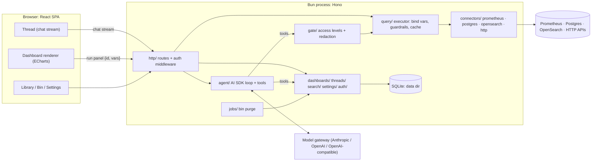
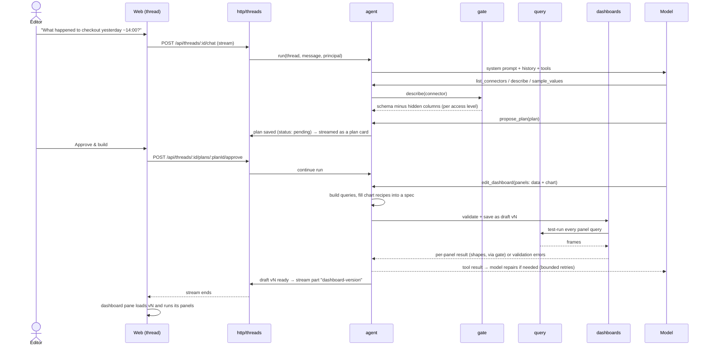

# Architecture

How querent is laid out and how the pieces talk to each other. The design is deliberately
simple: one Bun process, one SQLite file, one React SPA. The complexity budget goes to the parts
that deserve it: the spec, the access gate and the agent loop.

The spec format is in [dashboard-spec.md](dashboard-spec.md).

---

## 1. The big picture



The two paths that matter:

- **Authoring** (costs tokens): thread → agent → tools → gate → query → connector. The model only
  ever receives what the gate returns.
- **Rendering** (no model): dashboard → `POST /api/panels/run` → query → connector → data frames
  → browser → ECharts. The gate is not involved because the output goes to a human who is allowed
  to see it (their role permits opening the dashboard).

## 2. Repository layout

```
.
├── apps/
│   ├── server/                      @querent/server
│   │   └── src/
│   │       ├── main.ts              bootstrap: config → migrate → jobs → Bun.serve
│   │       ├── app.ts               Hono app: middleware, /api routes, static SPA + fallback
│   │       ├── config/              env parsing (Zod), defaults, data dir
│   │       ├── lib/                 leaf utilities: errors, logger, ids, clock
│   │       ├── http/                route modules + middleware (auth, errors, request id)
│   │       ├── auth/                modes none|basic|oidc, sessions, Principal, role checks
│   │       ├── agent/               AI SDK: provider factory, prompts, tools, run loop
│   │       ├── gate/                what the model may see: access levels, hidden columns, error sanitizing
│   │       ├── query/               executor: variable binding, guardrails, timeouts, result cache
│   │       ├── connections/         configured connectors: CRUD, sealed secrets, open instances, schema cache
│   │       ├── connectors/          registry + _shared/ (Frame, interface) + one folder per kind
│   │       │   ├── _shared/
│   │       │   ├── prometheus/
│   │       │   ├── postgres/
│   │       │   ├── opensearch/
│   │       │   └── http/
│   │       ├── dashboards/          versions, validate, pin, variants, bin, diff; queries/ (builders,
│   │       │                        saved and raw queries) and panels/ (edits: data + chart, layout)
│   │       ├── threads/             threads, messages, plans (state machine)
│   │       ├── search/              FTS5 queries
│   │       ├── settings/            typed settings store (auth, gateway, retention)
│   │       ├── secrets/             encrypt/decrypt credentials at rest
│   │       ├── jobs/                in-process scheduler; bin purge
│   │       └── db/                  bun:sqlite client, migrations, repositories
│   └── web/                         @querent/web
│       ├── index.html
│       ├── vite.config.ts           dev proxy /api → :3000
│       └── src/
│           ├── main.tsx
│           ├── app/                 router, session, route guards, layout with nav rail, error page
│           ├── routes/              thin route modules; compose features
│           ├── features/
│           │   ├── thread/          chat stream, plan card, diff cards, composer, @mentions
│           │   ├── dashboard/       dashboard pane, variables bar, panels, inspector
│           │   ├── library/         search, tag filters, cards
│           │   ├── bin/
│           │   ├── connectors/
│           │   └── settings/        gateway, auth, retention
│           ├── charts/              view + datasets → ECharts option: preparations, tokens, maps
│           ├── ui/                  presentational primitives (Button, Card, Pill, Tabs, Switch…), brand
│           └── lib/                 typed API client (from shared contract), utils
├── packages/
│   └── shared/                      @querent/shared  (isomorphic: browser + Bun)
│       └── src/
│           ├── spec/                dashboard spec Zod schemas + types
│           ├── api/                 endpoint contracts (method, path, input, output)
│           ├── formatters/          named formatter library (pure functions)
│           ├── dataset/             the data contract: datasets, shapes, reshaping, from frames
│           ├── chart-recipes/       chart recipes by family, their schema, fill, samples
│           ├── queries.ts           query builders, saved queries, a thread's queries
│           ├── frames.ts            result frame types
│           ├── roles.ts             Role, capability matrix
│           └── index.ts
├── dev/                             docker-compose + seed data for local sources
├── evals/                           prompt → expected-dashboard checks against dev sources
├── docs/                            architecture, dashboard spec, brand, contributing, security
├── scripts/                         remark-check-formatted.mjs (the docs:check plugin)
├── AGENTS.md · CLAUDE.md            conventions for anyone writing code here
├── Dockerfile · .tool-versions      the image, and the Bun version CI and the image use
├── biome.json · knip.json · .dependency-cruiser.cjs · tsconfig.base.json
├── .remarkrc.mjs · commitlint.config.js · .releaserc.json · .husky/
└── .github/  dependabot.yml · workflows/quality.yml · workflows/release.yml · octocov.yml
```

## 3. Server modules and who may import whom

The allowed dependencies are enforced by `.dependency-cruiser.cjs`. The table summarizes
them.

| Module                | Responsibility                                              | May import                                                          | Must not import                                 |
| --------------------- | ----------------------------------------------------------- | ------------------------------------------------------------------- | ----------------------------------------------- |
| `lib/`                | errors, logger, ids                                         | nothing internal                                                    | everything else                                 |
| `connectors/<kind>/`  | talk to one kind of source; return Frames                   | `connectors/_shared`, `lib`, `@querent/shared`, its own driver      | other connector kinds, anything else in the app |
| `query/`              | bind variables, enforce guardrails, run, cache              | `connectors`, `lib`, shared                                         | `agent`, `http`                                 |
| `gate/`               | turn query results and schemas into what the model may see  | `query`, `connectors/_shared`, `settings`, `lib`                    | `agent`, `http`                                 |
| `agent/`              | AI SDK loop, prompts, tool definitions                      | `gate`, `dashboards`, `threads`, `search`, `settings`, `lib`        | **`connectors`, `query`, `db`**                 |
| `dashboards/`         | validate, store, pin and run specs                          | `db`, `query`, `lib`, shared; connectors through injected functions | `http`, `agent`, `connections`, `connectors`    |
| `threads/`, `search/` | domain logic                                                | `db`, `lib`, shared                                                 | `http`, `agent`                                 |
| `settings/`           | typed settings sections; the model key, sealed              | `db`, `secrets`, `lib`, shared                                      | `http`, `agent`                                 |
| `connections/`        | configured connectors: CRUD, sealed secrets, open instances | `db`, `secrets`, `connectors`, `gate`, `query` types, `lib`         | `http`, `auth`, `agent`                         |
| `db/`                 | the only user of `bun:sqlite`                               | `lib`                                                               | —                                               |
| `http/`               | validate, authorize, call services, stream                  | services, `agent`, `auth`                                           | `connectors`, `db`                              |
| `auth/`               | modes, sessions, Principal                                  | `settings`, `db` via repositories, `lib`                            | `agent`                                         |

Library ownership rules: only `agent/` imports `ai` or `@ai-sdk/*`, only `db/` imports
`bun:sqlite`, and only `connectors/opensearch/` imports the OpenSearch client. Postgres uses
the `postgres` driver and Prometheus uses `fetch`.

## 4. Web modules

- `routes/` compose features. Features never import routes (rule `features-not-to-routes`).
- Features reach each other only through their `index.ts(x)`
  (`features-talk-through-their-index`). The thread screen draws its draft with the
  `DashboardCanvas` and `usePanelRunData` that `features/dashboard` exports, so a draft renders
  exactly like a pinned dashboard.
- `charts/` is the only place that imports ECharts (`echarts-only-in-charts`). It exposes
  `<Chart spec={panel} frames={frames} />` and nothing about ECharts leaks out.
- `@ai-sdk/react` is used only in `features/thread` (`ai-react-only-in-thread`).
- **Thread screen.** The conversation streams through `useChat`, which posts only the new message
  to `/api/threads/:threadId/chat`; the server holds the conversation. Approving a plan, undoing
  and pinning go through the route action, and approving then continues the assistant message.
  The version the draft pane shows lives in `?v=`, so a reload or a shared link keeps it. The new-thread screen is one question box in the middle of the screen, with past threads (each deletable) in a menu at the top right. It creates the thread and hands the first question over in `?ask=`, which the thread screen sends
  once and removes. Each question carries the browser's time zone.
- `ui/` is purely presentational (`ui-is-dumb`). `ui/brand.tsx` draws the logo, icon and mark
  from [`docs/brand/`](brand/README.md); `public/` holds the favicons and the web app manifest.

**Routes** (React Router data mode):

| Path                                                       | Screen                                                     | Min role |
| ---------------------------------------------------------- | ---------------------------------------------------------- | -------- |
| `/`                                                        | redirect → `/library` (viewer) or `/threads/new` (editor+) | viewer   |
| `/threads/new`, `/threads/:threadId`                       | Plan, Build and refine, Variant                            | editor   |
| `/library`                                                 | Library                                                    | viewer   |
| `/d/:dashboardId`                                          | Pinned view, latest pinned version                         | viewer   |
| `/d/:dashboardId/v/:version`                               | a specific version                                         | viewer   |
| `/d/:dashboardId/v/:version/panels/:panelId`               | resource route: one panel's run, for fetchers              | viewer   |
| `/d/:dashboardId/v/:version/options/:name`                 | resource route: a variable's options, for fetchers         | viewer   |
| `/bin`                                                     | Bin                                                        | editor   |
| `/connectors`, `/connectors/:connectorId`                  | Connectors: list, access level, guardrails, schema         | admin    |
| `/connectors/new`, `/connectors/:connectorId/edit`         | add and edit a connection                                  | admin    |
| `/connectors/:connectorId/health`                          | resource route: the connection test, for fetchers          | admin    |
| `/settings/model`, `/settings/auth`, `/settings/retention` | Settings                                                   | admin    |
| `/settings/usage`                                          | Usage: tokens, cost and pinned views per day, by model     | admin    |
| `/settings/queries`                                        | Queries: builders on or off, your own with placeholders    | admin    |
| `/settings/charts`                                         | Charts: every chart recipe drawn from its sample           | admin    |
| `/settings`                                                | redirect → `/settings/model`                               | admin    |
| `/ui`                                                      | UI kit: every `ui/` primitive, for checking the visuals    | viewer   |
| `/login`                                                   | only in `basic` / `oidc` modes                             | —        |

Route loaders fetch through the typed API client. The root loader loads the session
(`GET /api/me`, once per page load). Without a session, every screen redirects to
`/login?next=<path>`. Each screen's loader checks its minimum role (`app/route-access.ts`) and
throws a 403, which the error page shows as "Your role can't do this" inside the layout, so the
rail stays. A test drives every screen with every role through the real route tree.

Screens change data through route actions: forms and fetchers submit JSON, the action calls the
API, and React Router reloads the route data afterwards. A refusal the user can act on
(`bad_request`, `source_failed`) comes back as action data with the issues by field; other errors
go to the error page. TanStack Query is added with the first screen that caches server data.

## 5. Core flows

### 5.1 Ask → plan → approve → build



**The thread state machine is enforced server-side:**

```
idle ──propose_plan──▶ plan_pending ──approve──▶ building ──done──▶ ready
  ▲                         │ reject/edit                               │
  └─────────────────────────┴────────────── new message ◀──────────────┘
```

`edit_dashboard` refuses to write unless the thread is `building`, or `ready` with the change
scoped to existing panels (the small-edit path). If the AI SDK's tool-approval feature fits this
flow cleanly, use it for the UX, but the state check in `threads/` stays the source of truth.

### 5.2 Render a panel (no model)

1. The dashboard pane knows `{dashboardId, version}`, the variable values and the time range
   (`now-6h`, or ISO timestamps).
2. For each panel: `POST /api/panels/run {dashboardId, version, panelId, variables, time}`.
3. The server loads the spec. Viewers may run pinned versions only; a draft is "not found" to them.
4. `dashboards/` resolves the time range and the variables against the spec's declarations: a
   custom value must be an option, a single-value variable takes one value, a text value must
   match its pattern. Query-backed values are bound as they come, since binding is safe; "All"
   (`$__all`) and a missing default run the variable's source query for the options.
5. Each query goes to `query/`, which binds it, applies the connector's guardrails, runs it with a
   timeout and caches the frames for 15 s by connector, bound query and time range. The chart's
   markers run their annotation queries the same way and come back as `{time, text}` points.
6. The browser receives `{ time, queries: [{ refId, frames, error }], markers, durationMs }`, and
   `charts/` builds the ECharts option.

Panels run in parallel. Each query has its own outcome with a safe error message, so one failing
query never fails the rest of the panel, and one failing panel never blanks the dashboard.
`POST /api/variables/options` lists a query-backed variable's options the same way.

### 5.3 Pin

`POST /api/dashboards/:id/pin {version}` (editor+):

1. Validate the version again (connectors may have changed) and test-run every panel with the
   default variables. A dashboard with a failing query can't be pinned; the refusal lists each
   failing query by path.
2. The _metadata_ model writes the title, description and tags. **This is best effort**: if the
   model is unavailable, pin anyway with the thread title and let tags be empty.
3. Mark the version pinned (the SQLite trigger now blocks updates to it), set
   `dashboards.pinned_version_id`, and upsert the FTS row.

### 5.4 Make variant

`POST /api/dashboards/:id/variants` creates a thread and a new dashboard whose draft v1 is a copy
of the parent's pinned spec, with `parent_dashboard_id` and `parent_version` set. The agent's system
prompt for that thread includes "this is a variant of X". The plan tool then describes changes as
CHANGED / NEW / SAME against the parent, computed server-side by `dashboards/diff`.

### 5.5 Bin and purge

- `POST /api/dashboards/:id/bin` (editor+) sets `deleted_at`, removes the FTS row, and writes an
  audit event.
- `POST /api/bin/:id/restore` (editor+) clears `deleted_at` and re-indexes.
- `DELETE /api/bin/:id` and `DELETE /api/bin` (admin) delete permanently.
- `jobs/purge` runs hourly (and once at startup): if `retention.binDays` is set, it purges
  dashboards where `deleted_at < now − binDays`. Purging deletes the dashboard and all its versions
  in one transaction. Variants keep their `parent_dashboard_id`, and the UI renders "parent deleted".

## 6. The agent

### Tools

Every tool validates its input with Zod, runs as the thread's person, and returns compact JSON.
The data tools answer only through the gate's model view (`gate/model-view.ts`), so what a result
shows depends on the connector's access level.

| Tool                                                | Returns                                                                                                   | Notes                                                                                    |
| --------------------------------------------------- | --------------------------------------------------------------------------------------------------------- | ---------------------------------------------------------------------------------------- |
| `describe(connector, scope?)`                       | entities and fields minus hidden ones, at most 60, and how many more matched                              | From the schema cache; read from the source when never read.                             |
| `sample_values(connector, entity, field, limit≤50)` | distinct values                                                                                           | Level 2 and up. Refuses hidden and high-cardinality fields.                              |
| `test_query(connector, query, variables?, time?)`   | L1: ok or error. L2: fields, types, row counts. L3: plus summaries. L4: plus rows                         | Default range `now-6h` to `now`. Errors are safe messages below L4.                      |
| `ask_person(question, options)`                     | `{ asked, next }`                                                                                         | 2 to 4 options, shown as buttons; the run then stops and the answer is the next message. |
| `propose_plan(plan)`                                | `{ planId, status, next }`                                                                                | Streams a `data-plan` part and moves the thread to `plan_pending`; the run then stops.   |
| `edit_dashboard(edit)`                              | the new version, each panel's test result, and the new panels left out; or the issues and failures to fix | Panels of data and a chart; see "Writing a version".                                     |
| `chart_recipe(id)`                                  | a chart recipe's roles, variants, pitfalls and option template                                            | The instructions list every recipe in one line; this reads one in full.                  |

`search_library` and `get_dashboard` arrive with the library and variants.

### Reuse before generating

On a thread's first question, before any model runs, the server searches the pinned dashboards
(`dashboards/pinned.ts`): words shared with each one's title (counting double), description, panel
titles and connectors, at most three matches. When some match, the answer is a matches card and
one sentence, with no model call and no tokens. The person can:

- open a match,
- start from it (`POST /api/threads/:id/start-from`): a copy of its pinned version becomes the
  thread's draft, with its lineage recorded, and the thread is ready for edits,
- or build a new one, which continues the answer: the model runs, told the person saw the matches
  and wants a new dashboard.

The search reads the pinned specs in memory. The full-text index arrives with the library.

### The catalog

The model starts every turn knowing the data: the instructions carry a catalog of the connectors
(`gate/catalog.ts`), built by the gate from the cached schemas. Each connector gets a header with
its kind, query language and access level, then one line per table (columns, types, row count) or
metric (label names), at most 80 per connector, with a note to call `describe` for the rest.

From level 2, fields with at most 20 distinct values also list their values, sampled through the
same gate function as `sample_values`. A Prometheus label is sampled once per connector, since its
values are counted across metrics. At most 30 fields are sampled per connector, and sampled values
are kept for ten minutes. Level 1 shows no values and no row counts, and hidden fields never
appear. The catalog replaces exploring call by call, which cost a model request per step.

A connector with more than 40 tables or metrics is trimmed to what the thread is about
(`gate/catalog-focus.ts`): the entities whose names, descriptions or field names share words with
the person's messages, at most 25, in catalog order, or the first 25 when none match. The note
under them says `describe` reaches the rest. The words come from all the person's messages, so the
catalog stays the same from turn to turn and the providers' cache keeps working.

### Writing a version

The model never writes a spec, and rarely a query. Each panel of an `edit_dashboard` edit is
**data** and a **chart**, two independent layers joined by one data contract: every query result
becomes a table of typed columns and rows (`Dataset`, `@querent/shared/dataset`), which maps
directly onto an ECharts `dataset`.

- **Data** (`dashboards/queries/`) is a query builder, a saved query or a raw query. Each says
  what it returns: a shape of table and its columns.
  - **Query builders.** PromQL: `rate`, `ratio` (such as 5xx over all requests), `latency`
    (every percentile in one query, labelled `quantile`), `gauge`, `top`. SQL: `sql-series`,
    `sql-breakdown`, `sql-stat`, `sql-rows`. Names are checked against strict patterns and
    quoted, literals are escaped, and variables stay bound references.
  - **Saved queries.** An admin saves a query with typed placeholders (`{{name}}`: metric, label,
    table, column, value or duration) and the shape it returns. The model asks for it by id with a
    value per placeholder. Each value is checked and written for its kind like the builders write
    theirs.
  - **Raw queries**, for data no builder gives.
- **Shapes.** `long` (x, series, value), `wide` (x, a column per series), `single`, `values` (raw
  numbers to bin), `matrix`, `hierarchical`, `graph`, `geo`, `ohlc` and `rows`. A Prometheus
  range result is long: the time, a column per label, `series` and `value`.
- **Charts** (`@querent/shared/chart-recipes/`) are presentation only: a recipe names the shape it
  draws and the role of each column (`x`, `series`, `y`, `category`, `value`…), carries an ECharts
  option template with `@role`, `@format` and theme tokens, variants as small option patches, its
  pitfalls, and a small fake sample it draws on its own. No recipe names a connector or a query
  language; a test checks it. Thirty-two recipes cover trends, comparisons, distributions,
  composition, relationships, flows, maps, numbers, tables and small multiples.
- **Filling.** The panel's chart choice (`recipe`, `variants`, `roles`, `unit`, `options`) is
  filled into the view (`fillView`): variants and the model's option changes merged in order, the
  unit's named formatter put where the recipe asks. The view keeps the filled option, how the
  adapter prepares the data (`prepare`) and the column of each role, so a pinned chart draws the
  same whatever the catalogue becomes.
- **Which queries.** Admins switch builders off (`GET/PUT /api/settings/queries`). A thread uses
  the default set (the builders switched on and every saved query), a set chosen when it starts,
  or none (free style: raw queries only), stored on the thread (`POST /api/threads` with
  `queries`). The tool schema and the guide list only those.
- **Which charts.** Every chart recipe is offered to the agent until an admin switches it off in
  Settings → Charts (`charts` settings section, `GET/PUT /api/settings/charts`); at least one
  stays on. The tool schema, the guide and `chart_recipe` offer only those.
- **Layout.** Existing panels keep their place; a rebuilt panel keeps its id and place; new
  panels are packed in reading order into rows below, as wide as asked or as their kind usually
  is (numbers a quarter, time charts full width, tables and category charts half).
- **Markers.** Deploy markers are one annotation (`markers`) put on every time chart.

The edit's schema is the tool's input schema, so providers that constrain tool input keep the model
to it. An edit then goes through one pipeline (`agent/build-tools.ts`, `agent/write-version.ts`):

1. The thread's state machine decides: after an approved plan, or in a ready thread when the set of
   panels stays the same.
2. The spec is built and checked, views aside, then every panel is test-run with its defaults.
3. Each built chart is completed from its first query's result (`dashboards/panels/complete.ts`):
   roles the model left out take the first fitting columns, and roles naming a column the result
   has not, or of the wrong type, become the panel's problems.
4. With the "test-run every query" switch on, a version is saved only with panels that work. New
   panels whose queries fail or whose chart does not fit their data are left out and reported, so
   the model re-adds only those. Any other failure saves nothing. Either way the counter of
   failed writes goes up. The results go back to the model through the gate.
5. The first version creates the thread's dashboard; later ones add versions. Each streams a
   `data-version` part, and a `data-diff` part with the changed panels.

**Settings → Queries** shows each builder's fields, an example, the query it becomes and what it
returns (`GET /api/settings/queries/guide`, built by the same code as the agent's requests). A
preview builds one data request, runs it on a chosen connector and time range, and draws it with
the chart that suits it or any recipe, with no model and nothing saved
(`POST /api/settings/queries/preview`). A saved query being edited goes along with its preview.
**Settings → Charts** draws every recipe and variant from its sample through the dashboards'
panel code, each with its switch for the agent.

### Prompting

The instructions are assembled per turn (`agent/prompt.ts`): a persona, the rules that always
hold, the facts of the turn, and last what the thread's phase asks for. The facts are the time now,
the catalog of the connectors, the current draft, the panels the person mentions (the user
message's `metadata.mentions`), and their time zone (`metadata.timeZone`), so "yesterday around
14:00" means their 14:00.

The persona is a calm, direct colleague: a few plain sentences per message, a sentence to the person
before its tool calls, at most one question, and a question always offers concrete choices from the
catalog. Before the first plan it asks one question, unless the person already said what to show,
for which service or table, and over which time. It never asks in words for approval: the plan
card has the buttons. The thread's state sets the phase
(`agent/phases.ts`), and each phase offers only its tools:

| Phase    | Thread states          | Tools                                                                       | Adds to the instructions                          |
| -------- | ---------------------- | --------------------------------------------------------------------------- | ------------------------------------------------- |
| planning | `idle`, `plan_pending` | `describe`, `sample_values`, `ask_person`, `propose_plan`                   | one question before the first plan, then the plan |
| building | `building`             | `describe`, `sample_values`, `test_query`, `chart_recipe`, `edit_dashboard` | the panel guide, the plan                         |
| editing  | `ready`                | all of the above, `ask_person` and `propose_plan`                           | the panel guide                                   |

Planning never runs a query: the build test-runs every query anyway. The panel guide only comes
once there is something to write, so planning requests stay short. It lists the thread's builders
with the columns each returns, raw and saved queries, the shapes of data, one line per chart
recipe, and the query guide of each connector kind in use.

### Keeping requests small

Every request carries the whole conversation, so what the model rereads is compacted
(`agent/compact.ts`); the stored conversation keeps everything.

- Turns before the person's latest message keep their text, and each tool call becomes one line,
  such as `[earlier tool call] describe(events): 2 entities`. Data and reasoning parts go.
- Within a run, before each step, older edits sent to `edit_dashboard` are
  elided and older results over 400 characters become the same one-line summary. The latest call
  and its results stay whole, so a repair sees exactly what failed.

Providers bill a repeated start of a request at a fraction of the input price (prompt caching), so
the instructions put what lasts first: the persona, the rules, the guides and the catalog, then
the time, the draft, the mentions and the phase's rules (`instructionParts`). OpenAI and Gemini
cache a stable start on their own. Anthropic caches only up to marked points (`agent/cache.ts`):
the lasting instructions are a separate system block marked as a cache point, and before each
step the last message is marked too, so the next step reads the conversation so far from the
cache. Earlier marks are removed, since Anthropic allows four.

### Reasoning effort

With the "keep the model's reasoning short" switch on (the default), each call asks for little
reasoning (`reasoningFor` in `agent/model.ts`): `none` for Anthropic, whose models think only when
asked; `low` for OpenAI and OpenAI-compatible gateways. Mistral maps every effort to its highest,
so it gets none. The connection test sends the same setting, so a gateway that rejects it fails
the test; turning the switch off sends the provider's default.

### Runs and limits

- `POST /api/threads/:id/chat` takes one message. A user message is appended to the stored
  conversation; an assistant message may only name one the thread already has, to continue it
  after an approval, and the stored copy is used, so a client cannot forge the agent's side.
- One run per thread at a time. A run stops when a plan waits for approval, when the agent asked
  the person a question, when it has made the maximum number of tool calls (setting, default 25),
  or when failed writes reach the repair attempts (setting, default 3).
- Each job has its model; an empty one means the build model. Planning turns (the conversation,
  questions and plans) use the plan model, building and editing use the build model, and once a
  write fails in a run, its later steps use the repair model. So a cheap model can talk and plan
  while a strong one builds.
- A model call that fails with a 429 is retried twice, which rides out a per-minute limit. A 429
  that says a quota is spent for the day (Gemini's `PerDay` quotas, OpenAI's `insufficient_quota`)
  is not retried: a middleware on every model (`agent/quota.ts`) turns it into an error that tells
  the person to try later or pick another model.
- Each answer's metadata holds its usage by model: fresh input, cache reads, cache writes and
  output (`agent/usage.ts`). A run that continues an answer after an approval adds to it. The
  thread shows each answer's tokens and cost under it, and the thread's total in its header,
  priced from the list prices in `@querent/shared` (`modelPrices`, dated). A model without a price
  is named instead.
- Each run adds its tokens to the thread, step by step, so a failed run still counts. A thread over its token budget (setting, default 200k)
  refuses new runs with a message that says so.
- Plan approval is a separate request (`POST /api/threads/:id/plans/:planId/approve`) that moves the
  thread to `building`. The client then continues the assistant message, and the turn's
  instructions tell the model to build the approved plan.

### Streaming

The chat endpoint answers with the AI SDK UI message stream (`createUIMessageStream` around
`streamText`). Custom parts carry `data-plan` (the plan card), `data-version` (the right pane moves
to that version) and `data-diff` (the change card); their schemas are in `@querent/shared`. The
whole conversation, tool parts included, is stored when the run ends, even if the person leaves, so
a reload shows the same thread.

## 7. Connectors

A **connector kind** is a kind of source, such as PostgreSQL. A **connector** is one configured
source of a kind, such as `postgres-orders`. Kinds are built to be added: each lives in its own
folder under `connectors/`, declares itself with `defineConnector`, and uses the core only through
the **connector kit**, `connectors/_shared/index.ts` (dependency-cruiser rule
`connector-kinds-use-the-kit`). [`connectors.md`](connectors.md) walks through adding a kind.

```ts
// connectors/<kind>/<kind>-connector.ts (shape)
export const exampleConnector = defineConnector({
  kind: 'example',                    // stable identifier, stored with each connector
  displayName: 'Example',
  description: 'One sentence shown when an admin picks a kind.',
  language: 'sql',                    // the core binds variables for this language
  configSchema: z.object({ … }),      // host, database, TLS: plain text; `.meta()` titles the form
  secretSchema: z.object({ … }),      // credentials: encrypted at rest, never returned
  describeTarget: (config) => '…',    // optional: where it points, shown under its name
  open: ({ config, secret }) => ({    // must not contact the source yet
    test, describe, sampleValues, execute, close,
  }),
})
```

- The app builds the add and edit forms from the two schemas (JSON Schema), so a kind ships no UI.
- `describeTarget` returns one line such as `postgres://dash_ro@replica:5432/orders`. It never
  includes credentials.
- A kind never sees a query template or raw variable values: `execute` receives a **bound query**
  (`SqlQuery` or `PromqlQuery`) and an **execution context** with the refId, the abort signal, the
  timeout, the row limit and the time range. Binding, guardrails and the gate stay in the core,
  whatever the kind does.
- Failures are `ConnectorError`s with a code and a `safeMessage` that quotes no data. The model sees
  only the safe message below access level 4.
- `createFrameBuilder` lays rows out in columns and handles the row limit and truncation.
- `connectors/_shared/test/conformance.ts` is the suite every kind runs in its test file: static
  checks of the declaration, and live checks against a source (health, schema, valid frames, row
  limit, abort, error messages, sample limit). `test/memory-connector.ts` is an in-memory kind for
  tests.

Every connector returns **Frames** (`packages/shared/src/frames.ts`), a columnar format like
Grafana's data frames:

```ts
type Field = { name: string; type: 'time' | 'number' | 'string' | 'boolean'; labels?: Record<string, string>; unit?: string }
type Frame = { refId: string; name?: string; fields: Field[]; values: unknown[][]; meta: { rowCount: number; truncated: boolean; durationMs: number } }
```

- **Prometheus:** the HTTP API over `fetch`, read endpoints only, with no auth, a bearer token or
  basic authentication. A range query returns one frame per series (labels on the value field, at
  most 1000 series); an instant query returns one table with a column per label and `Value`.
  Non-finite values become `null`. `describe` lists metric names with their type from the metadata
  API and each metric's label keys with value counts. Quoted literals are removed from the safe
  message of an error, because label values can be data.
- **Postgres:** the `postgres` driver. `Bun.sql` 1.3 returns no column names or types (a query with
  no rows has no fields) and cannot cancel a running statement; `postgres` gives the row
  description and sends a real cancel request. Every query runs in a `read only` transaction with
  `SET LOCAL statement_timeout`, wrapped in `LIMIT maxRows + 1`. `describe` reads `pg_catalog`
  (comments, `reltuples`, `pg_stats.n_distinct`), never table data. SQLSTATEs map to connector
  errors; data errors (class 22) never quote the value.
- **OpenSearch:** the official client (`@opensearch-project/opensearch`), only in
  `connectors/opensearch/`. The query body is DSL JSON with structural variables. `describe` =
  index patterns + mappings. A spike (client 3.9.0, Bun 1.3.14, OpenSearch 3.8.0) found:
  - `info`, `bulk`, `indices.getMapping` on a pattern, and `search` with a range filter, a
    `date_histogram` and nested `terms` aggregations all work under Bun.
  - Cancelling works through the returned promise's `abort()` (`RequestAbortedError`); the
    `signal` and `abortController` request options are ignored, under Node too. The connector
    wires the execution signal to `abort()`.
  - `requestTimeout` stops a request on the client side. The `timeout` search parameter is best
    effort on the server and returns partial results with `timed_out`.
  - Errors are `ResponseError`s with `meta.statusCode` and `meta.body.error.type`. The reason text
    quotes query values, so the safe message uses the error type only.
  - OpenSearch has no read-only transaction: the connector calls read APIs only, and the
    credentials should hold a read-only role.
- **HTTP JSON:** GET only by default. The response is mapped to frames with a small declarative
  extractor (JSON pointer paths), not code.

### Query engine (`query/`)

`createQueryExecutor(cache).run(source, request)` runs one template against a connector the caller
resolved (`QuerySource`: the open instance, its language, guardrails and a version that changes with
its settings).

1. The time range is checked against `maxRangeDays`.
2. The template is bound for its language (`query/sql-binder.ts`, `query/promql-binder.ts`):
   - **SQL:** `:name` becomes `$n`, a list becomes `$n, $m`, an empty list `NULL`; `:__from` and
     `:__to` are the time range. Strings, quoted identifiers, dollar quotes, comments and `::` casts
     are never rewritten, and `$1` in a template is refused. The template must be one statement
     starting with SELECT, WITH, VALUES or TABLE, without INSERT, UPDATE, DELETE, MERGE, TRUNCATE,
     DROP, ALTER, CREATE, GRANT, REVOKE, COPY or INTO outside literals.
   - **PromQL:** `$name` and `${name}` are replaced only inside the string value of a label matcher,
     escaped for the string, and for `=~` and `!~` escaped as a regular expression unless the
     variable is declared as one. In code only `$__interval`, `$__range`, `$__rate_interval` and
     interval variables are allowed: an interval variable's value must be one of its options and is
     checked again against the duration pattern (`15s`, `5m`, `1h`) when bound. The step is a
     duration or an interval variable, raised so the range fits in the row limit (at most 11000
     points).
3. The connector runs the bound query with an abort signal that fires at `timeoutMs` or when the
   caller gives up. The executor also races the signal, so a connector that ignores it cannot hold
   the caller.
4. Every frame is checked (`frameProblems`); invalid frames are a connector error.
5. The frames are cached for 15 seconds by connector, version, refId, bound query and time range.

Failures are `QueryError`s (`invalid`, `guardrail`, `timeout`, `connector`) with a safe message.
Injection tests cover both binders, and integration tests run the attacks against the dev sources.

### Access gate (`gate/`)

Everything the model receives from a connector passes through `gate/`. Its functions return
model-ready results and never throw.

| Access level          | `modelSchema` (describe)                                           | `testQueryForModel` (test-run)                                                                      |
| --------------------- | ------------------------------------------------------------------ | --------------------------------------------------------------------------------------------------- |
| 1 schema only         | entities, fields, types, descriptions                              | `{ ok }`, or the safe error message                                                                 |
| 2 schema and metadata | also row estimates, and distinct counts of fields with ≤ 50 values | also the shape: fields, types, row counts, label names (not values)                                 |
| 3 aggregates          | same                                                               | also labels with values and per-field summaries: min, max, mean, spikes (> mean + 3σ), top 5 values |
| 4 full access         | same                                                               | also the rows, at most 500, and the source's own error text                                         |

- Hidden fields (`entity.field`, or a bare `field`) are removed at every level: from the schema, and
  from results by column name and label name. Results do not say which table a column came from,
  so a query that renames a hidden column gets past the name match. A database role or view that
  cannot read the column is the hard guarantee; an integration test shows the limit.
- Admin-written descriptions replace the source's.
- `gate/model-view.ts` is what the agent's data tools call: the connector list with what each level
  means, `describe` (cut to a scope, at most 60 entities), `sample`, `testQuery` and the shaping of
  saved panels' results. The gate declares what it needs from the connectors service
  (`ConnectorAccess`) and the bootstrap hands it over, so the gate never imports `connections/`.
- `sampleForModel` lists distinct values from level 2 only, never for a hidden field, and never
  when the field has more than the asked number of values (at most 50).
- `gate/leak.test.ts` feeds random marker values through levels 1 and 2 (rows, unusual numbers,
  labels, frame names, error texts) and checks none reaches the model.

Credentials are stored encrypted. A connector config holds everything else: URL, database,
TLS options, the access level, hidden columns, guardrails, and table and field descriptions.

## 8. Data model (SQLite)

```sql
-- settings: typed key/value, validated by Zod in settings/
CREATE TABLE settings (key TEXT PRIMARY KEY, value TEXT NOT NULL, updated_at INTEGER NOT NULL);

CREATE TABLE users (                                   -- basic auth mode only
  id TEXT PRIMARY KEY, username TEXT UNIQUE NOT NULL, name TEXT,
  password_hash TEXT NOT NULL, role TEXT NOT NULL CHECK (role IN ('viewer','editor','admin')),
  disabled INTEGER NOT NULL DEFAULT 0, created_at INTEGER NOT NULL);

CREATE TABLE sessions (
  id TEXT PRIMARY KEY, subject TEXT NOT NULL, name TEXT, role TEXT NOT NULL,
  mode TEXT NOT NULL, expires_at INTEGER NOT NULL, created_at INTEGER NOT NULL);

CREATE TABLE connectors (
  id TEXT PRIMARY KEY, name TEXT UNIQUE NOT NULL, kind TEXT NOT NULL,
  config TEXT NOT NULL,             -- JSON, non-secret
  secret BLOB NOT NULL,             -- AES-GCM sealed, bound to the connector id
  access_level INTEGER NOT NULL DEFAULT 2 CHECK (access_level BETWEEN 1 AND 4),
  hidden_fields TEXT NOT NULL DEFAULT '[]',
  guardrails TEXT NOT NULL,         -- JSON: timeoutMs, maxRows, maxRangeDays, statements
  descriptions TEXT NOT NULL DEFAULT '{}',
  created_at INTEGER NOT NULL, updated_at INTEGER NOT NULL);

CREATE TABLE schema_cache (connector_id TEXT PRIMARY KEY REFERENCES connectors(id) ON DELETE CASCADE,
  snapshot TEXT NOT NULL, read_at INTEGER NOT NULL);

CREATE TABLE threads (
  id TEXT PRIMARY KEY, title TEXT, state TEXT NOT NULL DEFAULT 'idle',
  dashboard_id TEXT,                -- the dashboard this thread authors
  provider_id TEXT,                 -- the model provider; NULL or a removed one means the default
  created_at INTEGER NOT NULL, updated_at INTEGER NOT NULL);

CREATE TABLE messages (
  id TEXT PRIMARY KEY, thread_id TEXT NOT NULL REFERENCES threads(id) ON DELETE CASCADE,
  role TEXT NOT NULL, parts TEXT NOT NULL,   -- AI SDK UI message parts, JSON
  actor TEXT, created_at INTEGER NOT NULL);

CREATE TABLE plans (
  id TEXT PRIMARY KEY, thread_id TEXT NOT NULL REFERENCES threads(id) ON DELETE CASCADE,
  body TEXT NOT NULL, status TEXT NOT NULL CHECK (status IN ('pending','approved','rejected','superseded')),
  decided_by TEXT, created_at INTEGER NOT NULL, decided_at INTEGER);

CREATE TABLE dashboards (
  id TEXT PRIMARY KEY, title TEXT NOT NULL, description TEXT, tags TEXT NOT NULL DEFAULT '[]',
  parent_dashboard_id TEXT,          -- no FK: parent may be purged
  parent_version INTEGER,
  pinned_version_id TEXT,
  deleted_at INTEGER,                -- bin
  created_at INTEGER NOT NULL, updated_at INTEGER NOT NULL);

CREATE TABLE dashboard_versions (
  id TEXT PRIMARY KEY, dashboard_id TEXT NOT NULL REFERENCES dashboards(id) ON DELETE CASCADE,
  version INTEGER NOT NULL, spec TEXT NOT NULL, change_summary TEXT,
  pinned_at INTEGER, actor TEXT, created_at INTEGER NOT NULL,
  UNIQUE (dashboard_id, version));

-- pinned versions are immutable, whatever the application code does
CREATE TRIGGER pinned_versions_are_immutable
BEFORE UPDATE OF spec, version, dashboard_id ON dashboard_versions
WHEN OLD.pinned_at IS NOT NULL
BEGIN SELECT RAISE(ABORT, 'pinned dashboard versions are immutable'); END;

CREATE VIRTUAL TABLE dashboards_fts USING fts5(
  dashboard_id UNINDEXED, title, description, tags, queries, tokenize = 'porter unicode61');

CREATE TABLE audit_log (
  id TEXT PRIMARY KEY, at INTEGER NOT NULL, actor TEXT NOT NULL, action TEXT NOT NULL,
  target TEXT, detail TEXT);

-- the usage ledger: no foreign keys, it outlives the threads and dashboards it names
CREATE TABLE usage_events (
  id TEXT PRIMARY KEY, at INTEGER NOT NULL, kind TEXT NOT NULL,   -- 'model' | 'pinned_view'
  thread_id TEXT, dashboard_id TEXT, provider TEXT, model TEXT, job TEXT,
  input INTEGER, cached_input INTEGER, cache_write INTEGER, output INTEGER,
  cost_micros INTEGER);                        -- list price when recorded; NULL when unknown
```

The usage ledger (`usage/usage.ts`) records every model step, with its provider, model, job,
tokens and list-price cost at that moment, and every read of a pinned version, which spends no
tokens. Deleting a thread keeps its history. `GET /api/settings/usage?days=` returns it by hour,
and the browser adds the hours up into its own days.

Migrations are plain numbered `.sql` files in `db/migrations/` (`0001-settings-and-audit-log.sql`).
At startup each pending file runs in its own transaction, together with its row in the
`migrations` table (`name`, `applied_at`), so a failing file leaves the schema as it was.
Timestamps (`at`, `*_at`) are Unix epoch milliseconds. SQLite runs with `journal_mode=WAL`,
`foreign_keys=ON` and `busy_timeout=5000`. IDs are ULIDs, so they sort by time.

## 9. HTTP API

All endpoints are under `/api` and declared in `packages/shared/src/api/`. The table is
indicative; the contract files are the source of truth.

| Method + path                                                                              | Purpose                                      | Min role |
| ------------------------------------------------------------------------------------------ | -------------------------------------------- | -------- |
| `GET /health`                                                                              | liveness + version                           | public   |
| `GET /me`                                                                                  | principal, role, auth mode                   | public   |
| `POST /auth/login`, `POST /auth/logout`, `GET /auth/oidc/start`, `GET /auth/oidc/callback` | sessions                                     | public   |
| `GET /threads`, `POST /threads`, `GET /threads/:id`, `DELETE /threads/:id`                 | threads                                      | editor   |
| `POST /threads/:id/chat`                                                                   | streamed agent run                           | editor   |
| `POST /threads/:id/plans/:planId/approve` · `/reject`                                      | plan decisions                               | editor   |
| `POST /threads/:id/start-from` (a pinned dashboard)                                        | draft from a copy, no model                  | editor   |
| `POST /threads/:id/restore` (a version)                                                    | Undo                                         | editor   |
| `GET /dashboards` (search: `q`, `tags`)                                                    | library                                      | viewer   |
| `POST /dashboards` (a spec, becomes draft v1)                                              | create from a spec                           | editor   |
| `GET /dashboards/:id`, `GET /dashboards/:id/versions/:v` (drafts: editor)                  | spec                                         | viewer   |
| `POST /dashboards/:id/pin`                                                                 | pin a version                                | editor   |
| `POST /dashboards/:id/variants`                                                            | new thread from a copy                       | editor   |
| `POST /dashboards/:id/bin`                                                                 | move to bin                                  | editor   |
| `GET /bin`, `POST /bin/:id/restore`                                                        | bin                                          | editor   |
| `DELETE /bin/:id`, `DELETE /bin`                                                           | permanent delete                             | admin    |
| `POST /panels/run`, `POST /variables/options`                                              | run one saved panel, options                 | viewer   |
| `GET /connector-kinds` (with the JSON Schemas of their forms)                              | connector kinds                              | admin    |
| `GET/POST /connectors`, `GET/PATCH/DELETE /connectors/:connectorId`                        | connectors                                   | admin    |
| `POST /connectors/:connectorId/test`, `GET/POST /connectors/:connectorId/schema`           | connection test, schema                      | admin    |
| `GET/PUT /settings/:section`                                                               | model, auth, retention, limits               | admin    |
| `POST /settings/model/test`                                                                | gateway capability test                      | admin    |
| `GET /settings/usage?days=`                                                                | usage by hour, from the ledger               | admin    |
| `GET /model-providers`                                                                     | the providers a thread may use, without keys | editor   |
| `GET/PUT /settings/queries`                                                                | builders on or off, saved queries            | admin    |
| `GET /queries`                                                                             | the queries a thread may use                 | editor   |
| `GET /settings/queries/guide`, `POST /settings/queries/preview`                            | how builders work, a test run of a query     | admin    |
| `GET/PUT /settings/charts`                                                                 | chart recipes on or off                      | admin    |
| `GET/POST/PATCH /users`                                                                    | local users (basic mode)                     | admin    |

Errors use one JSON shape: `{ error: { code, message, details? } }`. `code` is a stable string,
so the UI switches on it rather than parsing messages. The codes are `bad_request` (400, with the
invalid params, query and body fields in `details`), `unauthorized` (401), `forbidden` (403),
`not_found` (404), `source_failed` (502, a data source failed; the message quotes no data) and
`internal` (500, with the request id and no internal message).

Every endpoint is mounted through `http/endpoint.ts`: it checks the declared access, parses the
input with the contract's schemas, runs the handler, and parses the result with the output schema,
so fields the contract does not declare never leave the server. Every response carries an
`X-Request-Id` header. `GET /api/me` answers 401 when the request has no session.

## 10. Authentication

```
request → requestId → session cookie? → Principal
                         │ none mode: Principal{anonymous, admin}
                         │ basic:     sessions → users
                         │ oidc:      sessions (created in the callback from ID token claims)
          → route guard requireRole('editor') → handler
```

- Each route module declares its minimum role next to its handler. A test walks the router and
  fails if any `/api` route (except the public ones) has no declared role.
- Sessions are opaque random IDs in an `HttpOnly; SameSite=Lax; Secure` cookie (Secure when served
  over https), stored in `sessions`. Changing the auth mode invalidates all sessions.
- OIDC uses the authorization code flow with PKCE (the `openid-client` library). The role comes
  from a configurable claim path (e.g. `groups` or `realm_access.roles`) and a value→role map.
  There is a default role for users with no match (setting; `viewer` by default, or "deny").
- Mutating requests require the `X-Requested-With` header or same-origin `Origin` as a CSRF check.
  The web client already sends `X-Requested-With: querent` on every request.

## 11. Rendering

- The dashboard screen (`features/dashboard`) loads the spec once. Variables and the time range
  live in the URL (`from`, `to`, `var-env=prod`, repeated for several values), so a link shares
  the view and changing them never reloads the spec.
- Each panel loads its run through a fetcher from a resource route
  (`/d/:id/v/:version/panels/:panelId`), so panels load, fail and refresh on their own. A
  query-backed variable loads its options the same way when its menu opens.
- `charts/` is the only place that imports ECharts. It registers the series types the chart
  recipes use and the components they need (`charts/register.ts`), draws on a canvas, and is
  loaded lazily, so pages without a chart never download ECharts.
- The adapter reads each query's frames as one dataset, applies the view's `filter` and `sort`,
  then prepares it the way the view says (`charts/prepare/`): pivoted to one column per series,
  scaled to shares, ranked, split into groups, binned, summed up for a box plot, built into a
  tree or a graph, laid on a calendar, a dial or a map, or split into small multiples. Series
  templates expand to one series per value column or group. `@role` tokens become columns, and
  theme tokens (`@ink`, `@palette.1`, `@scale.low`…) become colours from `ui/theme.css`.
- Axes and legends are styled only where a chart has them. Times on an axis read as hours, dates
  or both, from how far apart the points are, in the dashboard's time zone. An empty result says
  so on the chart.
- **Maps:** the world map (`charts/maps/world.geojson`, Natural Earth) is a file of the repository,
  loaded and registered only when a chart draws a map; no map is fetched from elsewhere.
- **Formatters:** every `{"$fmt": …}` object becomes a function from
  `@querent/shared/formatters`. ECharts string templates pass through unchanged.
- The adapter owns the dataset, the grid, the palette, fonts and axis colours (from the tokens in
  `ui/theme.css`), and the tooltip's render mode, whatever the spec says.
- **Tooltip safety:** tooltips are forced to `renderMode: 'richText'`, drawn on the canvas, so a
  series named `` is shown as text and never parsed as HTML. Legends
  and marker labels are canvas text too. A test holds this.
- Annotation markers are dashed vertical lines on the first series, labelled `14:02 deploy #481`.
- Stat and table panels are plain React components, not ECharts: a stat reduces a column
  (`last`, `first`, `max`, `min`, `mean`, `sum`, `count`); a table reads columns by field name, or
  by label name for range series, formats, sorts and shows at most 500 rows.

## 12. Security checklist

- The model never receives rows unless the connector is at level 4. `agent/` can't import
  around the gate (dependency-cruiser).
- No model-written code runs anywhere. Biome bans `eval` and `dangerouslySetInnerHTML`.
- The browser never sends queries. Variables are bound, not concatenated.
- Guardrails are enforced by the executor. Connectors use read-only credentials, verified on
  test where possible.
- Secrets are encrypted at rest and never returned by the API (connector GETs show
  `secret: "••••1234"`).
- Response headers: CSP `default-src 'self'; connect-src 'self'; img-src 'self' data:;
  style-src 'self' 'unsafe-inline'` (ECharts sets inline styles), `frame-ancestors 'none'`,
  `X-Frame-Options: DENY`, `X-Content-Type-Options: nosniff`, `Referrer-Policy: same-origin`.
- Fonts are self-hosted from `@fontsource` packages, because this CSP blocks Google Fonts. Vite
  never inlines them as `data:` URIs.
- The SPA turns off Zod's JIT (`lib/zod-without-eval.ts`), which otherwise probes `new Function`
  and triggers a CSP violation report.
- Audit log entries for pin, bin, restore, purge, connector changes and settings changes.

## 13. Configuration

Environment variables handle boot-time concerns. Everything else lives in Settings (SQLite) and
is editable in the UI.

The model gateway (**Settings → Model**) is a settings section: the saved providers, the default
one, the limits of a run and the behaviour switches. Each provider has a name (such as "Mistral
free"), a vendor (Anthropic, OpenAI, Mistral, or an OpenAI-compatible base URL such as LiteLLM,
Ollama or Gemini's OpenAI endpoint), its base URL, and the model for each job (plan, build, repair,
metadata). Choosing a vendor fills in its API's base URL and its starting models; the
OpenAI-compatible choice offers the common gateways' base URLs. The job fields offer the vendor's
current models by name (`providerProfiles` in `@querent/shared`), then the rest of the chat models
the provider's own `/models` API returns (`POST /api/settings/model/models`).

Each provider's API key is sealed with the secret key, bound to `settings.model.<provider id>`,
stored apart from the section (`model-keys`), and returned masked only. A key typed in the form is
used for the model listing, and a stored key only for the provider it was saved for. Removing a
provider drops its key. Settings saved when there was one provider are upgraded on read: it
becomes the only provider and the default, and its key moves to it.

A thread runs on the provider it was started with (`POST /api/threads` with `providerId`), or on
the default when it named none or its provider was removed. Editors see the providers' names and
build models, never their keys (`GET /api/model-providers`). The usage ledger records the
provider's name, so two setups of the same vendor stay apart.

| Variable             | Default                 | Purpose                                                                |
| -------------------- | ----------------------- | ---------------------------------------------------------------------- |
| `QUERENT_PORT`       | `3000`                  | HTTP port                                                              |
| `QUERENT_DATA_DIR`   | `./data`                | SQLite database, generated key                                         |
| `QUERENT_SECRET_KEY` | generated into data dir | encryption key for secrets                                             |
| `QUERENT_AUTH_MODE`  | _(unset)_               | if set, overrides the stored mode. `none` is the lockout escape hatch. |
| `QUERENT_PUBLIC_URL` | derived from request    | needed for the OIDC redirect URI                                       |
| `QUERENT_LOG_LEVEL`  | `info`                  | `debug`, `info`, `warn` or `error`.                                    |
| `QUERENT_LOG_FORMAT` | `text`                  | `text` for readable lines, `json` for one JSON object per line.        |
| `QUERENT_WEB_DIR`    | `apps/web/dist`         | the built SPA the server serves                                        |

## 14. Local development

- `bun install`, then `bun run dev` runs the Vite dev server (5173, proxying `/api`) and
  `bun --hot apps/server/src/main.ts` (3000).
- `bun run env:up` starts the local data sources in `dev/docker-compose.yml`, and `bun run env:down`
  deletes them with their data.
- `bun run dev:seed` adds the dev connectors (`postgres-orders`, `prometheus-dev`) to a running
  server in open access mode, then creates and pins the checkout incident dashboard
  (`dev/seed/checkout-incident.json`) with its time range around the incident, and prints its
  address. `QUERENT_URL` points at the server (`http://localhost:3000` by default).

| Source     | Address          | Contents                                                                                                                                                                                        |
| ---------- | ---------------- | ----------------------------------------------------------------------------------------------------------------------------------------------------------------------------------------------- |
| Postgres   | `localhost:5433` | Database `orders`: `customers`, `orders`, `order_items`, `payments`, `refunds`, `deploys`. Users `querent_admin` (password `querent-dev`) and the read-only `dash_ro` (password `dash-ro-dev`). |
| Prometheus | `localhost:9091` | `http_requests_total{service,env,code}` and `http_request_duration_seconds{service,env,route}`, from a synthetic traffic model.                                                                 |
| OpenSearch | `localhost:9202` | A single node without security, started only by `bun run env:up:opensearch`.                                                                                                                    |

- Both sources tell one story, the checkout incident: deploy #481 of `checkout-svc` yesterday at
  12:02 UTC, 5xx errors of checkout rising to 8.4% and its p95 latency to about 3 s, failed orders
  and payment errors in Postgres, and the rollback (#482) 36 minutes later. It is the demo, the
  manual test script and the eval fixture all at once.
- `dev/metrics/incident.ts` holds the traffic model. `history.ts` writes the metrics from eight
  hours before the incident until now, which `promtool` backfills into Prometheus on the first
  start; `serve.ts` serves the same model live. The Postgres seed (`dev/postgres`) computes the
  incident from the same instant. The seed runs once per data volume, so after `env:down` the next
  `env:up` moves the incident to the new yesterday.

## 15. Testing and evals

- **Unit** (`bun test`): spec validation, formatter library, variable binding and escaping (with
  injection cases), gate redaction per level, error sanitizing, guardrails, diff, the thread state
  machine, bin retention.
- **Integration** (`bun run test:integration`, after `bun run env:up`): each connector against the
  real service, in `*.integration.test.ts` files that run only with `QUERENT_INTEGRATION=1`. Every
  connector kind also runs the conformance suite there. CI runs them in the `integration` job.
  `dashboards/checkout-fixture.integration.test.ts` pins the seed's fixture and runs every panel as
  a viewer with no model configured anywhere.
- **Web:** unit tests for the chart adapter, the panel reductions and tables, and the URL state.
  Component tests for the plan card, diff card and variables bar (happy-dom) and Playwright smoke
  tests later.
- **Evals** (`evals/`): a set of questions against the dev sources with assertions such as "the
  dashboard has a timeseries panel whose query references `http_requests_total` and returns
  data" or "no panel exceeds the row cap". Run manually or nightly with a configured model. They
  are not part of CI, because they cost tokens and aren't deterministic.

## 16. Quality gates

`bun run verify` runs Biome, remark (`docs:check`: Markdown formatting and links),
dependency-cruiser, knip, `tsc` in each workspace, `bun test`, then the web build. The pre-push
hook runs it. CI (`.github/workflows/quality.yml`) runs the same steps, reports coverage, builds
the Docker image and checks that it serves the app, and lints commit messages on pull requests.
A PR is mergeable only when the `quality` job is green. Warnings from `no-orphans` are reviewed,
not ignored. Biome's complexity and length limits are errors.

## 17. Releases

The Release workflow (`.github/workflows/release.yml`) runs on demand:

1. It runs `bun run verify`, then semantic-release reads the Conventional Commits on `main`. `fix`
   is a patch, `feat` a minor version, `feat!` or `BREAKING CHANGE` a major version. Other types
   release nothing.
2. semantic-release writes the version into the root `package.json`, commits it as
   `chore(release): X.Y.Z [skip ci]`, tags `vX.Y.Z` and creates the GitHub Release with the notes.
   A GitHub App (the release bot, `RELEASE_APP_ID` and `RELEASE_APP_PRIVATE_KEY`) pushes the
   commit, so the ruleset on `main` can stay closed to everyone else.
3. The image job builds the image at the tag for `linux/amd64` and `linux/arm64` and pushes it to
   `ghcr.io/<owner>/querent` as `:vX.Y.Z` and `:latest`. A released image is never rebuilt.

The root `package.json` holds the one version. `/api/health` reports it. The workspace
`package.json` files stay at `0.0.0`, because `bun.lock` records their versions and a bump there
would break `bun install --frozen-lockfile`.
