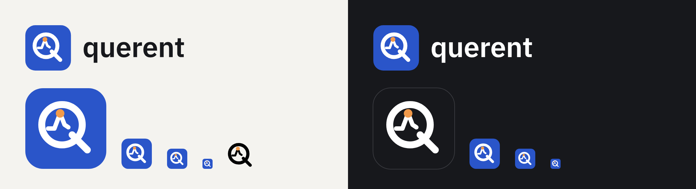

# Brand

The querent logo files, as delivered. `querent-logo-preview.png` shows every variant on light and
dark grounds.

## Files

| File                    | What it is                                                     |
| ----------------------- | -------------------------------------------------------------- |
| `querent-logo.svg`      | Icon and "querent" wordmark, ink lettering. For light grounds. |
| `querent-logo-dark.svg` | Icon and wordmark, white lettering. For dark grounds.          |
| `querent-icon.svg`      | The blue tile. The app icon at every size.                     |
| `querent-icon-dark.svg` | The ink tile. Large sizes on dark grounds only.                |
| `querent-mark.svg`      | The mark alone. Lens and handle in the current text colour.    |

## Colours

| Token                  | Value     | Use                                         |
| ---------------------- | --------- | ------------------------------------------- |
| `--color-accent`       | `#2A55C9` | The icon tile. Also the UI accent.          |
| `--color-ink`          | `#17181C` | Wordmark lettering, the dark tile.          |
| `--color-brand-signal` | `#F29A4A` | The signal dot of the mark. Brand use only. |

The signal orange is not a chart colour. The second chart series stays `#D0691C`
(`--color-series-2`), so data never reads as the brand.

## Where each variant is used

| Place                         | Variant                                                                                                  |
| ----------------------------- | -------------------------------------------------------------------------------------------------------- |
| Nav rail, home link           | Blue icon, 32 px (`BrandIcon`).                                                                          |
| Browser tab                   | `apps/web/public/favicon.svg` (blue icon), `favicon-32.png` fallback.                                    |
| Home screen and installed app | `apple-touch-icon.png`, `icon-192.png`, `icon-512.png`, `icon-maskable-512.png`, via `site.webmanifest`. |
| Sign-in page                  | Logo for light grounds (`Logo`).                                                                         |
| Loading screen                | The mark in secondary ink (`BrandMark`).                                                                 |
| `/ui` kit                     | Every variant on the ground it is meant for.                                                             |
| The repository README         | Logo, with the dark variant in GitHub's dark mode.                                                       |

In the app, `apps/web/src/ui/brand.tsx` draws the mark and the icons inline from the same
geometry, so their colours come from the theme tokens. The two wordmark files are used unchanged.

## Rules

- Keep the icon tile blue at small sizes, also on dark grounds. The ink tile is for large sizes.
- Do not recolour the signal dot, and do not stretch or re-letter the wordmark.
- Give the mark clear space of at least a quarter of its height.

## Generated icons

The PNG icons in `apps/web/public/` are rendered from `querent-icon.svg` with headless Chromium:
the tile as delivered for `favicon-32`, `icon-192` and `icon-512`, a full-bleed square for
`apple-touch-icon` (iOS applies its own mask), and a full-bleed square with the mark scaled to 78%
for `icon-maskable-512`, so the mark stays inside the maskable safe zone. Render them again when
the icon changes.
